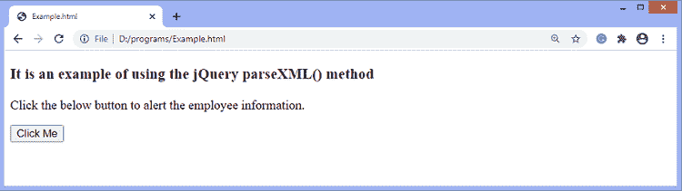
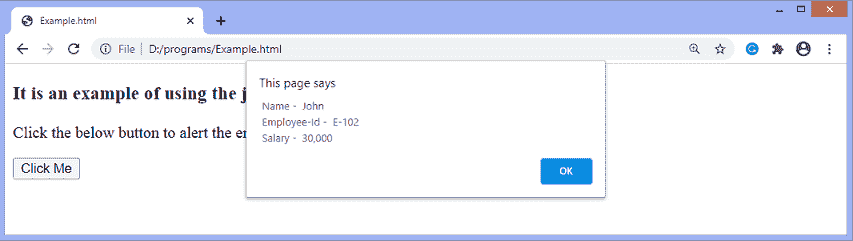

# jQuery parseXML()方法

> 原文:[https://www.javatpoint.com/jquery-parsexml-method](https://www.javatpoint.com/jquery-parsexml-method)

jQuery 中的 **parseXML()** 方法用于将字符串解析成 XML 文档。它使用浏览器的本机方法来创建有效的 XML 文档。这个有效的 XML 文档可以被传递到 [jQuery](https://www.javatpoint.com/jquery-tutorial) 来创建一个可以被操作或遍历的 jQuery 对象。

### 句法

```

jQuery.parseXML(data)

```

此方法接受一个参数，定义如下-

**数据:**为**弦**型。这是一个要解析的 [XML](https://www.javatpoint.com/xml-tutorial) 字符串。

现在，让我们用一个例子来理解这个方法的工作原理。

### 例子

这是一个使用 **parseXML()** 方法的简单例子。在这个例子中，我们将一个格式良好的 XML 字符串传递给 **parseXML()** 方法。

```

<!DOCTYPE html>
<html>
<head>
<script src = "https://ajax.googleapis.com/ajax/libs/jquery/3.5.1/jquery.min.js"> </script> 
</head>
<body>
<h3> It is an example of using the jQuery parseXML() method </h3>
<p> Click the below button to alert the employee information. </p>
<button> Click Me </button>

<script>
$(document).ready(function(){
 $("button").click(function(){
  var str = "<xml version = '2.0'> <employee> <name> John </name> <eid> E-102 </eid> <salary> 30,000 </salary> </employee> </xml>",
  xmlDoc = $.parseXML(str),
   $xml = $( str );
  alert(" Name - " + $($xml).find("name").text() + "\n Employee-Id - " + $($xml).find("eid").text() + " \n Salary - " + $($xml).find("salary").text() ); 
 });
});
</script>
</body>
</html>

```

[Test it Now](https://www.javatpoint.com/oprweb/test.jsp?filename=jquery-parsexml-method1)

**输出**

成功执行上述代码后，输出将是-



点击给定按钮后，输出将是-



* * *