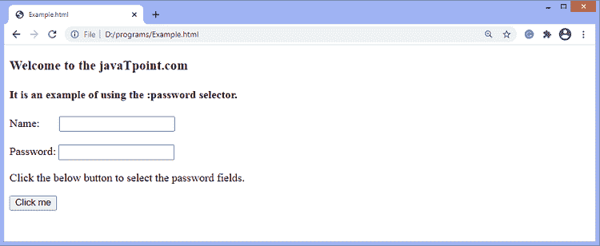
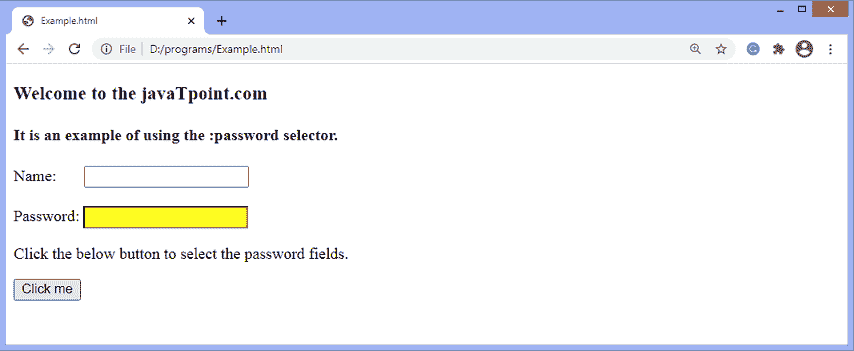

# jQuery:密码选择器

> 原文：<https://www.javatpoint.com/jquery-password-selector>

[jQuery](https://www.javatpoint.com/jquery-tutorial) 中的**:密码**选择器用于选择输入元素**类型=“密码”**。

### 句法

使用**:密码**选择器的常用语法如下-

```js

$(":password")

```

让我们看一个插图来了解**:密码**选择器的工作原理。

### 例子

这是一个使用**:密码**选择器的简单例子。在本例中，有两个输入字段，一个是 type = "text "，另一个是 type = "password "。单击给定按钮时，密码选择器将选择类型为“密码”的输入字段。

```js

<!DOCTYPE html>
<html>
<head>
<script src = "https://ajax.googleapis.com/ajax/libs/jquery/3.5.1/jquery.min.js"> </script>
<script>
$(document).ready(function() {
$("button").click(function() {
  $(":password").css("background-color", "yellow");
  });
});
</script>
</head>
<body>
<h3> Welcome to the javaTpoint.com </h3>
<h4> It is an example of using the :password selector. </h4>
  Name:    <input type = "text"> </br> </br>
  Password: <input type = "password"> </br>
  <p> Click the below button to select the password fields. </p>
  <button> Click me </button>
</body>
</html>

```

[Test it Now](https://www.javatpoint.com/oprweb/test.jsp?filename=jquery-password-selector1)

**输出**

执行上述代码后，输出将是-



点击给定按钮后，密码字段的背景颜色将发生变化，如下图所示-



* * *