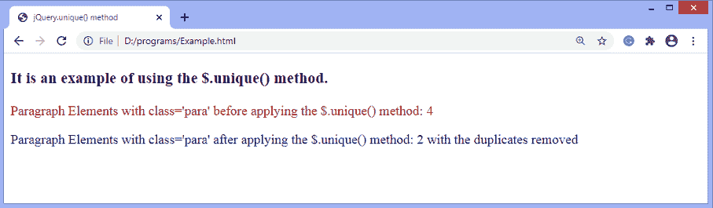

# jQuery.unique()方法

> 原文:[https://www.javatpoint.com/jquery-unique-method](https://www.javatpoint.com/jquery-unique-method)

**$。unique()** 方法对 DOM 元素的数组进行排序，并移除重复的元素。它在删除重复项后返回排序后的数组。这个方法是从 [jQuery](https://www.javatpoint.com/jquery-tutorial) 版本 **3.0** 中弃用的，我们可以用 [**jQuery.uniqueSort()** 方法](jquery-uniquesort-method)代替，它的工作原理类似于 **jQuery.unique()** 方法。

此方法搜索对象数组，对数组进行排序，并移除重复的节点。与阵列中已存在的节点完全相同的节点被视为重复节点。如果节点不同，但它们的属性相同，则不会被视为重复。

### 句法

```

jQuery.unique( array )

```

此方法接受一个参数，定义如下-

**数组:**是 DOM 元素的数组。

让我们看一个插图来理解**的工作原理。独特的()**方法。

### 例子

这是一个使用 **$的简单例子。独特的()**方法。在本例中，最初有两个段落元素与 ***段落*** 类相关。但是我们正在使用**。concat()** 方法创建段落的副本。所以， **$。unique()** 方法将删除使用**创建的重复项。concat()** 方法。

```

<!DOCTYPE html>
<html>
<head>
<title> jQuery.unique() method </title>
<script src = "https://ajax.googleapis.com/ajax/libs/jquery/3.4.0/jquery.min.js"> </script>
<style>
p {
color: darkred;
}
</style>
</head>

<body>
<h3> It is an example of using the $.unique() method. </h3>
<p id = "p1"> </p>
<p class = "para"> </p>
<p class = "para"> </p>
<p id = "p2"> </p>

<script>
$(document).ready(function(){
var paras = $(".para").get();
paras = paras.concat($(".para").get());
$("#p1").text(" Paragraph Elements with class='para' before applying the $.unique() method: " + paras.length);
paras = jQuery.unique(paras);
$("#p2").text(" Paragraph Elements with class='para' after applying the $.unique() method:  " + paras.length + " with the duplicates removed") .css("color", "darkblue");
})

</script>
</body>

</html>

```

[Test it Now](https://www.javatpoint.com/oprweb/test.jsp?filename=jquery-unique-method1)

**输出**

执行上述代码后，输出将是-



* * *