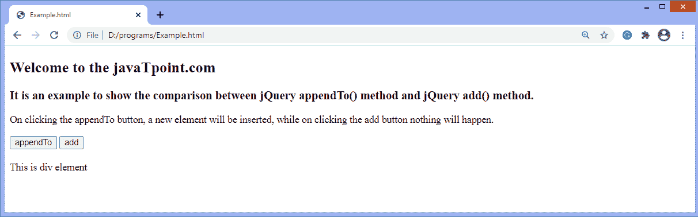

# jQuery add()方法

> 原文:[https://www.javatpoint.com/jquery-add-method](https://www.javatpoint.com/jquery-add-method)

jQuery 中的 **add()** 方法将一个元素添加到现有元素集中。如果指定了 ***上下文*** 参数，我们可以使用这种方法添加上下文元素中的元素，或者可以使用它添加整个文档中的元素。

不要假设使用 **add()** 方法将元素附加到现有元素集。此方法的工作方式与 **append()** 方法不同。不应与**追加()**方法相比。

### 句法

```

$(selector).add(element,context)

```

此方法接受两个参数，其中一个是强制的，另一个是可选的。 **add()** 方法的参数值定义如下:

**元素:**为必选项。它可以是一个 [jQuery](https://www.javatpoint.com/jquery-tutorial) 对象、一个选择器表达式、 [HTML](https://www.javatpoint.com/html-tutorial) 片段、一个元素或要添加到现有元素集中的元素集。

**上下文:**为可选参数。它指示文档中选择器开始匹配的点。

让我们用一些插图来理解 **add()** 方法。

### 示例 1

这是使用 **add()** 方法的一个简单示例。这里我们使用 **add()** 方法为 **p** 和 **span** 元素添加相同的 CSS 样式。这里有一些 [**p** 元素](https://www.javatpoint.com/html-paragraph)和一些 [**span**](https://www.javatpoint.com/html-span-tag) 元素，点击给定的按钮，两者都会被样式化。

```

<!DOCTYPE html>
<html>
<head>
<script src = "https://ajax.googleapis.com/ajax/libs/jquery/3.5.1/jquery.min.js"> </script>
<script>
$(document).ready(function(){
$("button").click(function(){
  $("p").add("span").css({"background-color": "yellow", "border": "5px dashed blue"});
});
});
</script>
</head>
<body>

<h2> Welcome to the javaTpoint.com </h2>
<h3> It is an example of using the jQuery add() method. </h3>
<p> This is a paragraph element </p>
<p> This is another paragraph element </p>
<h4> Click the following button to see the effect. </h4>
<button> Click me </button> </br> </br>
<span> This is a span element </span> </br> </br>
<span> This is another span element </span> </br> </br>

</body>
</html>

```

[Test it Now](https://www.javatpoint.com/oprweb/test.jsp?filename=jquery-add-method1)

**输出**

执行上述代码后，输出将是-


点击给定按钮后，输出将是-


### 示例 2

这是使用 **add()** 方法的另一个例子。这里，我们使用 **appendTO()** 方法以及 **add()** 方法来指定它们之间的比较。有两个按钮名为**追加到**和**增加**。当我们单击 appendTo 按钮时，会插入一个新元素，而单击 add 按钮时，不会插入任何元素。

每次单击 appendTo 按钮时，一个新的段落元素将被添加到 div 元素之后。

```

<!DOCTYPE html>
<html>
<head>
<script src = "https://ajax.googleapis.com/ajax/libs/jquery/3.5.1/jquery.min.js"> </script>
<script>
$(document).ready(function(){
$("#b1").click(function(){
  $("<p> Paragraph Element. </p>").appendTo("div");
});
$("#b2").click(function(){
  $("<p> Paragraph Element. </p>").add("div");
});
});
</script>
</head>
<body>

<h2> Welcome to the javaTpoint.com </h2>
<h3> It is an example to show the comparison between jQuery appendTo() method and jQuery add() method. </h3>
<p> On clicking the appendTo button, a new element will be inserted, while on clicking the add button nothing will happen. </p>
<button id = "b1"> appendTo </button> 
<button id = "b2"> add </button>
</br></br>
<div> This is div element </div>
</body>
</html>

```

[Test it Now](https://www.javatpoint.com/oprweb/test.jsp?filename=jquery-add-method2)

**输出**

执行上述代码后，输出将是-



点击**追加到**按钮后，输出为-


* * *