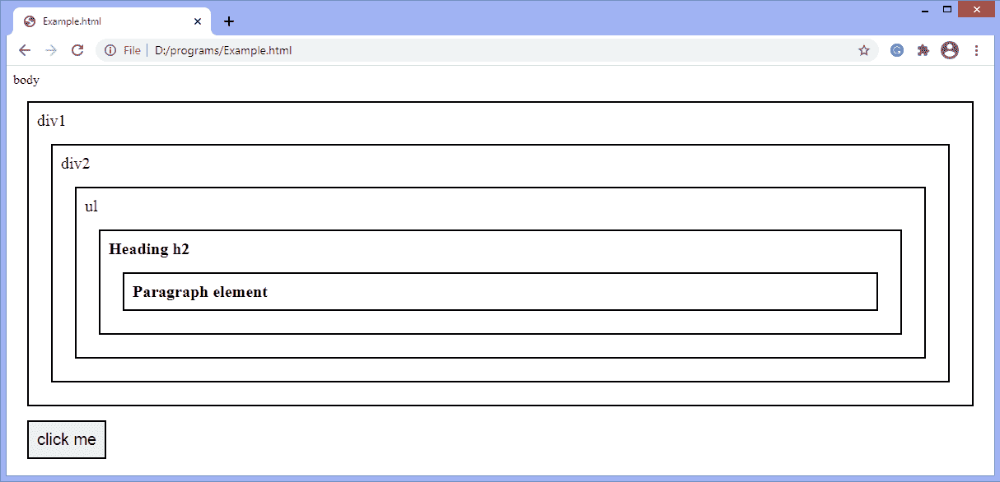
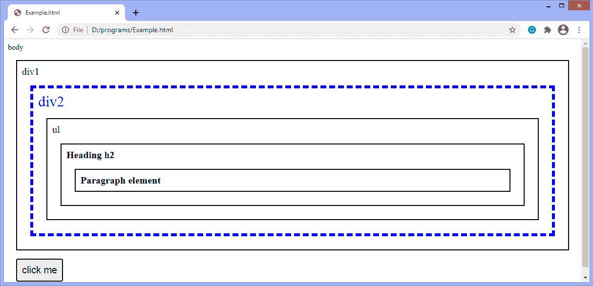
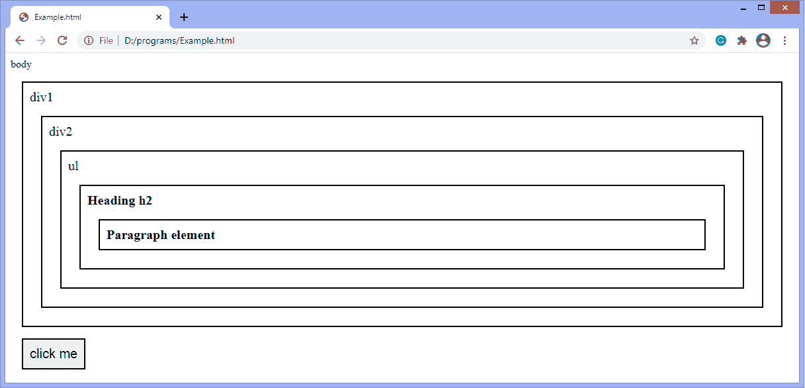
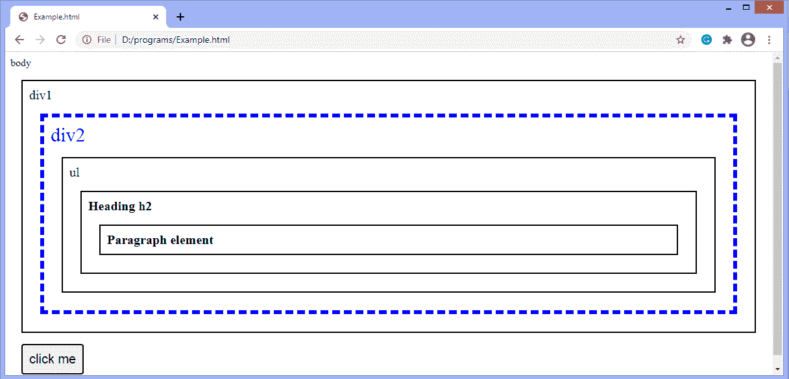

# jQuery 最接近()的方法

> 原文:[https://www.javatpoint.com/jquery-closest-method](https://www.javatpoint.com/jquery-closest-method)

jQuery 中最接近的()方法选择给定选择器的第一个祖先。祖先可以是父母、祖父母等。这是 [jQuery](https://www.javatpoint.com/jquery-tutorial) 中的一个内置方法。为了搜索第一个祖先，最近的()方法从当前元素向上遍历。如果不匹配，搜索将逐父级进行，直到找到与指定表达式匹配的元素。此方法返回选定元素的第一个祖先。

这类似于 [**父母()**方法](https://www.javatpoint.com/jquery-parents-method)，因为两者都向上行进到 DOM 树。 **parents()** 方法从父元素开始，返回所有匹配指定表达式的祖先。与 **parents()** 方法不同，**closer()**方法从当前元素开始，并返回与指定表达式匹配的第一个祖先。

### 句法

**回归始祖**

```

$(selector).closest(selector);

```

**使用 DOM 上下文返回第一个祖先**

```

$(selector).closest(selector, context);

```

**最接近()**方法的参数值定义如下:

### 参数值

**选择器:**是指定选择器表达式、元素或 jQuery 对象的必需参数。该值过滤元素并缩小祖先搜索范围。

**上下文:**它是一个 DOM 元素，在其中可以找到匹配的元素。可以选择使用。

让我们用一些插图来理解**最接近()**的方法。

### 示例 1

在这个例子中，我们没有使用 ***上下文*** 参数，也就是说，我们没有传递 DOM 上下文。这里有两个 div 元素以及一个 [**ul**](https://www.javatpoint.com/html-unordered-list) 元素、一个标题 **h2** 和一个段落元素。

我们正在搜索段落元素的第一个 div 祖先。虽然该段落最近的祖先是 **h2、**，因为我们正在寻找 [**div**](https://www.javatpoint.com/html-div-tag) ，所以 h2 元素被跳过，搜索进行到下一个祖先，它将继续，直到找到指定的元素。我们必须单击给定的按钮来获取段落元素的第一个祖先。

如果我们使用 **parents()** 方法而不是使用**close()**方法，它将返回两个 div 祖先。

```

<!DOCTYPE html>
<html>
<head>
<style>
.main * { 
  display: block;
  font-size: 20px;
  position: relative;
  border: 2px solid black;
  color: black; 
  padding: 10px;
  margin: 17px;
}
</style>
<script src="https://ajax.googleapis.com/ajax/libs/jquery/3.5.1/jquery.min.js"></script>
<script>
function fun(){
$(document).ready(function(){
  $("p").closest("div").css({ "font-size": "30px", "color": "blue", "border": "6px dashed blue"});
});
}
</script>
</head>

<body class = "main"> body
  <div> div1
  <div> div2
    <ul> ul 
      <h2> Heading h2
          <p> Paragraph element </p>
      </h2>
    </ul>   
	</div>
  </div>
<button onclick = "fun()"> click me </button>
  </body>
</html>

```

[Test it Now](https://www.javatpoint.com/oprweb/test.jsp?filename=jquery-closest-method1)

**输出**

执行上述代码后，输出将是-



点击给定按钮后，输出为-



### 示例 2

在这个例子中，我们传递了 DOM 上下文。这意味着搜索是在 DOM 上下文中完成的。这里有两个 div 元素。第一个 div 元素的 id 是 **demo。**我们使用这个 div 作为上下文，并搜索段落元素的第一个 div 祖先。单击按钮时，第二个 div 将突出显示为段落的第一个祖先，因为它位于上下文中。

如果 **ul** 元素的 id 是 **demo，**是 **div、**的子元素，那么 div 元素将不会突出显示，因为在这种情况下，对应的 div 元素在上下文之外。

```

<!DOCTYPE html>
<html>
<head>
<style>
.main * { 
  display: block;
  font-size: 20px;
  position: relative;
  border: 2px solid black;
  color: black; 
  padding: 10px;
  margin: 17px;
}
</style>
<script src="https://ajax.googleapis.com/ajax/libs/jquery/3.5.1/jquery.min.js"></script>
<script>
function fun(){
$(document).ready(function(){
var context = document.getElementById("dom");
  $("p").closest("div", context).css({ "font-size": "30px", "color": "blue", "border": "6px dashed blue"});
});
}
</script>
</head>

<body class = "main"> body
  <div  id = "dom"> div1
  <div> div2
    <ul> ul 
      <h2> Heading h2
          <p> Paragraph element </p>
		  </h2>
      </ul>   
	</div>
  </div>
<button onclick = "fun()"> click me </button>
  </body>
</html>

```

[Test it Now](https://www.javatpoint.com/oprweb/test.jsp?filename=jquery-closest-method2)

**输出**

执行上述代码后，输出将是-



点击给定按钮后，输出为-



* * *