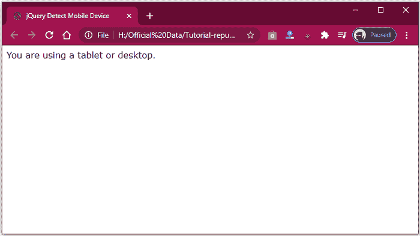
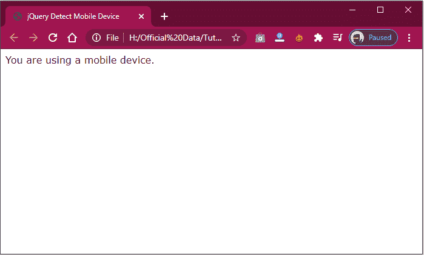

# 如何在 jQuery 中检测移动设备

> 原文:[https://www . javatpoint . com/如何在 jquery 中检测移动设备](https://www.javatpoint.com/how-to-detect-a-mobile-device-in-jquery)

如果我们想搜索一个特定的用户，下面给出了一个 JavaScript 语法列表，可以用来识别不同的移动设备，如 iPod、iPad、安卓、黑莓、Windows Phone 和 WebOS 等。

### 句法

```

/**
 * jQuery.browser.mobile (http://detectmobilebrowser.com/)
 * jQuery.browser.mobile returns true if the browser act as a mobile device
 **/
(function(a){jQuery.browser.mobile=/android.+mobile|avantgo|bada/|blackberry|blazer|compal|elaine|fennec|hiptop|iemobile|ip(hone|od)|iris|kindle|lgpalm( os)?|phone|p(ixi|re)/|plucker|pocket|psp|symbian|treo|up.(browser|link)|vodafone|wap|windows (ce|phone)|xda|xiino/i.test(a)||/1207|6310|6590|3gso|4thp|50[1-6]i|770s|802s|a wa|abac|ac(er|oo|s-)|ai(ko|rn)|al(av|ca|co)|amoi|an(ex|ny|yw)|aptu|ar(ch|go)|as(te|us)|attw|au(di|-m|r |s )|avan|be(ck|ll|nq)|bi(lb|rd)|bl(ac|az)|br(e|v)w|bumb|bw-(n|u)|c55/|capi|ccwa|cdm-|cell|chtm|cldc|cmd-|co(mp|nd)|craw|da(it|ll|ng)|dbte|dc-s|devi|dica|dmob|do(c|p)o|ds(12|-d)|el(49|ai)|em(l2|ul)|er(ic|k0)|esl8|ez([4-7]0|os|wa|ze)|fetc|fly(-|_)|g1 u|g560|gene|gf-5|g-mo|go(.w|od)|gr(ad|un)|haie|hcit|hd-(m|p|t)|hei-|hi(pt|ta)|hp( i|ip)|hs-c|ht(c(-| |_|a|g|p|s|t)|tp)|hu(aw|tc)|i-(20|go|ma)|i230|iac( |-|/)|ibro|idea|ig01|ikom|im1k|inno|ipaq|iris|ja(t|v)a|jbro|jemu|jigs|kddi|keji|kgt( |/)|klon|kpt |kwc-|kyo(c|k)|le(no|xi)|lg( g|/(k|l|u)|50|54|e-|e/|-[a-w])|libw|lynx|m1-w|m3ga|m50/|ma(te|ui|xo)|mc(01|21|ca)|m-cr|me(di|rc|ri)|mi(o8|oa|ts)|mmef|mo(01|02|bi|de|do|t(-| |o|v)|zz)|mt(50|p1|v )|mwbp|mywa|n10[0-2]|n20[2-3]|n30(0|2)|n50(0|2|5)|n7(0(0|1)|10)|ne((c|m)-|on|tf|wf|wg|wt)|nok(6|i)|nzph|o2im|op(ti|wv)|oran|owg1|p800|pan(a|d|t)|pdxg|pg(13|-([1-8]|c))|phil|pire|pl(ay|uc)|pn-2|po(ck|rt|se)|prox|psio|pt-g|qa-a|qc(07|12|21|32|60|-[2-7]|i-)|qtek|r380|r600|raks|rim9|ro(ve|zo)|s55/|sa(ge|ma|mm|ms|ny|va)|sc(01|h-|oo|p-)|sdk/|se(c(-|0|1)|47|mc|nd|ri)|sgh-|shar|sie(-|m)|sk-0|sl(45|id)|sm(al|ar|b3|it|t5)|so(ft|ny)|sp(01|h-|v-|v )|sy(01|mb)|t2(18|50)|t6(00|10|18)|ta(gt|lk)|tcl-|tdg-|tel(i|m)|tim-|t-mo|to(pl|sh)|ts(70|m-|m3|m5)|tx-9|up(.b|g1|si)|utst|v400|v750|veri|vi(rg|te)|vk(40|5[0-3]|-v)|vm40|voda|vulc|vx(52|53|60|61|70|80|81|83|85|98)|w3c(-| )|webc|whit|wi(g |nc|nw)|wmlb|wonu|x700|xda(-|2|g)|yas-|your|zeto|zte-/i.test(a.substr(0,4))})(navigator.userAgent||navigator.vendor||window.opera);

```

### 一个基本例子

这里，我们有使用 jQuery 检测手机的最基本的代码。

```

if (jQuery.browser.mobile)
{
	console.log("You're using a cellular device!");
}
else
{
	console.log("You're not using a cellular device!");
}

```

### 支持浏览器

上面提到的语法和代码支持以下浏览器:

*   **Safari**
*   **谷歌铬**
*   **Mozilla Firefox**
*   **微软边缘**
*   **歌剧**

现在，我们将定义不同的语法逻辑来检测各种类型的手机。

### 用于检测 iPhone

可以借助下面的 JavaScript 代码搜索 iPhone。

```

var isiPhone = / iphone/i.test(navigator.userAgent.toLowerCase());
 if (isiPhone)
{
	//... code block
}

```

### 用于检测 iPod

下面给出了一个检测 iPod 的 JavaScript 代码。

```

var isiPod = / ipod/i.test(navigator.userAgent.toLowerCase());
 if (isiPod)
{
	//… code block
}

```

### 用于检测 iPad

这里，我们有一个检测 iPad 的插图。

```

var isiPad = / ipad/i.test(navigator.userAgent.toLowerCase());
 if (isiPad)
{
	//… Statement
}

```

### 用于检测安卓手机

你可以借助下面的 JavaScript 代码来检测[安卓](https://www.javatpoint.com/android-tutorial)手机。

```

var isAndroid = / Android/i.test(navigator.userAgent.toLowerCase());
 if (isAndroid)
{
	//… Executable code
}

```

### 用于检测黑莓手机

你可以借助下面的 JavaScript 代码来检测黑莓手机。

```

var isBlackberry = / blackberry/i.test(navigator.userAgent.toLowerCase());
 if (isBlackberry)
{
	//… code statement
}

```

### 用于检测视频设备

您可以借助以下 [JavaScript](https://www.javatpoint.com/javascript-tutorial) 代码来搜索视频设备。

```

var isiDevice = / iPod| iPad| iPhone/i.test(navigator.userAgent.toLowerCase());
 if (isiDevice)
{
	//… code statement
}

```

### 用于检测视窗电话

你可以在下面给出的 JavaScript 代码的帮助下搜索 Windows 手机。

```

var isWindowsPhone = / windows phone/i.test(navigator.userAgent.toLowerCase());
 if (iswindowphone)
{
	//… code statement
}

```

### 用于检测网络操作系统

您可以借助下面提到的 JavaScript 代码来检测网络操作系统。

```

var isWiebOs = / webos/i.test(navigator.userAgent.toLowerCase());
 if (isWebOs)
{
	//… code block
}

```

这里我们还有另外一种借助 **window.matchmedia()** 方法检测手机的方法。

也可以使用 JS window.matchMedia()方法，根据 [CSS 媒体查询](https://www.javatpoint.com/css-media-query)搜索手机设备。这是预测移动设备的最佳和最简单的方法。

**语法**

```

window.matchMedia();

```

**示例 1:** 桌面示例代码。

```

<!DOCTYPE html>
<html lang="en">
<head>
<title> jQuery Detect Mobile Device </title>
</head>
<body>
<script>
           if (window.matchMedia("(max-width: 768px)").matches)
           {             // The port of view is less than 768 pixel wide
           document.write("You are using a mobile device.");
           }
else
{           // The port of view is minimum 768 pixels wide
   document.write("You are using a tablet or desktop.");
           }
</script>
</body>
</html> 

```

**输出**

高效执行上述代码后，您将获得以下结果。



**示例 2:** 手机示例代码。

```

<!DOCTYPE html>
<html lang="en">
<head>
<title> jQuery Detect Mobile Device </title>
</head>
<body>
<script> 
        if (window.matchMedia("(max-width: 767px)").matches) 
        {                                         // The port of view is smaller than 768 pixels wide 
          document.write("You are using a mobile device."); 
        } 
else 
{                                                 // The port of view is minimum have 768 pixels wide
document.write("You are using a tablet or desktop."); 
        } 
</script>
</body>
</html> 

```

**输出**

成功实现上述代码后，您将获得以下结果。



* * *