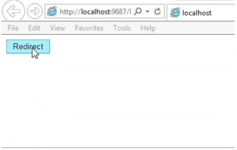
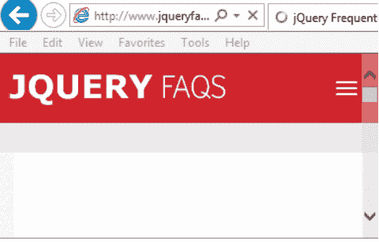

# 5 秒后 jQuery 重定向到另一页

> 原文:[https://www . javatpoint . com/jquery-5 秒后重定向到另一页](https://www.javatpoint.com/jquery-redirect-to-another-page-after-5-seconds)

在本节中，我们将学习如何在 jquery 中五秒钟后自动重定向到另一个页面。之后，我们将学习如何使用 jquery 在 10、15、30 秒或任何指定时间后重定向到 url。为了在五秒钟后重定向到 jQuery 中的 url，我们将使用 JavaScript setInterval 函数。setTimeout 方法和 setInterval 函数彼此类似。setTimeout()仅用于调用函数一次。setInetrval 用于多次调用它们。假设我们希望每三秒钟为我们网站的访问者显示一条消息。当我们在网站上使用 [JavaScript setInterval()](https://www.javatpoint.com/javascript-setinterval-method) 功能时，我们能够在网站上加入新的功能。

[HTML 按钮](https://www.javatpoint.com/html-button-tag)包含在 [HTML](https://www.javatpoint.com/html-tutorial) 标记中。为了显示倒计时定时器，我们将使用 [HTML SPAN](https://www.javatpoint.com/html-span-tag) ，它包含在 [HTML DIV](https://www.javatpoint.com/html-div-tag) 中。 [jQuery](https://www.javatpoint.com/jquery-tutorial) 的点击事件处理程序分配给名为**“重定向”**的按钮。之后，JavaScript setInterval 函数将在 click 事件处理程序中初始化，这样它就可以每 1000 毫秒执行一次，也就是说每 1 秒执行一次。在我们的例子中，每次执行 JavaScript setInterval 函数。首先，第二个变量的值将减少。之后，它会显示倒计时定时器 HTML SPAN 的值。当第二个变量的值达到 0 时，倒计时计时器将结束，然后该页面将被重定向到另一个页面。

在我们的例子中，我们将使用 2 秒钟的时间通过创建一个按钮来重定向到另一个页面。点击创建的按钮“重定向”后，倒计时将开始，该按钮将在 5 秒后重定向到输入的 url 页面。下面的例子向我们展示了在 jQuery 中重定向到另一个给定的 url 页面。

**示例:**

```

<input type="button" id="btnRedirect" value="Redirect" />
<br />
<br />
<div id="dvCountDown" style="display: none">
You will be redirected after <span id="lblCount"></span>&nbsp;seconds.
</div>
<script type="text/javascript" src="http://ajax.googleapis.com/ajax/libs/jquery/1.8.3/jquery.min.js"></script>
<script type="text/javascript">
$(function () {
    $("#btnRedirect").click(function () {
        var seconds = 5;
        $("#dvCountDown").show();
        $("#lblCount").html(seconds);
        setInterval(function () {
            seconds--;
            $("#lblCount").html(seconds);
            if (seconds == 0) {
                $("#dvCountDown").hide();
                window.location = "http://www.jqueryfaqs.com/";
            }
        }, 1000);
    });
});
</script>

```

上述示例的输出如下:



点击此处后，我们将被重定向到另一个页面。考虑以下截图:



* * *