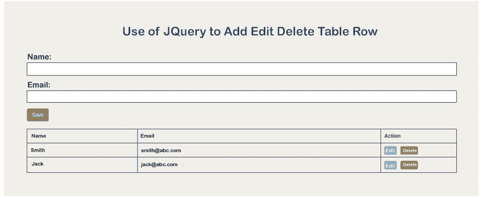

# 在 JQuery 中添加编辑删除表行

> 原文:[https://www . javatpoint . com/add-edit-delete-table-row-in-jquery](https://www.javatpoint.com/add-edit-delete-table-row-in-jquery)

在本节中，我们将学习表格行的编辑、删除或添加。我们将使用 JQuery 来实现这一点。在下面的例子中，我们将使用 JQuery 添加、编辑和删除表的行。假设我们不知道如何将 JQuery 用于添加、编辑和删除功能。在这种情况下，下面的例子将在 JQuery 中提供一种方式，通过这种方式，我们可以轻松地执行各种操作，如添加、编辑和删除。我们还将使用 Bootstrap，这将有助于我们提供一个非常有吸引力和漂亮的布局。

为了实现这一点，我们将简单地创建一个 html 文件。之后，我们将添加 [Bootstrap](https://www.javatpoint.com/bootstrap-tutorial) 以获得更好的外观，然后我们将添加 [JQuery](https://www.javatpoint.com/jquery-tutorial) 文件。现在，我们将通过编写下面的代码在 JQuery 中创建新行一个表。我们还将在 JQuery 中编写代码来编辑和移除行数据。这样做的示例描述如下:

**示例:**

```

<!DOCTYPE html>
<html>
<head>
  <title> Use of JQuery to Add Edit Delete Table Row </title>
  <link rel="stylesheet" href="https://cdnjs.cloudflare.com/ajax/libs/twitter-bootstrap/3.3.7/css/bootstrap.min.css" />
  <script src="https://cdnjs.cloudflare.com/ajax/libs/jquery/3.4.0/jquery.min.js"></script>
</head>
<body>

<div class="container">
  <h1> Use of JQuery to Add Edit Delete Table Row </h1>

  <form>

    <div class="form-group">
      <label>Name:</label>
      <input type="text" name="name" class="form-control" value="Smith" required="">
    </div>

    <div class="form-group">
      <label>Email:</label>
      <input type="text" name="email" class="form-control" value="smith@abc.com" required="">
    </div>

    <button type="submit" class="btn btn-success save-btn">Save</button>

  </form>
  <br/>
  <table class="table table-bordered data-table">
    <thead>
      <th>Name</th>
      <th>Email</th>
      <th width="200px">Action</th>
    </thead>
    <tbody>

    </tbody>
  </table>

</div>

<script type="text/javascript">

    $("form").submit(function(e){
        e.preventDefault();
        var name = $("input[name='name']").val();
        var email = $("input[name='email']").val();

        $(".data-table tbody").append("<tr data-name='"+name+"' data-email='"+email+"'><td>"+name+"</td><td>"+email+"</td><td><button class='btn btn-info btn-xs btn-edit'>Edit</button><button class='btn btn-danger btn-xs btn-delete'>Delete</button></td></tr>");

        $("input[name='name']").val('');
        $("input[name='email']").val('');
    });

    $("body").on("click", ".btn-delete", function(){
        $(this).parents("tr").remove();
    });

    $("body").on("click", ".btn-edit", function(){
        var name = $(this).parents("tr").attr('data-name');
        var email = $(this).parents("tr").attr('data-email');

        $(this).parents("tr").find("td:eq(0)").html('<input name="edit_name" value="'+name+'">');
        $(this).parents("tr").find("td:eq(1)").html('<input name="edit_email" value="'+email+'">');

        $(this).parents("tr").find("td:eq(2)").prepend("<button class='btn btn-info btn-xs btn-update'>Update</button><button class='btn btn-warning btn-xs btn-cancel'>Cancel</button>")
        $(this).hide();
    });

    $("body").on("click", ".btn-cancel", function(){
        var name = $(this).parents("tr").attr('data-name');
        var email = $(this).parents("tr").attr('data-email');

        $(this).parents("tr").find("td:eq(0)").text(name);
        $(this).parents("tr").find("td:eq(1)").text(email);

        $(this).parents("tr").find(".btn-edit").show();
        $(this).parents("tr").find(".btn-update").remove();
        $(this).parents("tr").find(".btn-cancel").remove();
    });

    $("body").on("click", ".btn-update", function(){
        var name = $(this).parents("tr").find("input[name='edit_name']").val();
        var email = $(this).parents("tr").find("input[name='edit_email']").val();

        $(this).parents("tr").find("td:eq(0)").text(name);
        $(this).parents("tr").find("td:eq(1)").text(email);

        $(this).parents("tr").attr('data-name', name);
        $(this).parents("tr").attr('data-email', email);

        $(this).parents("tr").find(".btn-edit").show();
        $(this).parents("tr").find(".btn-cancel").remove();
        $(this).parents("tr").find(".btn-update").remove();
    });

</script>

</body>
</html>

```

现在我们上面的代码可以运行了。当我们运行它时，将生成以下输出:



* * *