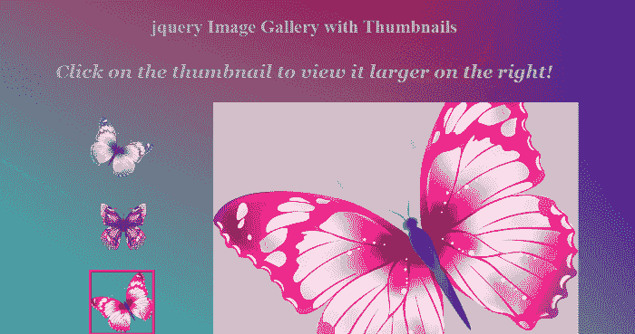
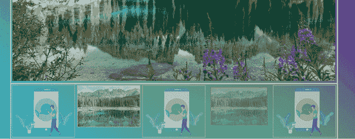
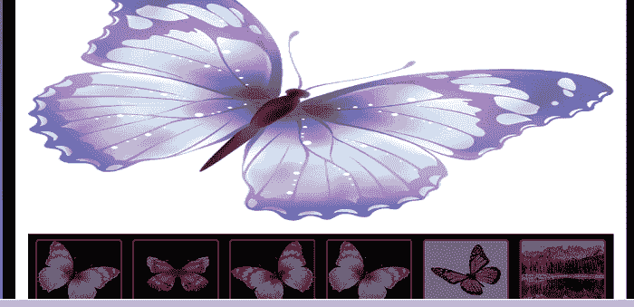

# 带有缩略图的 JQuery 照片库

> 原文：<https://www.javatpoint.com/jquery-photo-gallery-with-thumbnail>

在本文中，我们了解了如何在 JQuery 的帮助下创建照片库。在本文的开头，我们通过一些例子学习了 JQuery 的一些基础知识和照片库的一些基本含义。

## jQuery 是什么意思？

JQuery 是一个快速、轻量级、小型且功能丰富的 JavaScript 库。

为了在 HTML 页面中包含 jQuery 库，我们可以使用

```js

<script src ="https://code.jquery.com/jquery-3.5.1.min.js"> </script>

```

### 你说的照片库是什么意思？

使用图像库实现的缩略图是原始图像的单独的较小副本。照片库用于创建图像库、文件夹和幻灯片等。

现在，借助下面给出的一些例子来理解这个概念。

## 例 1:

```js

<! DOCTYPE html>
<html>
<head>
<title>
JQuery photo gallery with thumbnail 
</title>
</head>
<meta name="viewport" content="width=device-width, initial-scale=1">
<style>
.wrapper {
  margin: 0 auto;
  width: 80%;
  text-align: center;
}
.image-gallery {
  margin: 0 auto;
  display: table;
}
.primary,
.thumbnails {
  display: table-cell;
}
.thumbnails {
  width: 300px;
}
body{
  background: -webkit-linear-gradient(45deg, #0BBDE5 0%, rgba(11, 189, 229, 0) 70%), -webkit-linear-gradient(315deg, #EC0432 10%, rgba(236, 4, 50, 0) 80%), -webkit-linear-gradient(225deg, #2305CC 10%, rgba(35, 5, 204, 0) 80%), -webkit-linear-gradient(135deg, #B4DC04 100%, rgba(180, 220, 4, 0) 70%);
background: linear-gradient(45deg, #0BBDE5 0%, rgba(11, 189, 229, 0) 70%), linear-gradient(135deg, #EC0432 10%, rgba(236, 4, 50, 0) 80%), linear-gradient(225deg, #2305CC 10%, rgba(35, 5, 204, 0) 80%), linear-gradient(315deg, #B4DC04 100%, rgba(180, 220, 4, 0) 70%);
 height: 100%;
  width: 100%;
}
.primary {
  width: 600px;
  height: 400px;
  background-color: #cccccc;
  background-size: cover;
  background-position: center center;
  background-repeat: no-repeat;
}
.thumbnail:hover .thumbnail-image {
  border: 4px solid red;
  opacity: 0.7;
-webkit-transition: opacity 0.35s linear 0s;
transition: opacity 0.35s linear 0s;
}
.selected .thumbnail-image {
  border: 4px solid red;
}
.thumbnail-image {
  width: 100px;
  height: 100px;
  margin: 20px auto;
  background-size: cover;
  background-position: center center;
  background-repeat: no-repeat;
  border: 4px solid transparent;
}
h2 {
  font-weight: bold;
  margin-bottom: 2.5rem;
  color: #aaa;
  align: center;
  font-size: 30px;
  margin-top: 1.5rem;
  font-weight: 1000;
}
h1 {
  font-weight: bold;
  margin-bottom: 2.5rem;
  color: #aaa;
  align: center;
  font-size: 30px;
  margin-top: 1.5rem;
  font-weight: 900;
  text-transform: uppercase;
  text-shadow: 3px 3px rgba(0, 0, 0, 0.25);
} 
p {
  font-weight: bold;
  margin-bottom: 2rem;
  color: #aaa;
  align: center;
  font-size: 30px;
  margin-top: 1.5rem;
  font-weight: 700;
}
em {
  font-family: Georgia, serif;
  line-height: 1.2;
}
</style>
<body>
<div class ="wrapper">
<header>
<h1> <b> Example: </b> </h1>
  <h2> jQuery Image Gallery with Thumbnails </h2>
  <p> <em> Click on the thumbnail to view it larger on the right! </em> </p>
</header>
<div class="image-gallery">
  <aside class="thumbnails">
    <a href="#" class="selected thumbnail" data-big="1.png">
      <div class="thumbnail-image" style="background-image: url(1.png)"></div>
    </a>
    <a href="#" class="thumbnail" data-big="3.png">
      <div class="thumbnail-image" style="background-image: url(3.png)"></div>
    </a>
    <a href="#" class="thumbnail " data-big="5.png">
      <div class="thumbnail-image" style="background-image: url(5.png)"></div>
    </a>
  </aside>
  <main class="primary" style="background-image: url('1.png');"></main>
</div>
</div>
</body>
<script src="https://cdnjs.cloudflare.com/ajax/libs/jquery/3.4.0/jquery.min.js"> </script>
<script>
$('.thumbnail').on ('click', function () {
  var clicked = $(this);
  var newSelection = clicked.data('big');
  var $img = $('.primary').css("background-image","url(" + newSelection + ")");
  clicked.parent().find('.thumbnail').removeClass('selected');
  clicked.addClass('selected');
  $('.primary').empty().append($img.hide().fadeIn('slow'));
});
</script>
</html>

```

**说明:**在本例中，我们借助 JQuery 创建了一个带有缩略图的简单照片库。在本例中，如果您单击照片库的特定缩略图，则会显示放大的图像。

**输出:**

**下面是这个例子的输出:**



## 例 2:

```js

<! DOCTYPE html>
<html lang="en">
<head>
    <meta charset="UTF-8">
    <meta name="viewport" content="width=device-width, initial-scale=1.0">
    <link href="https://cdnjs.cloudflare.com/ajax/libs/font-awesome/5.13.0/css/all.min.css" rel="stylesheet">
    <title> Photo Gallery Slider with Thumbnails </title>
</head>
<style>
* {
    margin: 0;
    padding: 0;
    box-sizing: border-box;
}
body {
  background: -webkit-linear-gradient(45deg, #0BBDE5 0%, rgba(11, 189, 229, 0) 70%), -webkit-linear-gradient(315deg, #EC0432 10%, rgba(236, 4, 50, 0) 80%), -webkit-linear-gradient(225deg, #2305CC 10%, rgba(35, 5, 204, 0) 80%), -webkit-linear-gradient(135deg, #B4DC04 100%, rgba(180, 220, 4, 0) 70%);
background: linear-gradient(45deg, #0BBDE5 0%, rgba(11, 189, 229, 0) 70%), linear-gradient(135deg, #EC0432 10%, rgba(236, 4, 50, 0) 80%), linear-gradient(225deg, #2305CC 10%, rgba(35, 5, 204, 0) 80%), linear-gradient(315deg, #B4DC04 100%, rgba(180, 220, 4, 0) 70%);
}
.container {
    margin: 80px auto;
    text-align: center;
    width: 80%;
    box-shadow: 2px 2px 2px #bbb;
}
.container .master {
    margin: auto;
    width: 100%;
    border: 2px solid #ccc;
    padding: 5px;
}
.container .thumbnails {
    margin: auto;
    width: 100%;
    border: 2px solid #ccc;
    padding: 5px;
}
.container .master {
    padding-bottom: 0;
    position: relative;
}
.container .master img {
    z-index: 1;
    width: 100%;
    height: 99%
}
.container .master .fa-chevron-left {
    position: absolute;
    left: 5px;
    top: 5px;
    background-color: rgb(0,0,0, .7);
    color: #fff;
    padding: 10px 15px;
    z-index: 2;
    cursor: pointer;
animation: bounce 1600ms infinite cubic-bezier(0.445, 0.05, 0.55, 0.95);
}
.container .master .fa-chevron-left:hover {
  padding-right: 24px;
  padding-left:8px;
}

.container .master .fa-chevron-right {
    position: absolute;
    left: 5px;
    top: 5px;
    background-color: rgb(0,0,0, .7);
    color: #fff;
    padding: 10px 15px;
    z-index: 2;
    cursor: pointer;
animation: bounce 1600ms infinite cubic-bezier(0.445, 0.05, 0.55, 0.95);
}
@keyframes bounce {
50% {
    transform: translateY(10px);
  }
}
.container .master .fa-chevron-right:hover {
  padding-right: 24px;
  padding-left:8px;
.container .master .fa-chevron-right {
    right: 5px;
    left: auto;
}
.container .thumbnails {
    overflow: hidden;
}
.container .thumbnails img {
    float: left;
    width: 19.2%;
    outline: 2px solid #bbb;
    opacity: .6;
    cursor: pointer;
    transition: all .6s ease-in-out;
}
.container .thumbnails img:last-child {
    margin-right: 0!important;
}
.container .thumbnails img.active {
    outline: 2px solid #e63946;
    opacity: 1;
}
.container .thumbnails img.active:hover
    {
box-shadow: 2px 2px 4px 2px rgb(60, 255, 53);
    opacity: 0.3;
    filter: alpha(opacity=30);
 transform: scale(.9);
  transition: .4s;
    }
</style>
<body>
    <div class="container">        
        <div class="master">
            
            <i class="fas fa-chevron-left"> </i>
            <i class="fas fa-chevron-right"> </i>
        </div>
        <div class="thumbnails">	
            		
            
            
            
            
        </div>
    </div>
 <script src="https://ajax.googleapis.com/ajax/libs/jquery/3.5.1/jquery.min.js">
 </script>
 <script>
 $(function () {    
    $(".master").css ( {
        height: $(".master img").height() + 13
    } );
    var imagesNumber    = $(".thumbnails").children().length,
        marginBetweenImages =  1,
        totalMargins        = marginBetweenImages * (imagesNumber - 1),
        imageWidth          = (100 - totalMargins) / (imagesNumber);      
    $(".thumbnails img").css( {
        width: imageWidth + "%",
        marginRight: marginBetweenImages + "%"
    } );
    $(".thumbnails img").on("click", function() {
        $(this).addClass("active").siblings().removeClass("active");
        $(".master img").hide().attr("src", $(this).attr("src")).fadeIn(300);
    } );
    $(".master .fas").on("click", function() {
        if($(this).hasClass("fa-chevron-left")) {
            if($(".thumbnails img.active").is(":first-child")) {
                $(".thumbnails img:last-child").click();
            } else {
                $(".thumbnails img.active").prev().click();
            }
        } else {
            if($(".thumbnails img.active").is(":last-child")) {
                $(".thumbnails img:first-child").click();
            } else {
                $(".thumbnails img.active").next().click();
            }
        }
    })
})
 </script>
</body>
</html> 

```

**说明:**在本例中，我们借助 JQuery 创建了一个简单的带有缩略图的照片库滑块。在本例中，如果您单击照片库的特定缩略图，则会显示放大的图像。

**输出:**

**下面是这个例子的输出:**



## 例 3:

```js

<! DOCTYPE html> 
<html> 
<head> 
<title>
JQuery photo gallery with thumbnail </title>
<meta name="viewport" content="width=device-width, initial-scale=1">
<style>
body {
  background: -webkit-linear-gradient(45deg, #0BBDE5 0%, rgba(11, 189, 229, 0) 70%), -webkit-linear-gradient(315deg, #EC0432 10%, rgba(236, 4, 50, 0) 80%), -webkit-linear-gradient(225deg, #2305CC 10%, rgba(35, 5, 204, 0) 80%), -webkit-linear-gradient(135deg, #B4DC04 100%, rgba(180, 220, 4, 0) 70%);
background: linear-gradient(45deg, #0BBDE5 0%, rgba(11, 189, 229, 0) 70%), linear-gradient(135deg, #EC0432 10%, rgba(236, 4, 50, 0) 80%), linear-gradient(225deg, #2305CC 10%, rgba(35, 5, 204, 0) 80%), linear-gradient(315deg, #B4DC04 100%, rgba(180, 220, 4, 0) 70%);
  height: 100%;
  width: 100%;
}
.main {
            width:1000px;
            height: 750px;
            background-color: #000;
            margin: 0 auto;
}
.header {
            width:960px;
            height: 80px;
            margin: 0 auto;
}
.logo {
            width:190px;
            height: 79px;
            margin-left: 40px;
            margin-top: 10px;
            float: left;
}
.wrapper {
            width:960px;
            height: 580px;
            background-color: #fff;
            float:left;
            margin:20px;
}
#big_img {
            width:920px;
            height: 420px;
            margin:20px 20px 0px 20px;
}
.thumbnail-inner {
            width:920px;
            height: 120px;
            background-color: #000;
            float: left;
            margin-left: 20px;
}
.thumbnail-inner img {
            width:130px;
            height: 100px;
            margin:8px 0px 0px 12px;
            border:3px solid red;
            border-radius: 5px;
            opacity: 0.5;
            cursor: pointer;
}
.thumbnail-inner img:hover {
            opacity: 0.7;
	-webkit-transition: opacity 0.35s linear 0s;
	transition: opacity 0.35s linear 0s;
	transform: scale(.9);
  transition: .4s;
}
h2 {
  font-weight: bold;
  margin-bottom: 2.5rem;
  color: #aaa;
  align: center;
  font-size: 30px;
  margin-top: 2.5rem;
  font-weight: 1000;
  margin-left: 2.5rem;
  text-transform: uppercase;
  text-shadow: 3px 3px rgba(0, 0, 0, 0.25);
}
</style>
</head>
<body>
<div class = "main">
   <header class = "header">
      <h2> jQuery Image Gallery with Thumbnails </h2>
   </header>
   <div class = "wrapper">
       <div id ="big_img">
          
       </div>
       <div class = "thumbnail-inner">
          
          
          
          
          
          
       </div>
    </div>
</div>
<!-- Including app.js jQuery Script -->
<script type = "text/javascript"> 
window.onload = gallery;
//when we load your gallery in browser then gallery function is loaded
function gallery() {
     // gallery is the name of function
     var allimages = document.images;
     //now we create a variable allimages
     //and we store all images in this allimages variable
     for(var i=0; i<allimages.length; i++) {
          //now we create a for loop
          if(allimages[i].id.indexOf("small") > -1) {
               allimages[i].onclick = imgChanger;
               //in above line we are adding a listener to all the thumbs stored inside the allimages array on onclick event.
          }
     }
}
//declaring the imgChanger function
function imgChanger() {
     //changing the src attribute value of the large image.
     document.getElementById('myPicture').src ="images/"+this.id+"-big.jpg";
}
	</script>
</body> 
</html>

```

**说明:**在本例中，我们借助 JQuery 创建了一个简单的带有缩略图的照片库滑块。

**输出:**

**下面是这个例子的输出:**



* * *