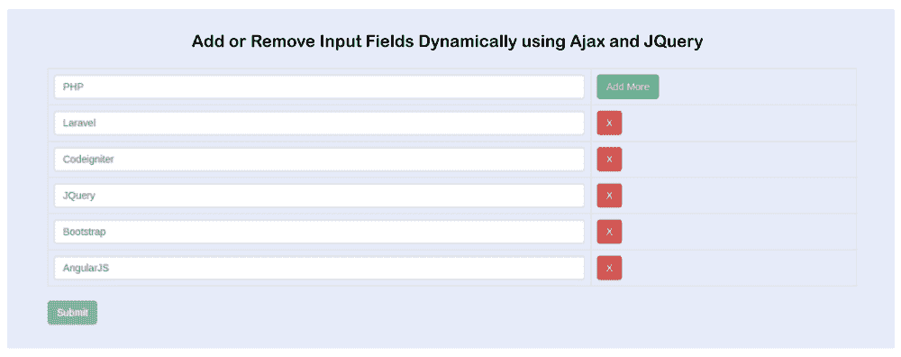

# 使用 JQuery Ajax 动态添加和删除输入字段

> 原文:[https://www . javatpoint . com/dynamic-add-remove-input-fields-use-jquery-Ajax](https://www.javatpoint.com/dynamically-add-remove-input-fields-using-jquery-ajax)

在本节中，我们将学习如何动态地从输入中添加和删除字段。我们将使用 Ajax、JQuery 和 PHP 来实现这一点。在下面的例子中，我们将使用 JQuery 来添加和删除字段，并将使用 PHP 将它们存储到数据库中。在我们的示例中，我们将处理动态添加的字段值。我们将使用 PHP Bootstrap 将其保存在 mysql 的数据库中。

假设客户端需要向数据库中添加多个值。在这种情况下，我们需要为它们添加更多的功能。如果我们想让我们的表单更加有趣和有吸引力，我们可以向用户提供“+”按钮，通过该按钮，他们一次可以输入多个值。为了进行这项工作，我们将使用分步过程，描述如下:

**第一步:**

在这一步中，我们将进入**创建数据库表**。为此，我们将创建一个名为“test”的数据库，我们还将创建一个名为“tagslist”的表，该表将包含两列 id 和名称。之后，我们将使用下面的 sql 查询轻松创建“tagslist”表。

**SQL 查询:**

```

CREATE TABLE IF NOT EXISTS `tagslist` (
  `id` int(10) unsigned NOT NULL AUTO_INCREMENT,
  `name` varchar(255) COLLATE utf8mb4_unicode_ci NOT NULL,
  PRIMARY KEY (`id`)
) ENGINE=InnoDB  DEFAULT CHARSET=utf8mb4 COLLATE=utf8mb4_unicode_ci AUTO_INCREMENT=24 ;

```

**第二步:**

在这一步中，我们将创建**index.php 文件**。在这个文件中，我们将创建包含按钮和输入文本框的表单。我们还将通过在 JQuery 中编写以下代码来添加更多的字段。因此，我们将使用 index.php 文件，并在其中添加以下代码:

**index.php:**

```

<!DOCTYPE html>
<html>
<head>
    <title> Add or Remove input fields Dynamically using Ajax and JQuery</title>
    <link rel="stylesheet" href="https://maxcdn.bootstrapcdn.com/bootstrap/3.3.6/css/bootstrap.min.css" />  
    <script src="//ajax.googleapis.com/ajax/libs/jquery/1.12.4/jquery.min.js"></script>
    <script src="https://maxcdn.bootstrapcdn.com/bootstrap/3.3.6/js/bootstrap.min.js"></script>
</head>
<body>

<div class="container">
    <h2 align="center"> Add or Remove Input Fields Dynamically using Ajax and JQuery </h2>  
    <div class="form-group">
         <form name="add_name" id="add_name">

            <div class="table-responsive">  
                <table class="table table-bordered" id="dynamic_field">  
                    <tr>  
                        <td><input type="text" name="name[]" placeholder="Enter your Name" class="form-control name_list" required="" /></td>  
                        <td><button type="button" name="add" id="add" class="btn btn-success">Add More</button></td>  
                    </tr>  
                </table>  
                <input type="button" name="submit" id="submit" class="btn btn-info" value="Submit" />  
            </div>

         </form>  
    </div> 
</div>

<script type="text/javascript">
    $(document).ready(function(){      
      var postURL = "/addmore.php";
      var i=1;  

      $('#add').click(function(){  
           i++;  
           $('#dynamic_field').append('<tr id="row'+i+'" class="dynamic-added"><td><input type="text" name="name[]" placeholder="Enter your Name" class="form-control name_list" required /></td><td><button type="button" name="remove" id="'+i+'" class="btn btn-danger btn_remove">X</button></td></tr>');  
      });

      $(document).on('click', '.btn_remove', function(){  
           var button_id = $(this).attr("id");   
           $('#row'+button_id+'').remove();  
      });  

      $('#submit').click(function(){            
           $.ajax({  
                url:postURL,  
                method:"POST",  
                data:$('#add_name').serialize(),
                type:'json',
                success:function(data)  
                {
                  	i=1;
                  	$('.dynamic-added').remove();
                  	$('#add_name')[0].reset();
    				        alert('Record Inserted Successfully.');
                }  
           });  
      });

    });  
</script>
</body>
</html>

```

**第三步:**

在这一步中，我们将创建**addmore.php 文件**。我们将使用 MySQL 查询来输入数据库数据。因此，我们将使用 addmore.php 文件，并在其中添加以下代码:

add more . PHP:

```

<?php

	define (DB_USER, "root");
	define (DB_PASSWORD, "root");
	define (DB_DATABASE, "test");
	define (DB_HOST, "localhost");
	$mysqli = new mysqli(DB_HOST, DB_USER, DB_PASSWORD, DB_DATABASE);

	if(!empty($_POST["name"])){

		foreach ($_POST["name"] as $key => $value) {
			$sql = "INSERT INTO tagslist(name) VALUES ('".$value."')";
			$mysqli->query($sql);
		}
		echo json_encode(['success'=>'Names Inserted successfully.']);
	}

?>

```

现在我们上面的代码已经准备好了，我们可以运行它了。当我们运行它时，将生成以下输出:



* * *