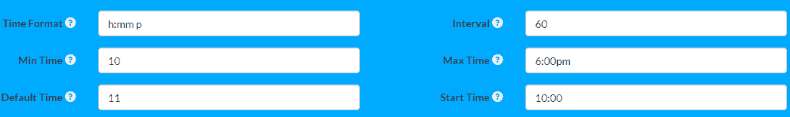

# jQuery Timepicker

> 哎哎哎:# t0]https://www . javatppoint . com/jquery-time picker

Javascript 是一种庞大的编程语言，支持大量增强它的库和框架。它还支持多个插件与您的源代码。

jQuery 是一个众所周知的 **Javascript 库**，它是一个超轻量级的，有点“少写多做”的库。它通常用于增强我们网站上 Javascript 的使用。jQuery 接受了很多常见的任务，这些任务可能需要 100 行的 Javascript。 [jQuery](https://www.javatpoint.com/jquery-tutorial) 帮助 Javascript 实现这些需要很少努力的任务，并将它们绑定到简单的方法中，这样您就可以在一行代码中轻松使用它们。

**jQuery Timepicker** 一般是一个插件，让用户增强标准表单输入字段，从而帮助用户选择不同类型的不同时间。类型通常取决于用户。因此，jQuery 解析经常使用的时间表示，允许我们和用户编写他们输入时间的方便方法。

要在 jQuery 中使用 Timepicker，您需要添加两个名为 **jquery.timepicker.min.js** 和**jQuery . time picker . min . CSS**的文件。使用这些文件的原因是将它们用作**插件**工具。更准确地说，如果您的文档中有任何输入元素，Timepicker 类可以通过初始化插件来利用该元素。这个插件负责不同类型的屏幕尺寸，无论是电脑还是手机。要初始化插件，您需要使用下面的代码。

```

$(document).ready(function()
{
    $('input.timepicker').timepicker({});
});

```

上面的代码专门用于移动和标签等远程设备，尽管还有很多其他方法可以安装 jQuery Timepicker 所需的插件。请考虑以下步骤，这些步骤将帮助您根据您的系统进行安装。

```

 NPM

  $ npm i juery-timepicker

Bower

bower install jquery-timepicker-wvega --save

```

你可以选择 HTML 代码来获得插件。考虑下面添加插件的代码。

将此代码包含在 [<头>标签](https://www.javatpoint.com/html-head)中。

```

 <link rel="stylesheet" 
href="//cdnjs.cloudflare.com/ajax/libs/timepicker/
1.3.5/jquery.timepicker.min.css">

```

将此包含在 [<身体>标签](https://www.javatpoint.com/html-body-tag)中。

```

<script src="//cdnjs.cloudflare.com/ajax/libs/timepicker/1.3.5/jquery.timepicker.min.js">
</script>

```

除了以上步骤，还可以从 [GitHub](https://www.javatpoint.com/github) 下载扩展。

虽然您可以使用以上两个文件创建用户界面时间选择器。您可以自定义 [HTML](https://www.javatpoint.com/html-tutorial) 和 [CSS](https://www.javatpoint.com/css-tutorial) 代码，以可视化 Timepicker 所做工作的影响。为了更好地理解这一点，您需要定义一个脚本和一个余像来显示 Timepicker 为您做了什么。您可以根据自己的需求轻松选择时间、日期和时间，并使用 HTML 和 CSS 添加更多功能。请参考下面的示例代码和图片。

```

$('.timepicker').timepicker
(
    {
    timeFormat: 'h:mm p',
    interval: 60,
    minTime: '10',
    maxTime: '6:00pm',
    defaultTime: '11',
    startTime: '10:00',
    dynamic: false,
    dropdown: true,
    scrollbar: true
    }
);

```

上面的代码包含在 HTML 和 CSS 模块中。如上所述，考虑下面显示时间选择器格式的图像。



您可以可视化时间选择器如何平衡上面代码中定义的格式。在此创建的用户界面只是为了让您更好地理解。jQuery Timepicker 将允许您更改这些时间格式以及定义的参数。同样，您也可以使用**日期选择器**。

### 例子

再考虑一个可能有助于你更好理解的例子。

```

  <!-- jQuery library -->
<script src="https://ajax.googleapis.com/ajax/libs/jquery/3.3.1/jquery.min.js"></script>
OR
<!-- jQuery timepicker library -->
<link rel="stylesheet" href="jquery-timepicker/jquery.timepicker.min.css">
<script src="jquery-timepicker/jquery.timepicker.min.js">
</script>

```

上面的代码将为您建立一个 timepicker 插件。

下一个任务是使用 HTML 建立输入字段，如下所示。

```

<input type="text" id="time"/>

```

接下来，您需要使用 JavaScript 将输入字段指定为时间选择器选择器，如图所示。

```

$(document).ready(function(){
    $('#time').timepicker();
});

```

现在，您需要做的就是在上面的输入字段中为您的代码提供默认时间。这可以通过使用下面的代码来完成。

```

$(document).ready(function(){
    $('#time').timepicker({
        timeFormat: 'h:mm p',
        interval: 15,
        minTime: '10',
        maxTime: '6:00pm',
        startTime: '10:00',
        defaultTime: '11'
    });
});

```

使用 jQuery 时间选择器插件，您可以轻松地在 HTML 元素中添加时间选择器功能。此外，您可以使用一些高级配置选项来根据需要扩展 timepicker，以便将 datepicker 和 timepicker 添加到输入字段中。

如果您对项目中的时间选择器非常严格，您可以进一步添加一些高级功能。此外，像 datapicker 这样的其他因素也可以与上述代码一起使用，让您的 timepicker 以通用格式显示时间和日期。

## 摘要

jQuery Timepicker 被用作网络项目的插件。我们讨论了配置它的步骤以及从不同类型的来源进行安装。我们还研究了 jQuery Timepicker 是最佳选择的小后果及其术语。此外，我们还遇到了与 HTML 和 CSS 基本相关的用户界面组件，这些组件对于观察 Timepicker 以真实方式做什么非常重要。jQuery timepicker 经常与标准输入表单和选择表单一起使用，这些表单可能包含时间间隔。

* * *