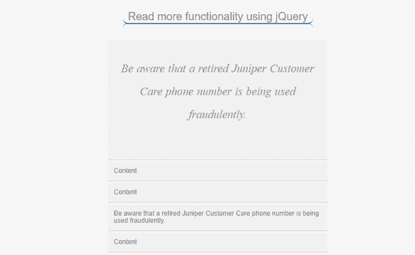

# 使用 jQuery 阅读更多功能

> 原文:[https://www . javatpoint . com/read-more-functional-use-jquery](https://www.javatpoint.com/read-more-functionality-using-jquery)

在本文中，我们将借助各种示例在 jQuery 中创建 read more 功能。在本文的开头，我们将了解 jQuery 的基础知识，并阅读更多的功能。之后，我们会理解这篇文章，用几个例子。

## jQuery 是什么意思？

jQuery 中使用了“读取更多”功能，以便在用户单击“读取更多”按钮时加载更多数据。[引入 JQuery](https://www.javatpoint.com/jquery-tutorial) 来简化 [HTML](https://www.javatpoint.com/html-tutorial) DOM 树的遍历和操纵以及事件处理、 [CSS 动画](https://www.javatpoint.com/css-animation)和 [Ajax](https://www.javatpoint.com/ajax-tutorial) 。它是免费的开源软件。

**我们来举几个借助 jQuery 多读的例子。**

## 例 1:

```

<! DOCTYPE html>
<html>
<head>
<title> Read more functionality using jQuery
</title>
<style>
   @import url(https://fonts.googleapis.com/css?family=Open+Sans:400,700);
body {
    background-color: #f6f6f6;
    width: 400px;
    margin: 20px auto;
    font: normal 13px/100% sans-serif;
    color: #444;
}
h1 {
 font-size: 32px; 
margin-bottom: 50px;
}
h1.sixth {
 position: relative;
 }
h1.sixth:before {
content: '[';
	display: inline-block;
	position: relative;
	top: 1px;
	font-size: 1.25em;
	color: black;
	transition: all 0.5s ease;
}
h1.sixth:after {
	content: '[';
	display: inline-block;
	position: relative;
	top: 1px;
	font-size: 1.25em;
	color: black;
	transition: all 0.5s ease;
}
h1.sixth:after { content: ']';  }
h1.sixth:hover:before { 
	transform: translateX(-5px);
}
h1.sixth:hover:after { 
	transform: translateX(5px);
}
h3.second {
	font-weight: 800;
	font-size:30px;
}
* {
    color: #7F7F7F;
    font-family: Arial, sans-serif;
    font-size: 12px;
    font-weight: normal;
}
h3.second span {
	position: relative;
	display: inline-block;
	padding: 5px 10px ;
	border-radius: 10px;
	font-size: 20px;
	border-bottom: 2px solid #33739E;
}
h3.second span:after {
	content: '';
	position: absolute;
	bottom: calc(-100% - 1px);
	margin-left: -10px;
	display: block;
	width: 100%; height: 100%;
	border-radius: 10px;
	border-top: 1px solid #33739E;
	font-weight: bold;
}
div {
    display:none;
    padding: 10px;
    border-width: 0 1px 1px 0;
    border-style: solid;
    border-color: #fff;
    box-shadow: 0 1px 1px #ccc;
    margin-bottom: 5px;
    background-color: #f1f1f1;
}
.totop {
    position: fixed;
    bottom: 10px;
    right: 20px;
}
.totop a {
    display: none;
}
a {
    color: #33739E;
    text-decoration: none;
    display: block;
    margin: 10px 0;
}
a:visited {
    color: #33739E;
    text-decoration: none;
    display: block;
    margin: 10px 0;
}
a:hover {
    text-decoration: none;
}
#loadMore {
    padding: 10px;
    text-align: center;
    background-color: #33739E;
    color: #fff;
    border-width: 0 1px 1px 0;
    border-style: solid;
    border-color: #fff;
    box-shadow: 0 1px 1px #ccc;
    transition: all 600ms ease-in-out;
    -webkit-transition: all 600ms ease-in-out;
    -moz-transition: all 600ms ease-in-out;
    -o-transition: all 600ms ease-in-out;
}
#loadMore:hover {
    background-color: #fff;
    color: #33739E;
}
.six h1 {
  text-align: center;
  color:#222; 
 font-size:30px; 
font-weight: 400;
 text-transform: uppercase;
 word-spacing: 1px;
 letter-spacing: 2px; 
color: #c50000;
}
.six h1 span {
  line-height :2em; 
 padding-bottom:15px;
  text-transform: none;
  font-size:.7em;
  font-weight: normal;
  font-style: italic; 
font-family:  "Playfair Display","Bookman",serif;
 color: #999; 
letter-spacing: -0.005em; 
word-spacing: 1px;
  letter-spacing: none;
}
.six h1:after, .six h1:before {
  position: absolute;
  left: 0;
  bottom: 0;
  width: 45px;
  height: 4px;
  content: "";
  right: 45px; 
  margin:auto;
  background-color: #ccc;
}
.six h1:before { 
background-color: #d78b8b;
  left: 45px; width: 90px;
}
</style>
</head>
<body>
<h1 align="center" class="sixth"> Example </h1>		   
<h3 align="center" class="second"> <span> Read more functionality using jQuery </span> </h3>  
<div class="six">
  <h1> 
    <span> Be aware that a retired Juniper Customer Care phone number is being used fraudulently.  </span>
  </h1>
</div>
<div> Content </div>
<div> Content </div>
<div> Be aware that a retired Juniper Customer Care phone number is being used fraudulently. </div>
<div> Content </div>
<div> Content </div>
<div> Content </div>
<div> Content </div>
<div> Be aware that a retired Juniper Customer Care phone number is being used fraudulently. </div>
<div> Content </div>
<div> Content </div>
<div> Content </div>
<a href="#" id="loadMore"> Read More </a>
<p class="totop"> 
    <a href="#top"> Back to top </a> 
</p>
<script src="https://cdnjs.cloudflare.com/ajax/libs/jquery/2.1.3/jquery.min.js"> </script> 
<script type="text/javascript">
$(function () {
    $("div").slice(0, 4).show();
    $("#loadMore").on('click', function (e) {
        e.preventDefault();
        $("div:hidden").slice(0, 4).slideDown();
        if ($("div:hidden").length == 0) {
            $("#load").fadeOut('slow');
        }
        $('html,body').animate({
            scrollTop: $(this).offset().top
        }, 1500);
    });
});
$('a[href=#top]').click(function () {
    $('body,html').animate({
        scrollTop: 0
    }, 600);
    return false;
});
$(window).scroll(function () {
    if ($(this).scrollTop() > 50) {
        $('.totop a').fadeIn();
    } else {
        $('.totop a').fadeOut();
    }
});
</script>
</body>
</html>

```

**说明:**

在上面的例子中，我们在 jquery 中创建了 read more 功能。

**输出:**

当用户点击阅读更多按钮时，将显示以下输出。



## 例 2:

```

<! DOCTYPE html>
<html>
<head>
<title> Read more functionality using jQuery
</title>
<style>
  @import url('https://fonts.googleapis.com/css?family=Raleway');
#text {
display: none;
}
.btn-container {
  margin: auto;
  height: 44px;
  width: 166.23px;
}
a:active {
  color:#ffd323;
}
body {
   background-color: aqua;
}
button {
  user-select: none;
  -webkit-user-select: none;
  -moz-user-select: none;
  -ms-user-select: none;
  cursor: pointer;
  border: none;
  padding: 8px;
  font-size: 20px;
  background: linear-gradient(141deg, #0fb8ad 0%, #1fc8db 51%, #2cb5e8 75%);
  color: white;
  font-family: cursive;
  box-sizing: border-box;
}
body {
  font-family: 'Raleway',monospace;
  font-size: 20px;
  color: white;
}
.five h1 {
  text-align: center;
  font-size: 22px;
  font-weight: 700; 
   color: #202020;
  text-transform: uppercase;
  word-spacing: 1px; 
 letter-spacing: 2px;
}
h1 {
  position: relative;
  padding: 0;
  margin: 10;
  font-family: "Raleway", sans-serif;
  font-weight: 300;
  font-size: 40px;
  color: #080808;
  -webkit-transition: all 0.4s ease 0s;
  -o-transition: all 0.4s ease 0s;
  transition: all 0.4s ease 0s;
}
h1 span {
  display: block;
  font-size: 0.5em;
  line-height: 1.3;
}
h1 em {
  font-style: normal;
  font-weight: 600;
}
.five h1 span {
  margin-top: 40px;
  text-transform: none;
  font-size:.75em;
  font-weight: normal;
  font-style: italic; font-family: "Playfair Display","Bookman",serif;
  color: #999; 
 letter-spacing: -0.005em; 
word-spacing: 1px;
  letter-spacing: none;
}
.five h1:before {
  position: absolute;
  left: 0;
  bottom: 38px;
  width: 60px;
  height: 4px;
  content: "";
  left: 50%;
  margin-left: -30px;
  background-color: #dfdfdf;
}
</style>
</head>
<body>
<div class="five">
  <h1> Example 
    <span> Read more functionality using jQuery </span>
  </h1>
</div>
Cascading Style Sheets (CSS) is a style sheet language used for describing the presentation of a document written in a markup language. Although most often used to set the visual style of web pages and user interfaces written in HTML and XHTML, the language can be applied to any XML document, including plain XML, SVG, and XUL, and applies to rendering in speech or on other media. Along with HTML and JavaScript.
<div>
  <br>
 <span id="text"> CSS is designed primarily to enable the separation of document content from document presentation, including aspects such as the layout, colors, and fonts. 
<br>
  </span>
</div>
<div class="btn-container">
<button id="toggle"> Read More </button>
</div>	
<script src="https://cdnjs.cloudflare.com/ajax/libs/jquery/2.1.3/jquery.min.js"> </script> 
<script type="text/javascript">
$(document).ready(function() {
  $("#toggle").click(function() {
    var elem = $("#toggle").text();
    if (elem == "Read More") {
      //Stuff to do when btn is in the read more state
      $("#toggle").text("Read Less");
      $("#text").slideDown();
    } else {
      //Stuff to do when btn is in the read less state
      $("#toggle").text("Read More");
      $("#text").slideUp();
    }
  });
  $('a[href=#top]').click(function () {
    $('body,html').animate({
        scrollTop: 0
    }, 600);
    return false;
});
});
</script>
</body>
</html> 

```

**说明:**

在上面的例子中，我们在 jQuery 中创建了一个 read more 功能。当用户点击“阅读更多”按钮时，文本被加载。

**输出:**

下面是这个例子的输出


* * *