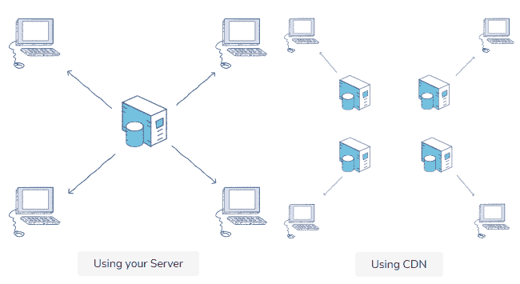

# jQuery CDN

> 哎哎哎:# t0]https://www . javatppoint . com/jquery-cdn

在本文中，我们将学习与 jQuery 相关的 CDN，但让我们回忆一下 jQuery 是什么。jQuery 是一个 JavaScript 库，主要用于操纵事件处理、使用 CSS 和 Ajax 的动画、HTML DOM 遍历等。它是运行在麻省理工学院许可证上的免费开源软件，受到 1000 万个热门网站中近 73%的信任。现在让我们更多地学习 CDN。

[jQuery](https://www.javatpoint.com/jquery-tutorial) 中的 CDN 代表**内容分发网络**。CDN 的主要目的是包含 jQuery，而不必实际下载或保存在我们网站的网站文件夹中。如今市场上有很多这样的 jQuery CDNs。例如 **Cloudflare、jQuery 的 CDN、谷歌和微软的 CDN** 等。

CDN 只不过是交付或分发网络，无论它是代理服务器及其数据中心的地理分布网络。CDN 的主要目的是为终端用户提供高度可扩展的性能和相关服务分发的可用性。让我们通过使用目前可用的不同类型的选项来发现一些探索 jQuery CDN 的流行方法。在继续使用 jQuery CDN 之前，让我们进行本地安装，以便在我们的系统上正确使用它。



## 装置

通常，jQuery 在网上有两个可下载的版本。它们是:

**制作版**:是你直播网站的压缩缩小版。

**开发人员版本**:主要用于开发和测试可读和压缩代码等成熟的操作。

#### 注意:建议在编程或调试时使用未压缩版本，对于带宽和性能提升等任务，建议使用压缩版本。

下一个任务是使用下面显示的步骤进行设置。

```js

<head>
<script src="jquery-3.5.1.min.js"></script>
</head>

```

将 jQuery 设置到您的 HTML 文件中后，继续包含下面的代码。

```js

<html>
   <head>
      <title>jQuery Setup</title>
      <script type = "text/javascript" src = "/jquery/jquery-3.5.1.min.js">
      </script>
   </head>
   <body>
      <h1>jQuery Setup</h1>
   </body>
</html>

```

现在，您可以按照下面的步骤使用 jQuery CDN。

您可以从 CDN 将 jQuery 库直接包含到您的 index.html 代码中。如果我们谈论谷歌，考虑下面的 HTML 代码，用于将 jQuery CDN 导入到您的 [HTML](https://www.javatpoint.com/html-tutorial) 代码中。

```js

<html>
   <head>
      <title>The jQuery Example</title>
      <script type = "text/javascript" 
src="https://ajax.googleapis.com/ajax/libs/jquery/2.1.3/jquery.
min.js">
      </script>

      <script type = "text/javascript">
         $(document).ready(function(){
            document.write("Hello, JavaTpoint");
         });
      </script>
   </head>

   <body>
      <h1>Hello</h1>
   </body>
</html>

```

同样，您可以为微软使用 jQuery CDN，如下所示。保留上面显示的代码，只需更改标题标签下的网址，如下所示。

```js

<html>
   <head>
      <title>The jQuery Example</title>
      <script type = "text/javascript" 
src="http://ajax.aspnetcdn.com/ajax/jQuery/jquery-
3.2.1.min.js">
      </script>

      <script type = "text/javascript">
         $(document).ready(function(){
            document.write("Hello, JavaTpoint");
         });
      </script>
   </head>

   <body>
      <h1>Hello</h1>
   </body>
</html>

```

对于 **Cloudflare** ，请考虑以下网址:

```js

<html>
   <head>
      <title>The jQuery Example</title>
      <script type = "text/javascript" 
src="https://cdnjs.cloudflare.com/ajax/libs/jquery/3.2.1/jquery.
min.js">
      </script>

      <script type = "text/javascript">
         $(document).ready(function(){
            document.write("Hello, JavaTpoint");
         });
      </script>
   </head>

   <body>
      <h1>Hello</h1>
   </body>
</html>

```

## 使用 jQuery CDN 的优缺点

### 优点:

使用 jQuery CDN 的优势如下:

1.  减少您网站上的负载，因为 jQuery 文件将从 CDN 加载，而不是从您的网站加载。CDN 将通过从 CDN 而不是直接从网站加载数据来减少您网站的负载。它将提高网站的整体性能。
2.  CDN 的另一个优势是它提供的速度和灵活性，因为它不直接从网站加载它，从而用最近位置的概念吸引用户。CDN 由大量高负载平衡算法和数据服务器提供动力，确保 jQuery 以闪电般的速度得到服务。

### 缺点:

使用 jQuery CDN 的缺点如下:

1.  在用 CDN 托管 jQuery 时，可能会出现阻塞的情况，因为在用户的连接上启用了过滤器和代理服务。
2.  在大多数浏览器启用的超时属性(准确地说是 30 秒)的情况下，jQuery 可能会失去平衡。

## 摘要

在本教程中，我们从零开始学习如何设置 jQuery 与 CDN 一起使用，而不是从您的常规网站。我们还了解了内容交付网络的整体架构，以及它如何提高加载性能。我们可能已经熟悉了 HTML 和 [CSS](https://www.javatpoint.com/css-tutorial) ，与 jQuery 一起，CDN 将帮助它们增强负载平衡因子，从而有效地提高速度，而不是依赖于网站。我们还遇到了各种各样的安装技术，无论是谷歌**、微软还是 Cloudflare** ，以及如何将它们包含在我们的 HTML 文件的 [<头>标签](https://www.javatpoint.com/html-head)中。最后，我们遇到了使用 jQuery 的优点和缺点，并讨论了应该在什么基础上使用它以及应该在什么时候实现它。

因此，jQuery CDN 是一个独特的工具包，用于提供有价值的负载平衡支持，同时管理对最终用户的相关交付服务。

* * *