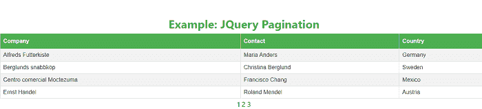
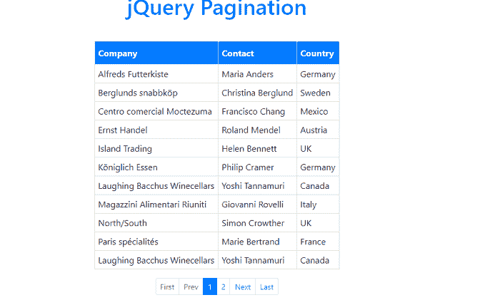
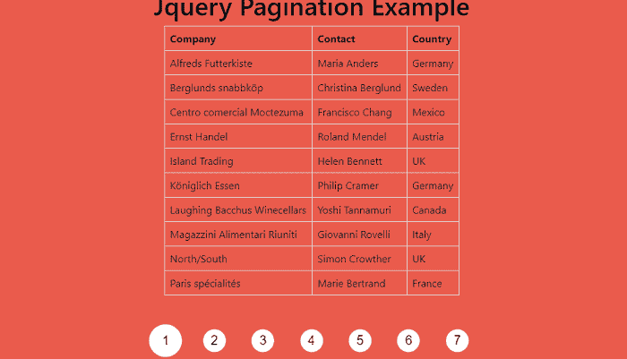

# JQuery 页面

> 哎哎哎:# t0]https://www . javatpoint . com/jquery-page

在本文中，我们将学习如何在 jQuery 中添加分页。在本文的开头，我们将了解 jQuery 的基本含义，分页。之后，我们将借助 jQuery 中的各种示例来创建分页。

## jQuery 是什么意思？

JQuery 是一个快速、轻量级、小型且功能丰富的 JavaScript 库。

为了在 HTML 页面中包含 [jQuery](https://www.javatpoint.com/jquery-tutorial) 库，我们可以使用 [<脚本>标记](https://www.javatpoint.com/html-script-tag)。下面的库用于将 jQuery 包含在 [HTML](https://www.javatpoint.com/html-tutorial) 页面中。

**<脚本 src = " https://code . jquery . com/jquery-3 . 5 . 1 . min . js ">**

**</剧本>**

## 你说的分页是什么意思？

也叫**分页**。在这种情况下，我们可以将网页分成离散的部分。换句话说，我们可以说**分页**是一种为用户提供浏览给定文章的单个部分的附加导航选项的方法。报告的详细信息通常由数字、箭头以及“上一个”和“下一个”按钮表示。

在本文中，我们将在 jQuery 的帮助下创建分页。

**我们举几个在 JQuery 中如何创建分页的例子。**

**例 1:** 如何在 JQuery 中创建分页。

```js

<html>
<head>
<title>
jQuery pagination
</title>
<meta name="viewport" content="width=device-width, initial-scale=1">
<head>
<link rel="stylesheet" href="https://maxcdn.bootstrapcdn.com/bootstrap/4.0.0/css/bootstrap.min.css">
<style>
#data tr {
  display: none;
}
.page {
margin-top: 50px;
}
table, th, td {
  border: 1px solid black;
}
#data {
  font-family: Arial, Helvetica, sans-serif;
  border-collapse: collapse;
  width: 100%;
}
#data td, #data th {
  border: 1px solid #ddd;
  padding: 8px;
}
#data tr:nth-child(even){ background-color: #f2f2f2; }

#data tr:hover {
background-color: #ddd;
}
#data th {
  padding-top: 12px;
  padding-bottom: 12px;
  text-align: left;
  background-color: #4CAF50;
  color: white;
}
h2 {
color: #4CAF50;
}
#nav a {
color: #4CAF50;
font-size: 20px;
margin-top: 22px;
font-weight: 600;
}
a:hover, a:visited, a:link, a:active {
    text-decoration: none;
}
</style>
<script src="https://code.jquery.com/jquery-3.5.1.min.js"> </script>
<script>
$(document).ready (function () {
    $('#data').after ('<div id="nav"></div>');
    var rowsShown = 5;
    var rowsTotal = $('#data tbody tr').length;
    var numPages = rowsTotal/rowsShown;
    for (i = 0;i < numPages;i++) {
        var pageNum = i + 1;
        $('#nav').append ('<a href="#" rel="'+i+'">'+pageNum+'</a> ');
    }
    $('#data tbody tr').hide();
    $('#data tbody tr').slice (0, rowsShown).show();
    $('#nav a:first').addClass('active');
    $('#nav a').bind('click', function() {
    $('#nav a').removeClass('active');
   $(this).addClass('active');
        var currPage = $(this).attr('rel');
        var startItem = currPage * rowsShown;
        var endItem = startItem + rowsShown;
        $('#data tbody tr').css('opacity','0.0').hide().slice(startItem, endItem).
        css('display','table-row').animate({opacity:1}, 300);
    });
});
</script>
</head>
<body>
<div class ="page" align="center">
<h2> <b> Example:  JQuery Pagination </b> </h2>
<table id="data" align="center">
<tr>
    <th>Company</th>
    <th>Contact</th>
    <th>Country</th>
  </tr>
  <tr>
    <td>Alfreds Futterkiste</td>
    <td>Maria Anders</td>
    <td>Germany</td>
  </tr>
  <tr>
    <td>Berglunds snabbk?p</td>
    <td>Christina Berglund</td>
    <td>Sweden</td>
  </tr>
  <tr>
    <td> Centro Moctezuma</td>
    <td>Francisco Chang</td>
    <td>Mexico</td>
  </tr>
  <tr>
    <td>Ernst Handel</td>
    <td>Roland Mendel</td>
    <td>Austria</td>
  </tr>
  <tr>
    <td>Island Trading</td>
    <td>Helen Bennett</td>
    <td>UK</td>
  </tr>
  <tr>
    <td>K?niglich Essen</td>
    <td>Philip Cramer</td>
    <td>Germany</td>
  </tr>
  <tr>
    <td>Laughing Bacchus Winecellars</td>
    <td>Yoshi Tannamuri</td>
    <td>Canada</td>
  </tr>
  <tr>
    <td>Magazzini Alimentari Riuniti</td>
    <td>Giovanni Rovelli</td>
    <td>Italy</td>
  </tr>
  <tr>
    <td>North/South</td>
    <td>Simon Crowther</td>                                                                                                                                                                                                                                                                                                                                                                                                                                                              
    <td>UK</td>
  </tr>
  <tr>
    <td> Paris specialties</td>
    <td> Marie Bertrand</td>
    <td> France</td>
  </tr>
</table>
 </div>
</body>
</html>

```

**输出:**

下面给出了这个例子的输出。



**例 2:** 如何在 JQuery 中创建分页。

```js

<html>
<head>
<title>
JQuery Pagination
</title>
<meta name="viewport" content="width=device-width, initial-scale=1">
<head>
<link rel="stylesheet" href="https://maxcdn.bootstrapcdn.com/bootstrap/4.0.0/css/bootstrap.min.css">
<style>
.wrapper {
  margin: 30px auto;
  text-align: center;
}
h1 {
  margin-bottom: 1em;
 color: #007bff;
}
#pagination-demo {
  display: inline-block;
  margin-bottom: 1em;
  margin-top: 1em;
}
#pagination-demo li {
  display: inline-block;
}
#data td, #data th {
  border: 1px solid #ddd;
  padding: 6px;
}
#data tr:hover { 
background-color: #ddd;
}
.page-content {
  background: #eee;
  display: inline-block;
  padding: 10px;
  width: 100%;
  max-width: 660px;
}
#data th {
  padding-top: 10px;
  padding-bottom: 10px;
  text-align: left;
  background-color: #007bff;
  color: white;
}
table, th, td {
  border: 1px solid black;
}
#page-content {
color: white;
 background-color: #007bff;
}
</style>
<script src="https://code.jquery.com/jquery-3.5.1.min.js"> </script>
<script src = "https://cdnjs.cloudflare.com/ajax/libs/twbs-pagination/1.4.1/jquery.twbsPagination.min.js"> </script>
<script>
$(function () {
$("#pagination-demo").twbsPagination({
  totalPages: 16,
  visiblePages: 2,
  next: "Next",
  prev: "Prev",
  onPageClick: function (event, page) {
    //fetch content and render here
    $("#page-content").text ("Page? + page) + ?content here";
  }
});
});
</script>
<body>
<div class="wrapper">
  <div class="container">
  <div class="row">
  <div class="col-sm-12">
  <h1> jQuery Pagination </h1>
 <table id="data" align="center">
 <tr>
    <th>Company</th>
    <th>Contact</th>
    <th>Country</th>
  </tr>
  <tr>
    <td> Alfreds Futterkiste</td>
    <td>Maria Anders</td>
    <td>Germany</td>
  </tr>
  <tr>
    <td>Berglunds snabbk?p</td>
    <td>Christina Berglund</td>
    <td>Sweden</td>
  </tr>
  <tr>
    <td>Centro comercial Moctezuma</td>
    <td>Francisco Chang</td>
    <td>Mexico</td>
  </tr>
  <tr>
    <td>Ernst Handel</td>
    <td>Roland Mendel</td>
    <td>Austria</td>
  </tr>
  <tr>
    <td>Island Trading</td>
    <td>Helen Bennett</td>
    <td>UK</td>
  </tr>
  <tr>
    <td>K?niglich Essen</td>
    <td>Philip Cramer</td>
    <td>Germany</td>
  </tr>
  <tr>
    <td>Laughing Bacchus Winecellars</td>
    <td>Yoshi Tannamuri </td>
    <td>Canada</td>
  </tr>
  <tr>
    <td> Magazzini Alimentari </td>
    <td> Giovanni Rovelli</td>
    <td>Italy</td>
  </tr>
  <tr>
    <td>North/South</td>
    <td>Simon Crowther</td>
    <td>UK</td>
  </tr>
  <tr>
    <td>Paris specialties</td>
    <td>Marie Bertrand</td>
    <td>France</td>
  </tr>
  <tr>
    <td>Laughing Bacchus Winecellars</td>
    <td>Yoshi Tannamuri</td>
    <td>Canada</td>
  </tr>

</table>
        <ul id="pagination-demo" class="pagination-sm">
</ul>
      </div>
    </div>
 <div id="page-content" class="page-content"> Page 1</div>
  </div>
</div>
</body>
</html>

```

**输出:**

下面给出了这个例子的输出。



**例 3:** 如何在 JQuery 中创建分页。

```js

<html>
<head>
<title>
jquery pagination
</title>
<meta name="viewport" content="width=device-width, initial-scale=1">
<head>
<link rel="stylesheet" href="https://maxcdn.bootstrapcdn.com/bootstrap/4.0.0/css/bootstrap.min.css">
<style>
.header-pen {
  text-align: center;
  margin-top: 10px;
}
.header-pen a {
  font-size: 35px;
  color: #fff;
  font-style: italic;
  text-decoration: none;
  border-bottom: 1px solid #fff;
}
.footer-pen {
  position: fixed;
  bottom: 0px;
  left: 0px;
  width: 100%;
  padding: 10px 0px;
  background: #fff;
  text-align: center;
  font-size: 18px;
  color: #333;
}
.footer-pen a {
  color: #000000;
}
h1 {
  margin-top: 1em;
 color: #000000;
}
body {
  margin: 0;
  background: #e95b4d;
}

.container {
  position: absolute;
  left: 50%;
  margin-top: 20px;
  transform: translate(-50%, 0%);
}

.fltr {
  filter: url("#gooey");
  -webkit-filter: url("#gooey");
  -moz-filter: url("#gooey");
  margin-top: 50px;
  left: 50%;
  position: fixed;
  transform: translateX(-50%);
}

.page-list {
  margin: 0;
  border-radius: 30px;
  display: inline-block;
  padding: 0px 0px;
  position: relative;
  z-index: 2;
}
.page-list li {
  background: #fff;
  border-radius: 50%;
  margin: 0px 15px;
  counter-increment: list;
  cursor: pointer;
  position: relative;
  z-index: 2;
  width: 41px;
  height: 41px;
  line-height: 41px;
  display: inline-block;
  text-align: center;
  color: #111;
  font-family: sans-serif;
  font-size: 20px;
}
.page-list li:after {
  content: "";
  content: counter(list);
}

.from-move {
  content: "";
  position: absolute;
  left: 7px;
  top: -7px;
  border-radius: 50%;
  z-index: 1;
  width: 55px;
  height: 55px;
  display: inline-block;
  transition: all 0.5s ease;
  background: #ffffff;
}
#data td, #data th {
  border: 1px solid #ddd;
  padding: 8px;
}
#data tr:hover {background-color: #ddd;}
.svg-flt {
  position: absolute;
}

.from-move.animate {
  animation: page-move 0.5s ease 0s forwards;
}
@keyframes page-move {
  0% {
    transform: scale(1, 1);
  }
  20% {
    transform: scale(1, 0.5);
  }
  40% {
    transform: scale(1, 0.5);
  }
  100% {
    transform: scale(1, 1);
  }
}

li.animate-right {
  animation: li-move-right 0.7s ease 0s forwards;
}
@keyframes li-move-right {
  0% {
    transform: translateX(0px);
  }
  20% {
    transform: translateX(20px);
  }
  40% {
    transform: translateX(-10px);
  }
  60% {
    transform: translateX(5px);
  }
  80% {
    transform: translateX(0px);
  }
  100% {
    transform: translateX(0px);
  }
}
li.animate-left {
  animation: li-move-left 0.7s ease 0s forwards;
}
@keyframes li-move-left {
  0% {
    transform: translateX(0px);
  }
  20% {
    transform: translateX(-20px);
  }
  40% {
    transform: translateX(10px);
  }
  60% {
    transform: translateX(-5px);
  }
  80% {
    transform: translateX(0px);
  }
  100% {
    transform: translateX(0px);
  }
}
</style>
<script src="https://code.jquery.com/jquery-3.5.1.min.js"> </script>
<script src="https://cdnjs.cloudflare.com/ajax/libs/jqueryui/1.12.1/jquery-ui.min.js"> </script>
<script>
$(function () {
$(".page-list li").click(function () {
  var delay = 0.05,
    init = 1;
  var li_ind = $(this).index();
  var li_ind_prev = $(".active").index();
  var li_length = $(this).length;
  var li_diff = li_ind - $(".active").index();
  var dur = Math.abs(li_diff);
  var left_pos = $(this).position().left + 7;
  $("#from-move").css({ left: left_pos });

  if (li_diff > 0) {
    for (i = li_ind_prev; i < li_ind; i++) {
      dur = delay * init;
      $("#page-list")
        .find("li")
        .eq(i)
        .addClass("animate-right")
        .css({ "animation-delay": dur + "s" });
      init = init + 1;
    }
  } else {
    for (i = li_ind_prev; i > li_ind; i--) {
      dur = delay * init;
      $("#page-list")
        .find("li")
        .eq(i)
        .addClass("animate-left")
        .css({ "animation-delay": dur + "s" });
      init = init + 1;
    }
  }
  $("#from-move").addClass("animate");

  $("#page-list li").removeClass("active");
  $(this).addClass("active");

  $("#from-move").bind(
    "webkitTransitionEnd otransitionend oTransitionEnd msTransitionEnd transitionend",
    function () {
      $("#from-move").removeClass("animate");
      $("#from-move").unbind(
        "webkitTransitionEnd otransitionend oTransitionEnd msTransitionEnd transitionend"
      );
    }
  );
  $(".page-list li").bind(
    "animationend webkitAnimationEnd oAnimationEnd MSAnimationEnd",
    function () {
      $(".page-list li").removeClass("animate-right").removeAttr("style");
      $(".page-list li").removeClass("animate-left").removeAttr("style");
      $("#page-list li").unbind(
        "animationend webkitAnimationEnd oAnimationEnd MSAnimationEnd"
      );
    }
  );
});
});
</script>
<body>
<div class="header-pen">
  <h1> Jquery Pagination Example </h1>
</div>
<table id="data" align="center">

  <tr>
    <th>Company</th>
    <th>Contact</th>
    <th>Country</th>
  </tr>
  <tr>
    <td>Alfreds Futterkiste</td>
    <td>Maria Anders</td>
    <td>Germany</td>
  </tr>
  <tr>
    <td>Berglunds snabbk?p</td>
    <td>Christina Berglund</td>
    <td>Sweden</td>
  </tr>
  <tr>
    <td>Centro comercial Moctezuma</td>
    <td>Francisco Chang</td>
    <td>Mexico</td>
  </tr>
  <tr>
    <td>Ernst Handel</td>
    <td>Roland Mendel</td>
    <td>Austria</td>
  </tr>
  <tr>
    <td>Island Trading</td>
    <td>Helen Bennett</td>
    <td>UK</td>
  </tr>
  <tr>
    <td>K?niglich Essen</td>
    <td>Philip Cramer</td>
    <td>Germany</td>
  </tr>
  <tr>
    <td>Laughing Bacchus Winecellars</td>
    <td>Yoshi Tannamuri</td>
    <td>Canada</td>
  </tr>
  <tr>
    <td>Magazzini Alimentari Riuniti</td>
    <td>Giovanni Rovelli</td>
    <td>Italy</td>
  </tr>
  <tr>
    <td>North/South</td>
    <td>Simon Crowther</td>
    <td>UK</td>
  </tr>
  <tr>
    <td>Paris sp?cialit?s</td>
    <td>Marie Bertrand</td>
    <td>France</td>
  </tr>

</table>

<div class="fltr">
  <span class="from-move" id="from-move"></span>
  <ul class="page-list" id="page-list">
    <li class="active"></li>
    <li></li>
    <li></li>
    <li></li>
    <li></li>
    <li></li>
    <li></li>
  </ul>
</div>

<svg  version="1.1" class="svg-flt">
  <defs>
    <filter id="gooey">
      <feGaussianBlur in="SourceGraphic" stdDeviation="10" result="blur"></feGaussianBlur>
      <feColorMatrix in="blur" mode="matrix" values="1 0 0 0 0  0 1 0 0 0  0 0 1 0 0  0 0 0 19 -9" result="goo"></feColorMatrix>
      <feComposite in="SourceGraphic" in2="goo" operator="atop"></feComposite>
    </filter>
  </defs>
</svg>
</body>
</html>

```

**输出:**

下面给出了这个例子的输出。



* * *