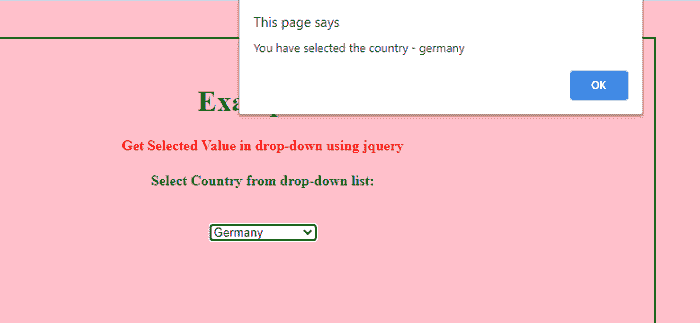
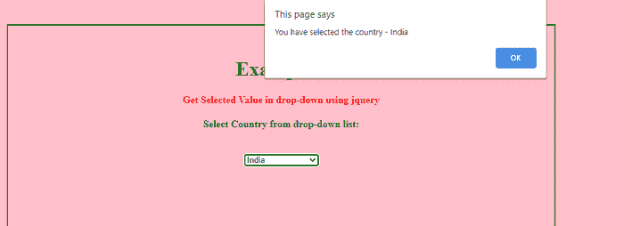

# 在 jQuery 的下拉列表中获取选定的值。

> 原文:[https://www . javatpoint . com/get-selected-value-in-下拉-in-jquery](https://www.javatpoint.com/get-selected-value-in-drop-down-in-jquery)

在本文中，我们将学习如何在 jQuery 的帮助下获取下拉列表中的选定值。首先，我们将使用 jQuery、 [jQuery 选择器](https://www.javatpoint.com/jquery-selectors)和 [jQuery val()方法](https://www.javatpoint.com/jquery-val)来理解这篇文章。之后，我们将借助各种例子来理解这个话题。

## jQuery 是什么意思？

[jQuery](https://www.javatpoint.com/jquery-tutorial) 是一个快速、轻量、小巧、功能丰富的 JavaScript 库。

**<脚本 src = " https://code . jquery . com/jquery-3 . 5 . 1 . min . js ">**

**</剧本>**

**使用 jQuery:** 选中的选择器结合 val()方法，在下拉列表中找到选中的选项值。

### jQuery 中的选择器:

它是一个应用声明的 HTML 元素。

**例如:**选中、勾选等。

Selected 用于在最初加载表单时指定默认选项。

### jQuery 中的 val()方法:

此方法用于获取表单元素的值或设置用于所选元素的属性值。

**语法:**

```

$(selector).val ();

```

**示例:**

```

$("input: text").val ("javaTpoint!");

```

## 带有<select>和<option>标签的下拉列表。</option></select>

选择和选项标签用于创建下拉菜单。它们允许用户从选项列表中选择一个或多个选项。所有的选项都没有显示在屏幕上，但是当他们拉下拉列表时，它们是可见的。它们用于节省空间，因为只显示列表中的一个项目。

创建下拉列表时， [<选择>标记](https://www.javatpoint.com/html-select-tag)代替 [<输入>标记](https://www.javatpoint.com/html-input-tag)。配对标签以开始<选择>标签开始，以结束标签</选择>结束。该标签必须与 [<选项>标签](https://www.javatpoint.com/html-option-tag)一起使用。

**语法:**

```

<select name = "select_list_name" size ="n" multiple>
<option value ="choice-name 1" selected> Text Label-1 </option>
<option value ="choice-name 2" selected> Text Label-2 </option>
…………………………………………………………………………………………………..
…………………………………………………………………………………………………..
</select>

```

**与<选择>标签一起使用的各种属性有:**

*   **多个:**用于设置<选择>标签接受多个选项。默认情况下，它可以采用用户选择的单个选项。要选择多个选项，用户必须在单击选项时按下 click。
*   **名称:**用于为下拉列表指定名称。

**与<选项>标签一起使用的各种属性有:**

*   **值:**用于指定表单提交时发送的值。如果在<选项>标签中省略了值属性，则使用<选项>标题内容。
*   **Selected:** 用于在浏览器中初始加载表单时指定预选选项。

以下示例用于从 jQuery 的下拉列表中获取选定的值。

### 例 1:

**如何在 jQuery 中从下拉列表中获取选中值。**

```

<! DOCTYPE html>
<html>
<meta name="viewport" content="width=device-width, initial-scale=1">
<head> 
	<title> 
		 Get Selected Value in drop-down using jQuery
	</title> 
	<style> 
		h1 { 
			color: green;
		} 
		h5 { 
			color: green; 
		} 
		h4 { 
			color: green; 
		} 
		p {
		color: red; 
		}
		.select {
		margin: 40px;
		width: 60%; 
		height: 300px; 
		padding: 30px; 
		border: 2px solid green; 
		}	
body {
		background-color: pink;
		}
</style>
<script src="https://code.jquery.com/jquery-3.5.1.min.js">
</script>
<script>
$(document).ready (function () {
    $("select.country").change (function () {
        var selectedCountry = $(this).children("option:selected").val();
        alert ("You have selected the country - " + selectedCountry);
    });
});
</script>
</head>
<body>
<div class ="select">
<center>
<h1> Example 1 </h1>
<p> <b> Get Selected Value in drop-down using jQuery </b> </p>
<form action="#" method ="post" >
	<label> <h4> Select Country from drop-down list: </h4> <br> </label>
    <select class="country">
         <option value="usa"> United States </option>
         <option value="india"> India </option>
         <option value="uk"> United Kingdom </option>
<option value ="brazil"> Brazil </option>
         <option value ="germany"> Germany </option>    
</select>
</form>
</center>
</div>
</body>
</html>

```

**说明:**

在上例中，我们借助<select>和<option>标签创建了一个下拉列表。假设我们从</option><option>列表值中选择一个特定值，然后从</option><option>列表中选择元素。在这种情况下，它将显示一条警报消息，其中包含从下拉列表中选择的元素。</option></select>

```

    <select class="country">
         <option value="usa"> United States </option>
         <option value="india"> India </option>
         <option value="uk"> United Kingdom </option>
<option value ="brazil"> Brazil </option>
         <option value ="germany"> Germany </option>    
</select>

```

在本例中，我们将显示

**输出:**

下面给出了这个例子的输出。



### 例 2:

**如何在 jQuery 中从下拉列表中获取选中值。**

```

<! DOCTYPE html>
<html>
<meta name="viewport" content="width=device-width, initial-scale=1">
<head> 
	<title> 
		 Get Selected Value in drop-down using jQuery
	</title> 
	<style> 
		h1 { 
			color: green;
		} 
		h5 { 
			color: green; 
		} 
		h4 { 
			color: green; 
		} 
		p {
		color: red; 
		}
		.select {
		margin: 40px;
		width: 60%; 
		height: 300px; 
		padding: 30px; 
		border: 2px solid green; 
		}
body {
		background-color: pink;
		}

	</style>
<script src="https://code.jquery.com/jquery-3.5.1.min.js"> 
</script>
<script>
$(document).ready (function () {
    $("select.country").change (function () {
        var selectedCountry = $(this).children("option: selected").val();
        alert ("You have selected the country - " + selectedCountry);
    });
});
</script>
</head>
<body>
<div class ="select">
<center>
<h1> Example 2 </h1>
<p> <b> Get Selected Value in drop-down using jQuery </b> </p>
<form action="#" method ="post" >
	<label> <h4> Select Country from drop-down list: </h4> <br> </label>
    <select class="country">
             <option> United States </option>
            <option> India </option>
            <option> United Kingdom </option>
	<option> Brazil </option>
            <option> Germany </option>        
</select>
	</form>
</center>
</div>
</body>
</html>

```

**说明:**

在上例中，我们借助<select>和<option>标签创建了一个下拉列表。如果我们从</option><option>列表中选择一个特定的值，并从</option><option>列表中选择该元素，它将显示一条带有下拉列表中所选元素的警告消息。</option></select>

```

    <select class="country">
             <option> United States </option>
            <option> India </option>
            <option> United Kingdom </option>
	<option> Brazil </option>
            <option> Germany </option>        
</select>

```

在本例中，我们将显示<option>印度</option>。

**输出:**

下面给出了这个例子的输出。



### 例 3:

**如何在 jQuery 中从下拉列表中获取多个值。**

```

<! DOCTYPE html>
<html>
<meta name="viewport" content="width=device-width, initial-scale=1">
<head> 
	<title> 
		 Get Selected Value in drop-down using jQuery
	</title> 
	<style> 
		h1 { 
			color: green;
		} 
		h5 { 
			color: green; 
		} 
		h4 { 
			color: green; 
		} 
body {
		background-color: pink;
		}

		p {
		color: red; 
		}
		.select {
		margin: 40px;
		width: 60%; 
		height: 300px; 
		padding: 30px; 
		border: 2px solid green; 
		}
	</style>
<script src="https://code.jquery.com/jquery-3.5.1.min.js">
</script>
<script>
$(document).ready (function () {
    $("button").click (function () {
        var countries = [];
        $.each ($(".country option:selected"), function(){            
            countries.push($(this).val());
        }
);
        alert ("You have selected the country - " + countries.join(", "));
    });
});
</script>
</head>
<body>
<div class ="select">
<center>
<h1> Example 3 </h1>
<p> <b> Get Selected Value in drop-down using jQuery </b> </p>
<form action="#" method ="post" >
	<label> <h4> Select Country from drop-down list: </h4> <br> </label>
   <select class="country" multiple="multiple" size="3">
            <option> United States </option>
            <option> India </option>
            <option> United Kingdom </option>
            <option> Brazil </option>
            <option> Germany </option>
        </select> <br> <br>
        <button type="button"> <b> Get selected values from list </b> </button>
</form>
</center>
</div>
</body>
</html>

```

**说明:**

在上例中，我们借助<select>和<option>标签创建了一个下拉列表。在这种情况下，如果我们从</option><option>列表中选择多个值，并在从<选项>列表中选择多个元素后创建一个 <按钮> ，然后单击一个按钮，它会显示一条警报消息，其中包含下拉列表中所选的元素。</option></select>

```

<select class="country" multiple="multiple" size="3">
            <option> United States </option>
            <option> India </option>
            <option> United Kingdom </option>
            <option> Brazil </option>
            <option> Germany </option>
        </select> <br> <br>
        <button type="button"> <b> Get selected values from list </b> </button>

```

这里， <select class="country" multiple="multiple" size="3">Size ="3 "用于显示下拉列表中显示的元素数量，multiple 用于从下拉列表中选择多个值。 输出: 下面给出了这个例子的输出。</select>