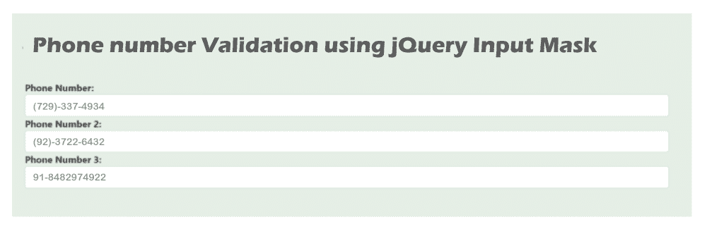

# JQuery 输入掩码电话号码验证

> 原文:[https://www . javatpoint . com/jquery-input-mask-phone-number-validation](https://www.javatpoint.com/jquery-input-mask-phone-number-validation)

在本节中，我们将学习使用输入掩码验证电话号码。我们将使用 JQuery 来实现这一点。jQuery 掩码描述了 jQuery 插件。基于其他元素和 HTML 输入字段，jQuery 掩码将添加一个掩码。当开发人员需要特定的输入字段格式来接受输入时，我们将使用 jQuery 掩码插件。使用后端语言，我们可以创建这种类型的功能。如果我们尝试使用前端本身来创建它，它将非常节省内存和时间。jQuery 的输入掩码很容易使用，并且是轻量级的 JQuery 插件。使用 [jQuery](https://www.javatpoint.com/jquery-tutorial) 输入掩码，可以轻松创建输入掩码。它用于确保输入的预定义格式。输入掩码将用于数字、日期、电话号码等。

在下面的例子中，我们将为电话号码添加一个输入掩码。我们可以验证不同数量的电话号码，电话号码也可以有不同的国家代码。这意味着我们不仅要验证印度的电话号码，还要验证不同国家的电话号码。如果开发者希望他们网站的用户以他们定义的格式指定 10 个电话号码。在这种情况下，jQuery 输入掩码会很有用，因为它会接受用户的输入，并自动将其转换为定义的格式。要在 JQuery 中添加输入掩码或验证我们的印度电话号码，我们将使用 jquery.inputmask.bundle JS 的插件。这样做的解决方案描述如下:

**解决方案:**

```

$(document).ready(function(){
    $('.phone').inputmask('(999)-999-9999');
});

```

添加输入掩码的完整示例描述如下:

**示例:**

```

<!DOCTYPE html>
<html>
<head>
    <title> Phone number Validation using jQuery Input Mask </title>
    <link rel="stylesheet" href="https://cdnjs.cloudflare.com/ajax/libs/twitter-bootstrap/4.4.0/css/bootstrap.min.css"/>
    <script src="https://cdnjs.cloudflare.com/ajax/libs/jquery/3.4.1/jquery.min.js"></script>
    <script src="https://cdnjs.cloudflare.com/ajax/libs/jquery.inputmask/3.3.4/jquery.inputmask.bundle.min.js"></script>
</head>
<body>

<div class="container">
    <h1> Phone number Validation using jQuery Input Mask </h1>

    <strong>Phone Number:</strong>  
    <input type="text" name="phone" class="phone form-control" value="7293374934">

    <strong>Phone Number 2:</strong>  
    <input type="text" name="phone" class="phone2 form-control">

    <strong>Phone Number 3:</strong>  
    <input type="text" name="phone" class="phone3 form-control">

</div>

<script>
    $(document).ready(function(){
        $('.phone').inputmask('(999)-999-9999');
        $('.phone2').inputmask('(99)-9999-9999');
        $('.phone3').inputmask('99-9999999999');
    });
</script>

</body>
</html>

```

现在我们上面的代码已经准备好了，我们可以运行它了。当我们运行它时，将生成以下输出:



* * *