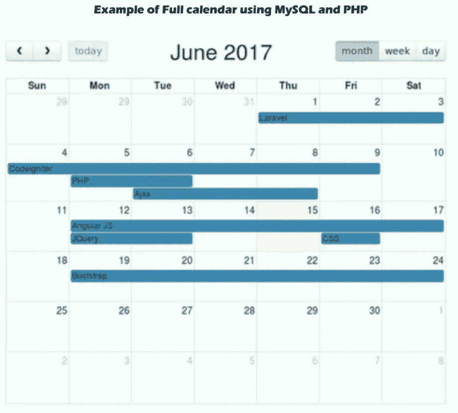

# 使用引导程序、PHP 和 MySQL 集成 jQuery 完整日历

> 原文：<https://www.javatpoint.com/integrate-jquery-fullcalendar-using-bootstrap-php-and-mysql>

在本节中，我们将学习集成 jQuery 完整日历。我们将使用 MySQL、Bootstrap 和 PHP 来实现这一点。在我们的示例中，我们将使用 [Php](https://www.javatpoint.com/php-tutorial) 、 [Bootstrap](https://www.javatpoint.com/bootstrap-tutorial) 和 [MySQL](https://www.javatpoint.com/mysql-tutorial) 来集成完整的日历事件 CRUD 操作。JQuery 库是 Fullcalendar 的一部分，用于提供显示包含事件和更多内容的日历的功能。

显示周、月、年和日日历的功能由完整日历 JS 提供。它还具有执行拖放事件管理的功能。当我们处理任务管理、事件管理或任何其他与日期相关的事情时，使用诸如完整日历的事件日历会非常好。在下面的例子中，我们将使用 MySQL 数据库创建一个名为“事件”的表。我们还将使用 [JQuery Ajax](https://www.javatpoint.com/jquery-ajax-method) 来创建 CRUD 操作，描述如下:

*   事件列表
*   创建事件
*   更新事件
*   删除事件

为了通过使用 Php MySQL 集成 fullcalendar 事件，逐步过程描述如下:

**第一步:**

在这一步中，我们将进入**创建事件表**。在这里，我们将使用我们的数据库，并在其中创建一个名为“events”的新表。为了创建这个表，我们将使用 SQL 查询，如下所述:

**项目表:**

```

CREATE TABLE `events` (
  `id` int(11) NOT NULL,
  `title` varchar(255) COLLATE utf8_bin NOT NULL,
  `start` datetime NOT NULL,
  `end` datetime DEFAULT NULL
) ENGINE=InnoDB DEFAULT CHARSET=utf8 COLLATE=utf8_bin;

```

**第二步:**

在这一步中，我们将进入**创建数据库配置文件**。为此，我们必须在数据库上设置一些细节，如用户名、密码和数据库名称。之后，我们将使用根目录，创建一个名为“db_config.php”的新文件，并在其中添加如下代码:

db _ config . PHP

```

<?php
$bdd = new PDO('mysql:host=localhost;dbname=laravel_test', 'root', 'root');
?>

```

**第三步:**

在这一步中，我们将进入**创建视图文件**。这里，将创建一个名为 index.php 的新视图文件。该文件用于呈现完整的日历布局。Ajax 代码和 [jQuery](https://www.javatpoint.com/jquery-tutorial) 代码将被写入这个文件。该文件将包含各种 js 和 css 文件，描述如下:

*   Jquery，我，js
*   full calendar . css-完整行事历. CSS
*   Fullcalendar 最小 js
*   引导.css
*   等等，最小 js

现在我们将创建一个名为 index.php 的文件，然后向其中添加如下代码:

**index.php**

```

<!DOCTYPE html>
<html>
<head>
<link rel="stylesheet" href="https://cdnjs.cloudflare.com/ajax/libs/fullcalendar/3.4.0/fullcalendar.css" />
<link rel="stylesheet" href="https://cdnjs.cloudflare.com/ajax/libs/twitter-bootstrap/4.0.0-alpha.6/css/bootstrap.css" />
<script src="https://cdnjs.cloudflare.com/ajax/libs/jquery/3.2.1/jquery.min.js"></script>
<script src="https://cdnjs.cloudflare.com/ajax/libs/jqueryui/1.12.1/jquery-ui.min.js"></script>
<script src="https://cdnjs.cloudflare.com/ajax/libs/moment.js/2.18.1/moment.min.js"></script>
<script src="https://cdnjs.cloudflare.com/ajax/libs/fullcalendar/3.4.0/fullcalendar.min.js"></script>
<script>

 $(document).ready(function() {
  var date = new Date();
  var d = date.getDate();
  var m = date.getMonth();
  var y = date.getFullYear();

  var calendar = $('#calendar').fullCalendar({
   editable: true,
   header: {
    left: 'prev,next today',
    center: 'title',
    right: 'month,agendaWeek,agendaDay'
   },

   events: "events.php",

   eventRender: function(event, element, view) {
    if (event.allDay === 'true') {
     event.allDay = true;
    } else {
     event.allDay = false;
    }
   },
   selectable: true,
   selectHelper: true,
   select: function(start, end, allDay) {
   var title = prompt('Event Title:');

   if (title) {
   var start = $.fullCalendar.formatDate(start, "Y-MM-DD HH:mm:ss");
   var end = $.fullCalendar.formatDate(end, "Y-MM-DD HH:mm:ss");
   $.ajax({
	   url: 'add_events.php',
	   data: 'title='+ title+'&start='+ start +'&end='+ end,
	   type: "POST",
	   success: function(json) {
	   alert('Added Successfully');
	   }
   });
   calendar.fullCalendar('renderEvent',
   {
	   title: title,
	   start: start,
	   end: end,
	   allDay: allDay
   },
   true
   );
   }
   calendar.fullCalendar('unselect');
   },

   editable: true,
   eventDrop: function(event, delta) {
   var start = $.fullCalendar.formatDate(event.start, "Y-MM-DD HH:mm:ss");
   var end = $.fullCalendar.formatDate(event.end, "Y-MM-DD HH:mm:ss");
   $.ajax({
	   url: 'update_events.php',
	   data: 'title='+ event.title+'&start='+ start +'&end='+ end +'&id='+ event.id ,
	   type: "POST",
	   success: function(json) {
	    alert("Updated Successfully");
	   }
   });
   },
   eventClick: function(event) {
	var decision = confirm("Do you really want to do that?"); 
	if (decision) {
	$.ajax({
		type: "POST",
		url: "delete_event.php",
		data: "&id=" + event.id,
		 success: function(json) {
			 $('#calendar').fullCalendar('removeEvents', event.id);
			  alert("Updated Successfully");}
	});
	}
  	},
   eventResize: function(event) {
	   var start = $.fullCalendar.formatDate(event.start, "yyyy-MM-dd HH:mm:ss");
	   var end = $.fullCalendar.formatDate(event.end, "yyyy-MM-dd HH:mm:ss");
	   $.ajax({
	    url: 'update_events.php',
	    data: 'title='+ event.title+'&start='+ start +'&end='+ end +'&id='+ event.id ,
	    type: "POST",
	    success: function(json) {
	     alert("Updated Successfully");
	    }
	   });
	}

  });

 });

</script>
<style>
 body {
  margin-top: 40px;
  text-align: center;
  font-size: 14px;
  font-family: "Lucida Grande",Helvetica,Arial,Verdana,sans-serif;
  }
 #calendar {
  width: 650px;
  margin: 0 auto;
  }
</style>
</head>

<body>
 <h2> Example of Full calendar using MySQL and PHP </h2>
 <br/>
 <div id='calendar'></div>
</body>

</html>

```

**第四步:**

在这一步中，我们将去**创建 Ajax 文件**。在我们的应用程序中，将为 Ajax 方法创建四个文件，描述如下:

*   Events.php
*   Add_events.php
*   Delete_events.php
*   更新事件. php

现在，上面四个文件的创建描述如下。我们将把下面的代码逐个添加到这些文件中。首先，我们将创建 events.php 文件，并将以下代码放入其中，如下所示:

**events.php**

```

<?php

 $json = array();

 $requete = "SELECT * FROM events ORDER BY id";

 try {
 	require "db_config.php";
 } catch(Exception $e) {
    exit('Unable to connect to database.');
 }

 $resultat = $bdd->query($requete) or die(print_r($bdd->errorInfo()));

 echo json_encode($resultat->fetchAll(PDO::FETCH_ASSOC));

?>

```

现在我们将创建一个 add_events.php 文件，并向其中添加如下代码:

**add_events.php**

```

<?php

$title = $_POST['title'];
$start = $_POST['start'];
$end = $_POST['end'];

try {
	require "db_config.php";
} catch(Exception $e) {
	exit('Unable to connect to database.');
}

$sql = "INSERT INTO events (title, start, end) VALUES (:title, :start, :end )";
$q = $bdd->prepare($sql);
$q->execute(array(':title'=>$title, ':start'=>$start, ':end'=>$end));

?>

```

之后，我们将创建一个 delete_event.php 文件，并向其中添加如下代码:

**delete_event.php**

```

<?php

$id = $_POST['id'];

try {
	require "db_config.php";
} catch(Exception $e) {
	exit('Unable to connect to database.');
}

$sql = "DELETE from events WHERE id=".$id;
$q = $bdd->prepare($sql);
$q->execute();

?>

```

最后，我们将创建一个 update_events.php 文件，并向其中添加如下代码:

**update_events.php**

```

<?php

$id = $_POST['id'];
$title = $_POST['title'];
$start = $_POST['start'];
$end = $_POST['end'];

try {
 	require "db_config.php";
} catch(Exception $e) {
	exit('Unable to connect to database.');
}

$sql = "UPDATE events SET title=?, start=?, end=? WHERE id=?";
$q = $bdd->prepare($sql);
$q->execute(array($title,$start,$end,$id));

?>

```

现在我们上面的代码可以运行了。为了快速运行上述代码，我们将使用根目录并运行以下命令:

```

php -S localhost:8000

```

现在，我们可以使用浏览器打开以下网址:

```

http://localhost:8000/

```

打开这个后，我们可以看到如下输出:



* * *