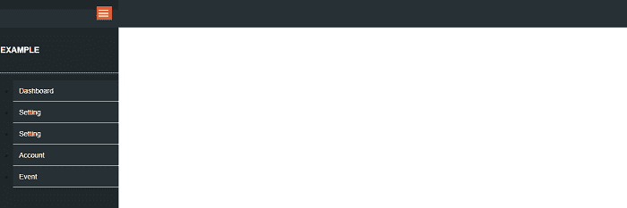
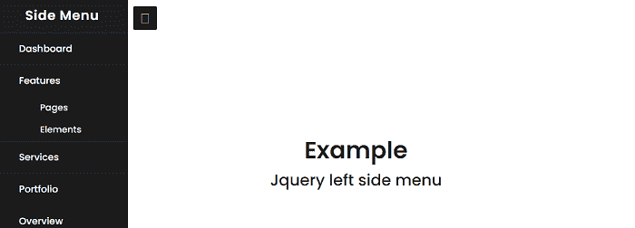

# JQuery 左侧菜单

> 原文:[https://www.javatpoint.com/jquery-left-side-menu](https://www.javatpoint.com/jquery-left-side-menu)

在本文中，我们将在 jQuery 的帮助下创建一个 jQuery 左侧菜单。在本文的开头，我们将学习 jQuery 的基础知识。之后我们将学习左侧菜单的基础知识。

### 什么是 jQuery？

[JQuery](https://www.javatpoint.com/jquery-tutorial) 是一个快速、轻量、小型且功能丰富的 [JavaScript](https://www.javatpoint.com/javascript-tutorial) 库。为了在 [HTML](https://www.javatpoint.com/html-tutorial) 页面中添加 jQuery，我们可以使用 [<脚本>标签](https://www.javatpoint.com/html-script-tag)。

```

<script src="https://cdnjs.cloudflare.com/ajax/libs/jquery/3.4.0/jquery.min.js"> </script>

```

在这里， **src** 属性是我们可以添加 jQuery 源代码的地方。

也可以下载 jQuery，在

### jQuery 左侧菜单是什么？

菜单栏是显示选项列表的用户界面元素。在 JQuery 左侧菜单中，链接通常显示为网站主页内容的左栏。

**我们举 jQuery 左侧菜单的各种例子。**

### 例 1:

```

<! DOCTYPE html>
<html>
<head>
<meta name="viewport" content="width=device-width, initial-scale=1">
<meta charset="UTF-8">
<title> JQuery left side menu </title>
<link href="https://fonts.googleapis.com/css?family=Montserrat">
<link href="https://maxcdn.bootstrapcdn.com/font-awesome/4.4.0/css/font-awesome.min.css">
</head>
<style>
 body {
  font: 14px/18px 'Montserrat', sans-serif;
}
a {
  text-decoration: none;
}
:after {
    -webkit-box-sizing: border-box;
    -moz-box-sizing: border-box;
    box-sizing: border-box;
}
.pad-15 {
  padding: 15px;
}
:before {
    -webkit-box-sizing: border-box;
    -moz-box-sizing: border-box;
    box-sizing: border-box;
}
.clear {
  clear: both; 
}
.clear:after { 
    content: " ";
   display: table;
}
clear:before { 
    content: " ";
   display: table;
}
.header {
  min-height: 55px;
  background: #273135;
  border-bottom: 1px solid #273135;
}
a.toggle-nav {
    top: 12px;
    right: 15px;
    position: absolute;
    color: #fff;
    line-height: 25px;
    font-size: 22px;
    background: #DE5939;
    padding: 3px 5px;
    border-radius: 1px;
    transform: rotate(90deg);
}
.header > .left-head {
  width: 250px;
  display: block;
  background:#20282B;
  position: relative;
}
.header > .left-head .logo {
  padding:10px 0px 10px 15px;
 }
.nice-nav {
  width: 250px;
  background: #20282b;
  height: 100%;
  transition: all 0.4s ease-in-out 0s;
  float: left;
}
.nice-nav.open {
    margin-left: -250px;
    display: block;
}
.nice-nav > .user-info {
    padding: 10px 15px;
    color: #fff;
    border-bottom: 1px solid #ddd;
    min-height: 41px;
}
.user-info > .user-name h5 {
  text-transform: uppercase;
  font-size: 16px;
}
.user-info > .user-name span {
  font-size: 80%;
  color: #555;
  font-style: italic;
}
.nice-nav li.child-menu span.toggle-right {
  text-align: right;
  float: right;
  display: inline-block;
  position: absolute;
  right: 0;
  padding: 15px;
  top: 0;
  background: #DE5939;
  bottom: 0;
}
.nice-nav ul li a {
  padding: 12px;
  background: #273135;
  border-bottom: 1px solid #ddd;
  display: block;
  color: #fff;
  position: relative;
}
.nice-nav ul li.child-menu ul {
  background: #aaa;
  display: none;
}
.nice-nav ul li.child-menu ul li a {
  background: #273135;
  padding: 10px 20px;
}
</style>
<body>
<div class="header">
  <div class="left-head">
 <div class="logo">
    </div>
    <a href="#" class="toggle-nav"> ||| </a>
  </div>
  <div class="right-head">
  </div>
</div>
<div class="nice-nav">
  <div class="user-info clear">
    <div class="user-name ">
      <h5> Example </h5>
    </div>
  </div>
  <ul>
    <li class="child-menu">
      <a href="#"> <span> Dashboard </span> </a>
    </li>
    <li class="child-menu">
      <a href="#"> <span> Setting </span> </a>
    </li>
    <li class="child-menu">
      <a href="#"> <span> Setting </span> </a>
</li>
      <li class="child-menu">
      <a href="#"> <span> Account </span> </a>
    </li>
       <li class="child-menu">
      <a href="#"> <span> Event </span> </a>
    </li>
  </ul>
</div>
<script src="https://cdnjs.cloudflare.com/ajax/libs/jquery/2.1.3/jquery.min.js"> </script>
<script>
 $(document).ready(function() {
   $('.toggle-nav').click(function() {
     $this = $(this);
     $nav = $('.nice-nav');
     $nav.toggleClass('open');
   });
   $('.body-part').click(function(){
     $nav.addClass('open');
   });
   $submenu = $('.child-menu-ul');
   $('.child-menu .toggle-right').on('click', function(e) {
     e.preventDefault();
     $this = $(this);
     $parent = $this.parent().next();
     $tar = $('.child-menu-ul');
     if (!$parent.hasClass('active')) {
       $tar.removeClass('active').slideUp('fast');
       $parent.addClass('active').slideDown('fast');
     } else {
       $parent.removeClass('active').slideUp('fast');
     }
   });
 });
</script>
</body>
</html>

```

**说明:**

在上面的例子中，我们已经创建了一个 jQuery 左侧菜单。在这种情况下，当用户点击左侧菜单时，显示一个汉堡。

**输出:**

下面是这个例子的输出。



### 例 2:

```

<! DOCTYPE html>
<html>
<head>
<meta name="viewport" content="width=device-width, initial-scale=1">
<meta charset="UTF-8">
<title> JQuery left side menu </title>
<link rel="stylesheet" href="https://cdnjs.cloudflare.com/ajax/libs/font-awesome/4.7.0/css/font-awesome.min.css">
</head>
<style>
 @import url('https://fonts.googleapis.com/css?family=Poppins:400,500,600,700&display=swap');
*{
  margin: 0;
  padding: 0;
  user-select: none;
  box-sizing: border-box;
  font-family: 'Poppins', sans-serif;
}
.btn {
  position: absolute;
  top: 15px;
  left: 45px;
  height: 45px;
  width: 45px;
  text-align: center;
  background: #1b1b1b;
  border-radius: 3px;
  cursor: pointer;
  transition: left 0.4s ease;
}
.btn.click {
  left: 260px;
}
.btn span {
  color: pink;
  font-size: 28px;
  line-height: 45px;
}
.btn.click span:before {
  content: '\f00d';
}
.sidebar {
  position: fixed;
  width: 250px;
  height: 100%;
  left: -250px;
  background: #1b1b1b;
  transition: left 0.4s ease;
}
.sidebar.show {
  left: 0px;
}
.sidebar .text {
  color: white;
  font-size: 25px;
  font-weight: 600;
  line-height: 65px;
  text-align: center;
  background: #1e1e1e;
  letter-spacing: 1px;
}
nav ul {
  background: #1b1b1b;
  height: 100%;
  width: 100%;
  list-style: none;
}
nav ul li {
  line-height: 60px;
  border-top: 1px solid rgba(255,255,255,0.1);
}
nav ul li:last-child {
  border-bottom: 1px solid rgba(255,255,255,0.05);
}
nav ul li a {
  position: relative;
  color: white;
  text-decoration: none;
  font-size: 18px;
  padding-left: 40px;
  font-weight: 500;
  display: block;
  width: 100%;
  border-left: 3px solid transparent;
}
nav ul li.active a {
  color: cyan;
  background: #1e1e1e;
  border-left-color: cyan;
}
nav ul li a:hover {
  background: #1e1e1e;
}
nav ul ul {
  position: static;
  display: none;
}
nav ul .feat-show.show {
  display: block;
}
nav ul .serv-show.show1 {
  display: block;
}
nav ul ul li {
  line-height: 42px;
  border-top: none;
}
nav ul ul li a {
  font-size: 17px;
  color: #e6e6e6;
  padding-left: 80px;
}
nav ul li.active ul li a { 
  color: #e6e6e6;
  background: #1b1b1b;
  border-left-color: transparent;
}
nav ul ul li a:hover {
  color: cyan!important;
  background: #1e1e1e!important;
}
nav ul li a {
  position: absolute;
  top: 50%;
  right: 20px;
  transform: translateY(-50%);
  font-size: 22px;
  transition: transform 0.4s;
}
nav ul li a span.rotate {
  transform: translateY(-50%) rotate(-180deg);
}
.content {
  position: absolute;
  top: 50%;
  left: 50%;
  transform: translate(-50%,-50%);
  color: #202020;
  z-index: -1;
  text-align: center;
}
.content .header {
  font-size: 45px;
  font-weight: 600;
}
.content p {
  font-size: 30px;
  font-weight: 500;
}
</style>
<body>
<div class="btn">
  <span class="fas fa-bars"> </span>
</div>
<nav class="sidebar">
  <div class="text">
    Side Menu
  </div>
  <ul>
    <li class="active"> <a href="#"> Dashboard </a> </li>
    <li>
      <a href="#" class="feat-btn"> Features
      </a>
      <ul class="feat-show">
        <li> <a href="#"> Pages </a> </li>
        <li> <a href="#"> Elements</a> </li>
      </ul>
    </li>
    <li>
      <a href="#" class="serv-btn"> Services </a>
      <ul class="serv-show">
        <li> <a href="#"> App Design </a> </li>
        <li> <a href="#">Web Design </a> </li>
      </ul>
    </li>
    <li> <a href="#"> Portfolio </a> </li>
    <li> <a href="#"> Overview </a> </li>
    <li> <a href="#"> Shortcuts </a> </li>
    <li> <a href="#"> Feedback </a> </li>
  </ul>
</nav>
<div class="content">
  <div class="header">
    Example 
  </div>
  <p>
    JQuery left side menu
  </p>
</div>
<script src="https://cdnjs.cloudflare.com/ajax/libs/jquery/3.4.1/jquery.min.js"> </script>
<script>
 $('.btn').click(function(){
  $(this).toggleClass("click");
  $('.sidebar').toggleClass("show");
});
$('.feat-btn').click(function(){
  $('nav ul .feat-show').toggleClass("show");
  $('nav ul .first').toggleClass("rotate");
});
$('.serv-btn').click(function(){
  $('nav ul .serv-show').toggleClass("show1");
  $('nav ul .second').toggleClass("rotate");
});
$('nav ul li').click(function(){
  $(this).addClass("active").siblings().removeClass("active");
});
</script>
</body>
</html>

```

**说明:**

在上面的例子中，我们已经创建了一个 jQuery 左侧菜单。在这种情况下，当用户点击左侧菜单时，显示一个汉堡。

**输出:**

下面是这个例子的输出。



* * *