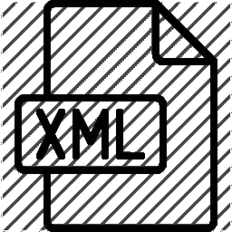

# XML 教程

> 原文:[https://www.javatpoint.com/xml-tutorial](https://www.javatpoint.com/xml-tutorial)



XML 教程是为初学者和专业人士设计的。我们的 xml 教程提供了 xml 技术的详细知识，例如什么是 xml、xml 的特性、xml 示例、xml 相关技术、通过 DTD 创建 XML 结构、通过模式创建 XML 结构(XSD)、DTD 和模式之间的区别。

## XML 验证

XML 文件可以通过两种方式进行验证:

1.  反对避免双重征税
2.  反对 XSD

文档类型定义和 XSD 模式定义用于定义 XML 结构。

## XML DTD

在我们的 xml 教程中，您将了解 DTD 文件、用 DTD 创建 XML、使用 CSS 文件、CDATA vs PCDATA 以及 DTD 和 XML 模式之间的区别。

让我们看一个使用 DTD 文件的 XML 的例子。

employee.xml

```
<?xml version="1.0"?>
<!DOCTYPE employee SYSTEM "employee.dtd">
<employee>
  <firstname>vimal</firstname>
  <lastname>jaiswal</lastname>
  <email>vimal@javatpoint.com</email>
</employee> 

```

[Test it Now](https://www.javatpoint.com/xmlpages/pcdata.xml)

在接下来的几页中，我们将详细描述带有 DTD 的 XML。

* * *

## XML 模式

在本 XML 教程中，我们将提供模式文件、XML 模式验证、XML 模式数据类型和 XML 解析器的详细描述。

让我们看一个使用 XSD 文件的 XML 的例子。

```
<?xml version="1.0"?>
<employee

xmlns:xsi="http://www.w3.org/2001/XMLSchema-instance"
xsi:schemaLocation="http://www.javatpoint.com employee.xsd">
  <firstname>vimal</firstname>
  <lastname>jaiswal</lastname>
  <email>vimal@javatpoint.com</email>
</employee>

```

[Test it Now](https://www.javatpoint.com/xmlpages/xmlschema1.xml)

在接下来的几页中，我们将详细描述 XSD 的 XML。

* * *

## XML 索引

* * *

**XML 教程**

*   [XML 简介](xml-tutorial)
*   [什么是 XML](what-is-xml)
*   [XML 特性](features-and-advantages-of-xml)
*   [HTML vs XML](html-vs-xml)
*   [XML 示例](xml-example)
*   [XML 技术](xml-related-technologies)
*   [XML 属性](xml-attributes)
*   [XML 注释](xml-comments)
*   [XML 树](xml-tree-structure)

**XML 验证**

*   [XML 验证](xml-validation)
*   [XML DTD](xml-dtd)
*   XML CSS
*   [XML 模式](xml-schema)
*   [DTD vs XSD](dtd-vs-xsd)
*   [CDATA vs PCDATA](cdata-pcdata)

**XML 高级**

*   [XML 解析器](xml-parsers)
*   [XML DOM](xml-dom) 的实现
*   [XML 数据库](xml-database)
*   [XML 命名空间](xml-namespaces)

**XML 面试**

*   [XML 面试问题](xml-interview-questions)

**XQuery 教程**

*   [XQuery 教程](xquery-tutorial)
*   [什么是 XQuery](what-is-xquery)
*   [XQuery 功能](xquery-features)
*   [XQuery vs XPath](difference-between-xquery-and-xpath)
*   [XQuery vs XSLT](xquery-vs-xslt)
*   [环境设置](xquery-environment-setup)
*   [XQuery 第一个示例](xquery-first-example)
*   [XQuery FLWOR](xquery-flwor)
*   [XQuery HTML 格式](xquery-html-format)
*   [XQuery XPath](xquery-xpath)
*   [XQuery 语法](xquery-syntax)
*   [XQuery 添加](xquery-add)
*   [XQuery 函数](xquery-functions)
*   [XQuery 序列](xquery-sequences)
*   [XQuery 序列功能](xquery-sequence-functions)
*   [XQuery 字符串函数](xquery-string-functions)
*   [1)弦长()](xquery-string-length-function)
*   [2） 字符串连接（）](xquery-concat-function)
*   [3)字符串连接()](xquery-string-join-function)
*   [XQuery 时间&日期](xquery-time-and-date-function)
*   [1)当前日期()](xquery-current-date-function)
*   [2)当前时间()](xquery-current-time-function)
*   [3)当前-日期时间()](xquery-current-datetime-function)
*   [XQuery If Then Else](xquery-if-then-else-statement)
*   [XQuery Regex](xquery-regular-expressions)

**XSLT 教程**

*   [XSLT 教程](xslt-tutorial)
*   [什么是 XSLT](what-is-xslt)
*   [XSLT 语法](xslt-syntax)
*   [XSLT xsl:值-的](xslt-xsl-value-of-element)
*   [XSLT xsl:for-each](xslt-xsl-for-each-element)
*   [XSLT xsl:sort](xslt-xsl-sort-element)
*   [XSLT xsl:if](xslt-xsl-if-element)
*   [XSLT xsl:选择](xslt-xsl-choose-element)
*   [XSLT xsl:key](xslt-xsl-key-element)
*   [XSLT xsl:message](xslt-xsl-message-element)
*   [XSLT xsl:apply-template](xslt-xsl-apply-template-element)
*   [XSLT xsl:导入](xslt-xsl-import-element)

**XPath 教程**

*   [XPath 教程](xpath-tutorial)
*   [什么是 XPath](what-is-xpath)
*   [XPath 表达式](xpath-expression)
*   [XPath 节点](xpath-nodes)
*   [XPath 语法](xpath-syntax)
*   [XPath 绝对路径](xpath-absolute-path)
*   [XPath 相对路径](xpath-relative-path)
*   [XPath 轴](xpath-axes)
*   [XPath 运算符](xpath-operators)
*   [XPath 运算符](xpath-operators)
*   [1) XPath 比较](xpath-comparison-operators)
*   [2) XPath 布尔](xpath-boolean-operators)
*   [3) XPath 编号](xpath-number-operators-functions)
*   [4) XPath 字符串](xpath-string-functions)
*   [5) XPath 节点](xpath-node-functions)
*   [XPath 通配符](xpath-wildcard)
*   [XPath 谓词](xpath-predicate)

* * *

## 先决条件

在学习 XML 之前，你必须具备 HTML 的基础知识。

## 观众

我们的 XML 教程旨在帮助初学者和专业人士。

## 问题

我们保证您在这个 XML 教程中不会发现任何问题。但是如果有任何错误，请在联系表格中发布问题。