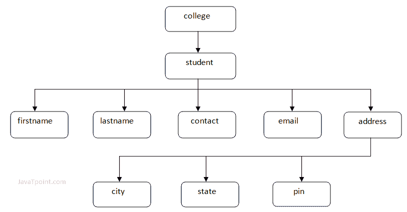

# XML 树结构

> 原文:[https://www.javatpoint.com/xml-tree-structure](https://www.javatpoint.com/xml-tree-structure)

XML 文档有一个自我描述的结构。它形成了一个被称为 XML 树的树结构。树形结构使得描述一个 XML 文档变得容易。

树结构包含根元素(作为父元素)、子元素等等。从根开始遍历所有后续的分支、子分支和叶节点是非常容易的。

* * *

## 一个 XML 文档的示例

```
<?xml version="1.0"?>
<college>
  <student>
      <firstname>Tamanna</firstname>
      <lastname>Bhatia</lastname>
      <contact>09990449935</contact>
      <email>tammanabhatia@abc.com</email>
      <address>
           <city>Ghaziabad</city>
           <state>Uttar Pradesh</state>
           <pin>201007</pin>
      </address>
  </student>
</college> 

```

[Test it Now](https://www.javatpoint.com/xmlpages/xmltree.xml)

让我们看看上面例子的树形结构表示。



在上面的例子中，第一行是 XML 声明。它定义了 XML 1.0 版本。下一行显示文档的根元素(学院)。里面还有一个元素(学生)。学生元素包含<firstname>、<lastname>、<contact>、<email>和</email></contact></lastname></firstname>

<address>五个分支。</address>

<address>分支包含 3 个子分支，分别命名为<city>、<state>和<pin>。</pin></state></city></address>

#### 注意:DOM 解析器以树形结构表示 XML 文档。

## XML 树规则

这些规则被用来找出元素之间的关系。它显示一个元素是另一个元素的子元素还是父元素。

**后代:**如果元素 A 被元素 B 包含，那么 A 被称为 B 的后代，在上例中“College”是根元素，其他所有元素都是“College”的后代。

**祖先:**包含其他元素的包含元素称为其他元素的“祖先”。在上面的例子中，根元素(学院)是所有其他元素的祖先。