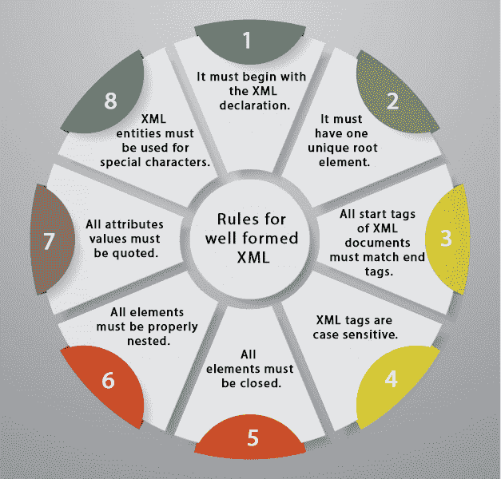

# XML 验证

> 原文：<https://www.javatpoint.com/xml-validation>

格式良好的 XML 文档可以根据 DTD 或 Schema 进行验证。

格式良好的 XML 文档是具有正确语法的 XML 文档。在了解 XML 验证之前，了解有效的 XML 文档是非常必要的。

* * *

## 有效的 XML 文档

它必须格式良好(满足所有基本语法条件)

它应该根据预定义的 DTD 或 XML 模式运行

* * *

## 格式良好的 XML 的规则

*   它必须从 XML 声明开始。
*   它必须有一个唯一的根元素。
*   XML 文档的所有开始标记必须匹配结束标记。
*   XML 标记区分大小写。
*   所有元素都必须关闭。
*   所有元素必须正确嵌套。
*   所有属性值都必须有引号。
*   XML 实体必须用于特殊字符。

* * *

## XML DTD

DTD 定义了 XML 文档的法律元素

简单地说，我们可以说 DTD 用一系列法律元素和属性定义了文档结构。

XML 模式是基于 XML 的 DTD 的替代方案。

实际上，DTD 和 XML 模式都用于形成一个格式良好的 XML 文档。

我们应该避免 XML 文档中的错误，因为它们会停止 XML 程序。

* * *

## XML 架构

它被定义为一种 XML 语言

使用命名空间允许重用现有定义

它支持大量内置数据类型和派生数据类型的定义