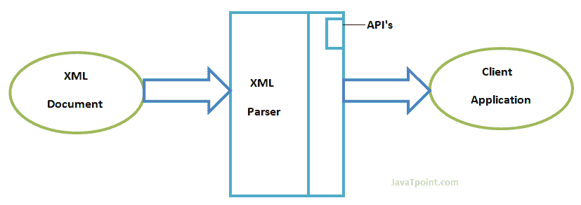

# xml 解析器

> 原文：<https://www.javatpoint.com/xml-parsers>

XML 解析器是一个软件库或软件包，为客户端应用程序使用 XML 文档提供接口。XML 解析器旨在读取 XML，并为程序创建一种使用 XML 的方式。

XML 解析器验证文档，并检查文档的格式是否正确。

让我们通过下图来理解 XML 解析器的工作原理:

* * *

## XML 解析器的类型

这是两种主要类型的 XML 解析器:

1.  数字正射影像图
2.  萨克斯管

* * *

## 文档对象模型

DOM 文档是一个包含 XML 文档所有信息的对象。它像一个树形结构。DOM 解析器实现一个 DOM 应用编程接口。这个 API 使用起来非常简单。

### DOM 解析器的特点

DOM 解析器在内存中创建一个内部结构，它是一个 DOM 文档对象，客户端应用程序通过调用这个文档对象上的方法来获取原始 XML 文档的信息。

DOM 解析器有一个基于树的结构。

### 优势

1)它支持读写操作，API 使用起来非常简单。

2)当需要随机访问文档中相隔很远的部分时，这是优选的。

### 不足之处

1)内存不足。(消耗更多内存，因为整个 XML 文档都需要加载到内存中)。

2)它比其他解析器相对慢。

* * *

## 简单的应用编程接口

SAX 解析器实现了 SAX 应用编程接口。这个 API 是基于事件的 API，不太直观。

### SAX 解析器的特点

它不会创建任何内部结构。

客户不知道调用什么方法，他们只是重写了应用编程接口的方法，并将自己的代码放在方法中。

它是一个基于事件的解析器，工作方式类似于 Java 中的事件处理程序。

### 优势

1)简单，内存效率高。

2)速度非常快，适用于大型文档。

### 不足之处

1)它是基于事件的，所以它的 API 不太直观。

2)客户永远不知道全部信息，因为数据被分割成碎片。