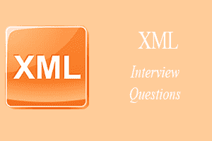
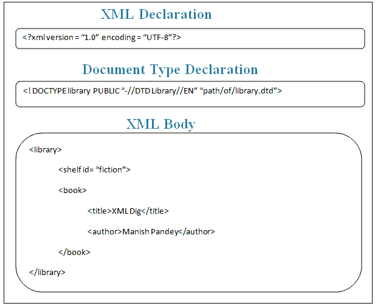

# XML 面试问题

> 原文：<https://www.javatpoint.com/xml-interview-questions>



有很多公司都问过的 XML 面试问题和答案。让我们看看前 25 个 XML 面试问题的列表。

### 1)什么是 XML？

**XML** 代表*可扩展标记语言*。这是一种简单灵活的标记语言。它被称为网络数据的通用语言，因为 XML 文档可以用任何语言创建和使用。它是信息交换的通用标准。

XML 技术方便您创建自己的标记语言。

[more details...](what-is-xml)

* * *

### XML 和 HTML 有什么不同？

HTML 代表超文本标记语言，而 XML 代表可扩展标记语言。超文本标记语言和可扩展标记语言的主要区别如下:

| 号码 | 超文本标记语言 | 可扩展置标语言 |
| 1) | HTML 是用来**显示数据**的，重点是数据看起来怎么样。 | XML 是一个独立于软件和硬件的工具，用于**传输和存储数据**。它关注的是什么是数据。 |
| 2) | HTML 本身就是一种**标记语言**。 | XML 提供了定义标记语言的框架。 |
| 3) | HTML 不区分大小写**。** | XML**区分大小写**。 |
| 4) | HTML 是一种表示语言。 | XML 既不是表示语言，也不是编程语言。 |

* * *

### 3)版本在 XML 中是什么意思？

版本是一个标签，用来显示使用了哪个版本的 XML。

* * *

### XML 有什么好处？

这些是使用 XML 的主要好处。

**简单性:**非常容易阅读和理解用 XML 编码的信息。

**开放性:**是 W3C 标准，得到软件行业市场领导者的认可。

**扩展性:**它是可扩展的，因为它没有固定的标签集。您可以根据需要定义它们。

**自描述:** XML 文档不需要像传统数据库那样设置特殊的模式来存储数据。XML 文档可以在没有这些定义的情况下存储，因为它们包含标签和属性形式的元数据。

**可伸缩:** XML 不是二进制格式，所以你可以用任何东西创建和编辑文件，并且它也很容易调试。

**快速访问:** XML 文档是分层排列的，所以速度比较快。

* * *

### 5)什么是 XML DOM？

**DOM** 代表*文档对象模型*，用于描述 XML 文档的逻辑结构。它是一个分层模型，提供了一种访问和操作 XML 文档的方法。

DOM 方法和对象可以用于任何语言，如 C#、VB、JavaScript 和 VB 脚本。

* * *

### 6)什么是 XML 中的 SAX？

**SAX** 代表*XML*的简单应用编程接口。它是一个顺序访问解析器。这是一个简单的 XML 应用编程接口，提供了从 XML 文档中读取数据的机制。它是 DOM 的一种替代。DOM 对整个文档进行操作，SAX 解析器对 XML 文档的每一部分进行顺序操作。

SAX 没有像 DOM 那样的正式规范，消耗的内存更少。但是它只能用来读 XML 文档而不能用来写。

* * *

### 7)什么是 XSNL？

**XSNL** 是一种 *XML 搜索中性语言*。这种语言在元搜索界面和目标系统之间起作用。

* * *

### 8)什么是格式良好的 XML 文档？

语法正确的文档称为格式良好的 XML 文档。格式良好的 XML 文档必须遵循 XML？的基本语法规则:

*   它必须有一个结束标记。
*   结束标记必须与开始标记完全匹配:XML 区分大小写。
*   所有元素都应该包含在一个根标签中。
*   子元素必须在父标记中关闭。

* * *

### 9)什么是有效的 XML 文档？

结构正确的元素称为有效的 XML 文档。它应该遵循特定类型文档的一些预定义规则。这些规则决定了文档每个部分可以包含的数据类型。这些规则可以由 XML 文档的作者或其他人编写。

#### 注意:有效的 XML 文档可能格式良好，但格式良好的 XML 文档可能无效。

* * *

### 10)什么是 DTD？

**DTD** 代表*文件类型定义*。它定义了一个 XML 文档的主要构建块。它定义了:

*   元素名称
*   如何以及在哪里使用它们
*   元素属性
*   合适的嵌套

* * *

### 11)如何将 DTD 应用于 XML 文档？

要将数据类型转换应用于 XML 文档，您可以:

*   在 XML 文档本身中使用 DTD 元素定义。
*   提供一个单独的 DTD 文件，并在 XML 文档中引用它的名称。

* * *

### 12)编写 XML 文档的基本规则是什么？

您应该考虑以下规则来编写 XML 文档。

*   它应该有一个根元素。
*   所有标签必须关闭。
*   标记名中不允许有空格。
*   所有标签必须正确嵌套。
*   XML 标记区分大小写。
*   使用引号中的属性值。
*   空白在 XML 中被保留。

* * *

### 13)什么是 XSL？

**XSL** 代表可扩展样式表语言。它是一种表达样式表的语言。这些样式表就像描述如何显示给定类型的 XML 文档的 CSS。

[more details...](xml-schema)

* * *

### 14)什么是 XML 中的 XPath？

**XPath** 是 XML 中使用的一种技术。它用于*从 XML 文档*中检索元素。XPath 表达式可以用来从 XML 文件中定位和检索元素、属性和值，因为 XML 文档是结构化的。它类似于 SQL。

由于 SQL 用于从数据库中检索数据，XPath 用于从 XML 中检索数据。

* * *

### 15)什么是 XSLT？

**XSLT** 是一种流行的 XML 技术，用于*将一个 XML 文件转换为其他格式，如 HTML* 等。XSLT 就像一种语言，它有自己的语法、函数和运算符来转换 XML 文档。XSLT 也用于将 XML 文件中的数据显示为 HTML 页面。

* * *

### 16)XML DTD 和 XML 模式或 XSD 有什么区别？

XSL 代表可扩展样式表语言。它是一种表达样式表的语言。这些样式表就像描述如何显示给定类型的 XML 文档的 CSS。

*   DTD 代表文档类型定义，而 XSD 代表 XML 模式定义。
*   DTD 不支持命名空间。它有自己的一组关键字来定义模式，而 XSD 使用自己的一组名称空间和元素来定义模式。
*   DTD 是 XML 模式的前身，而 XML 模式是一种新技术，一些 XML 解析器还不支持它。

[more details...](dtd-vs-xsd)

* * *

### 17)XML 是用来替代 HTML 的吗？

不，两种语言都有自己的规范，用于不同的目的。XML 用于描述数据，而 HTML 关注如何显示数据。

* * *

### 18)在 XML 文档中定义元素和属性。

从开始标记到结束标记，您在 XML 文档中看到的所有内容都是 XML 元素。它可以包含其他元素、属性和文本。

属性是用于定义关于元素的附加信息的值。

让我们举个例子来很好地理解它:

```
<librarymembers>
  <student id="001">
     <name>Vimal</name>
     <age>25</age>
  </student>
</librarymembers> 

```

在上例中，<student>是一个元素，id 是<student>元素的属性。</student></student>

* * *

### 19)简单元素和复杂元素有什么区别？

在 XML 中，简单元素是基于文本的元素。它包含较少的属性和子元素，不能留空。

但是，复杂的元素可以包含多个属性和元素。它可以包含额外的子元素和空元素。

* * *

### 20)定义 XPOINTER 的概念。

XPOINTER 用于在 XML 文档中指向数据。它用于定位 XML 文档的特定部分。这是 W3C 的建议。

请看这个例子:

```
address.xml#pointer(/ descendant ::streetnumber[@id =9])

```

在这个例子中，XPOINTER 指向“address.xml”中的“streetnumber = 9”。

* * *

### 21)什么是 XML 数据绑定？为什么要用？

XML 数据绑定是将 XML 文档中的信息表示为计算机内存中的对象的过程。

XML 数据绑定用于缩短您的开发工作，简化维护，提高可靠性。它节省了您的开发时间和金钱。它使得处理 XML 数据非常直观。

* * *

### 22)什么是 XML 编码错误？

有两种类型的 XML 编码错误:

1.  在文本内容中发现无效字符。
2.  不支持从当前编码切换到指定编码。

出现这些错误是因为 XML 文档可能包含非 ASCII 字符，如挪威语和法语。这些错误可以通过指定 XML 编码 Unicode 来避免。

* * *

### 23)有哪些不同的 XML API？

**基于树的 API:** 它以树状结构编译一个 XML 文档，并将其加载到内存中。您可以遍历和更改树结构。基于树的应用编程接口适用于广泛的应用。基于树的应用编程接口的例子是 DOM 解析器。

**基于事件的应用编程接口:**基于事件的应用编程接口向应用程序提供关于解析事件的报告。它使用一组内置的回调函数。基于事件的应用编程接口的例子是 SAX 解析器。

* * *

### 24)什么是 XmlReader 类？解释一下。

XmlrReader 类表示一个提供对 XML 数据的快速、非连接、仅转发访问的读取器。您需要导入以下命名空间来使用. NET 中的 XmlReader 类。

**在 VB 中:**

进口系统。可扩展标记语言

**在 C#中:**

使用系统。Xml

* * *

### 25)CDATA 和 PCDATA 有什么区别？

CDATA 表示未解析的字符数据，而 PCDATA 表示已解析的字符数据。

[more details...](cdata-pcdata)

* * *

### 26)什么是 XQuery？

XQuery 是一种用于从 XML 文档中检索数据的查询语言。

* * *

### 27)什么是 XML 命名空间？

命名空间是与 DTD/Schema 位置关联的限定名。

一个文档可能有重复的元素和属性。因此，命名空间定义了一种比较重复元素和属性名的方法。

* * *

### 28)什么是 SGML？

SGML 是一种庞大而强大的通用标记语言，用于定义几个电子文档的结构描述。

* * *

### 29)我们可以在 XML 中使用图形吗？

是的，图形可以用 XLink 和 XPointer 存储在 XML 文件中。它支持图形像 GIF，JPG，TIFF，PNG，CGM，EPS，SVG。

* * *

### 30)XML 区分大小写吗？

是的，XML 是一种区分大小写的语言。

* * *

### 31)定义 XML 的结构？



* * *

| [Java 基础面试题](corejava-interview-questions#corebasicsinterview) | [Java OOPs 面试问题](corejava-interview-questions#oopsinterview) |
| [Java 多线程面试题](java-multithreading-interview-questions) | [Java 字符串&异常面试问题](corejava-interview-questions-3) |
| [Java 集合面试问题](java-collections-interview-questions) | [JDBC 面试问题](jdbc-interview-questions) |
| [Servlet 面试问题](servletinterview) | [JSP 面试问题](jspinterview) |
| [春季面试题](spring-interview-questions) | [冬眠面试问题](hibernate-interview-questions) |
| [PL/SQL 面试问题](pl-sql-interview-questions) | [SQL 面试问题](sql-interview-questions) |
| [甲骨文面试题](oracle-interview-questions) | [安卓面试问题](android-interview-questions) |
| [SQL Server 面试问题](sql-server-interview-questions) | [MySQL 面试问题](mysql-interview-questions) |