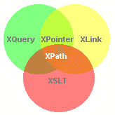

# 什么是 XQuery

> 原文：<https://www.javatpoint.com/what-is-xquery>

XQuery 是一种功能查询语言，用于检索以 XML 格式存储的信息。对于 XML 来说，它就像 SQL 对于数据库一样。它旨在查询 XML 数据。

XQuery 建立在 XPath 表达式的基础上。这是所有主要数据库都支持的 W3C 建议。

其官方文档给出的 XQuery 的原样定义如下:

“XQuery 是一种标准化语言，用于组合文档、数据库、网页和几乎任何其他内容。它得到了非常广泛的实施。它功能强大，易于学习。XQuery 正在取代专有的中间件语言和网络应用程序开发语言。XQuery 正在用几行代码取代复杂的 Java 或 C++程序。XQuery 比许多其他替代方法更易于使用和维护。”

* * *

## 它是做什么的

XQuery 是一种功能性语言，负责从 XML 文档中查找和提取元素和属性。

它可以用于以下用途:

*   提取信息用于 web 服务。
*   生成摘要报告。
*   将 XML 数据转换为 XHTML。
*   在网络文档中搜索相关信息。

* * *

## 历史

XQuery 是由 W3C 设计的，最早出现在 2007 年。它于 2007 年 1 月 23 日成为 W3C 的推荐。XQuery 3.0 是 W3C 从 2014 年 4 月 8 日开始推荐的。