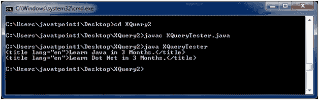

# XQuery 第一个示例

> 原文:[https://www.javatpoint.com/xquery-first-example](https://www.javatpoint.com/xquery-first-example)

这里，XML 文档被命名为**课程. xml** ，xqy 文件被命名为**课程. xqy**

**课程. xml**

```

<?xml version="1.0" encoding="UTF-8"?>
<courses>   
   <course category="JAVA">
      <title lang="en">Learn Java in 3 Months.</title>
      <trainer>Sonoo Jaiswal</trainer>
      <year>2008</year>
      <fees>10000.00</fees>
   </course>  
    <course category="Dot Net">
      <title lang="en">Learn Dot Net in 3 Months.</title>
      <trainer>Vicky Kaushal</trainer>
      <year>2008</year>
      <fees>10000.00</fees>
   </course>
    <course category="C">
      <title lang="en">Learn C in 2 Months.</title>
      <trainer>Ramesh Kumar</trainer>
      <year>2014</year>
      <fees>3000.00</fees>
   </course>
    <course category="XML">
      <title lang="en">Learn XML in 2 Months.</title>
      <trainer>Ajeet Kumar</trainer>
      <year>2015</year>
      <fees>4000.00</fees>
   </course>  
</courses>

```

**跑步。xqy**

```

for $x in doc("courses.xml")/courses/course
where $x/fees>5000
return $x/title

```

本示例将显示费用超过 5000 英镑的课程的标题元素。

创建一个基于 Java 的 XQuery executor 程序来读取 courses.xqy，将其传递给 XQuery 表达式处理器，并执行该表达式。之后将显示结果。

**XQueryTester.java**

```

import java.io.File;
import java.io.FileInputStream;
import java.io.FileNotFoundException;
import java.io.InputStream;

import javax.xml.xquery.XQConnection;
import javax.xml.xquery.XQDataSource;
import javax.xml.xquery.XQException;
import javax.xml.xquery.XQPreparedExpression;
import javax.xml.xquery.XQResultSequence;

import com.saxonica.xqj.SaxonXQDataSource;

public class XQueryTester {
   public static void main(String[] args){
      try {
         execute();
      }

      catch (FileNotFoundException e) {
         e.printStackTrace();
      }

      catch (XQException e) {
         e.printStackTrace();
      }
   }

   private static void execute() throws FileNotFoundException, XQException{
      InputStream inputStream = new FileInputStream(new File("courses.xqy"));
      XQDataSource ds = new SaxonXQDataSource();
      XQConnection conn = ds.getConnection();
      XQPreparedExpression exp = conn.prepareExpression(inputStream);
      XQResultSequence result = exp.executeQuery();
       while (result.next()) {
         System.out.println(result.getItemAsString(null));
      }
   }	
}

```

* * *

## 对 XML 执行 XQuery

将以上三个文件放在同一个位置。我们将它们放在桌面上一个名为 XQuery2 的文件夹中。使用控制台编译 XQueryTester.java。您的计算机上必须安装 JDK 1.5 或更高版本，并且配置了类路径。

**编译:**

javac XQueryTester.java

**执行:**

java XQueryTester

**输出:**

[download this example](https://static.javatpoint.com/xquery/src/XQuery2.zip)