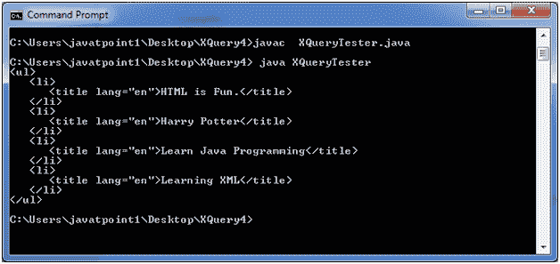
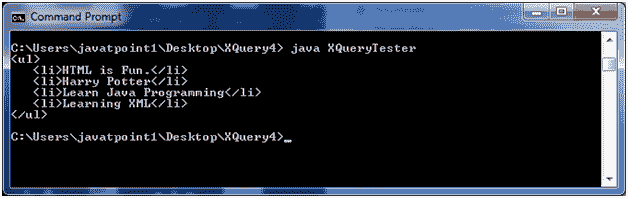

# XQuery HTML 格式

> 原文:[https://www.javatpoint.com/xquery-html-format](https://www.javatpoint.com/xquery-html-format)

XQuery 还可以用来将 XML 文档转换成 HTML 页面。

让我们举个例子来看看它是如何工作的:

* * *

## XQuery HTML 格式示例

让我们来看一个名为“books.xml”的 XML 文件，它包含以下代码。

**XML 语句:**

**books.xml:**

```

<bookstore>
<book category="web">
<title lang="en">HTML is Fun.</title>
<author>Ajeet Kumar</author>
<year>2012</year>
<price>200.00</price>
</book>
<book category="children">
<title lang="en">Harry Potter</title>
<author>J K. Rowling</author>
<year>2005</year>
<price>600.00</price>
</book>
<book category="programming">
<title lang="en">Learn Java Programming</title>
<author>James Gowsling</author>
<author>Peter Brown</author>
<author>Sri Bala</author>
<author>James Linn</author>
<author>Vaidyanathan Nagarajan</author>
<year>2003</year>
<price>400.00</price>
</book>
<book category="web" cover="paperback">
<title lang="en">Learning XML</title>
<author>Aryan Tomar</author>
<year>2013</year>
<price>150.00</price>
</book>
</bookstore>

```

**XQuery 表达式:**

**书籍. xqy:**

```

<ul>
{
for $x in doc("books.xml")/bookstore/book/title
order by $x
return <li>{$x}</li>
}
</ul>

```

本示例将选择书店元素下的图书元素下的所有标题元素，并按字母顺序返回标题元素。

现在，创建一个基于 Java 的 XQuery executor 程序来读取 books.xqy，将其传递给 XQuery 表达式处理器，并执行该表达式。之后将显示结果。

**XQueryTester.java**

```

import java.io.File;
import java.io.FileInputStream;
import java.io.FileNotFoundException;
import java.io.InputStream;

import javax.xml.xquery.XQConnection;
import javax.xml.xquery.XQDataSource;
import javax.xml.xquery.XQException;
import javax.xml.xquery.XQPreparedExpression;
import javax.xml.xquery.XQResultSequence;

import com.saxonica.xqj.SaxonXQDataSource;

public class XQueryTester {
   public static void main(String[] args){
      try {
         execute();
      }

      catch (FileNotFoundException e) {
         e.printStackTrace();
      }

      catch (XQException e) {
         e.printStackTrace();
      }
   }

   private static void execute() throws FileNotFoundException, XQException{
      InputStream inputStream = new FileInputStream(new File("books.xqy"));
      XQDataSource ds = new SaxonXQDataSource();
      XQConnection conn = ds.getConnection();
      XQPreparedExpression exp = conn.prepareExpression(inputStream);
      XQResultSequence result = exp.executeQuery();
       while (result.next()) {
         System.out.println(result.getItemAsString(null));
      }
   }	
}

```

* * *

## 对 XML 执行 XQuery

将以上三个文件放在同一个位置。我们将它们放在桌面上一个名为 XQuery4 的文件夹中。使用控制台编译 XQueryTester.java。您的计算机上必须安装 JDK 1.5 或更高版本，并且配置了类路径。

**编译:**

javac XQueryTester.java

**执行:**

java XQueryTester

**输出:**



如果您想要消除标题元素并只显示标题元素中的数据，请使用以下 XQuery 表达式:

**书籍. xqy:**

```

<ul>
{
for $x in doc("books.xml")/bookstore/book/title
order by $x
return <li>{data($x)}</li>
}
</ul>

```

**输出:**

[download this example](https://static.javatpoint.com/xquery/src/XQuery4.zip)