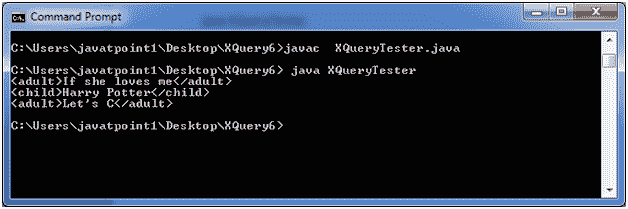

# XQuery 语法

> 原文:[https://www.javatpoint.com/xquery-syntax](https://www.javatpoint.com/xquery-syntax)

XQuery 元素、属性和变量必须是有效的 XML 名称，并且区分大小写。

**XQuery 语法规则**

*   XQuery 遵循区分大小写。
*   XQuery 元素、属性和变量必须是有效的 XML 名称。
*   XQuery 字符串值可以用单引号或双引号引起来。
*   XQuery 变量是用$后跟名称来定义的，例如:。$书店
*   XQuery 注释由(:和:)分隔，例如:(XQuery 注释:)

### 例子

让我们来看一个包含以下数据的 XML 文件“books.xml”:

```

<bookstore>
<book category="Romantic">
<title lang="en">If she loves me</title>
<author>Ajeet Kumar</author>
<year>2014</year>
<price>150</price>
</book>
<book category="children">
<title lang="en">Harry Potter</title>
<author>J K. Rowling</author>
<year>2005</year>
<price>700</price>
</book>
<book category="programming">
<title lang="en">Let's C</title>
<author>Yashwant Kanetkar</author>
<year>2003</year>
<price>200</price>
</book>
</bookstore>

```

* * *

## XQuery 条件表达式

XQuery 中允许“如果-那么-否则”条件语句。

**XQuery 语句:**

**图书. xqy**

```

for $x in doc("books.xml")/bookstore/book
return if ($x/@category="CHILDREN")
then <child>{data($x/title)}</child>
else <adult>{data($x/title)}</adult>

```

* * *

## 怎么跑

创建一个基于 Java 的 XQuery executor 程序来读取 books.xqy，将其传递给 XQuery 表达式处理器，并执行该表达式。之后将显示结果。

**XQueryTester.java**

```

import java.io.File;
import java.io.FileInputStream;
import java.io.FileNotFoundException;
import java.io.InputStream;
import javax.xml.xquery.XQConnection;
import javax.xml.xquery.XQDataSource;
import javax.xml.xquery.XQException;
import javax.xml.xquery.XQPreparedExpression;
import javax.xml.xquery.XQResultSequence;
import com.saxonica.xqj.SaxonXQDataSource;
public class XQueryTester {
   public static void main(String[] args){
      try {
         execute();
      }
      catch (FileNotFoundException e) {
         e.printStackTrace();
      }      
      catch (XQException e) {
         e.printStackTrace();
      }
   }
   private static void execute() throws FileNotFoundException, XQException{
      InputStream inputStream = new FileInputStream(new File("courses.xqy"));
      XQDataSource ds = new SaxonXQDataSource();
      XQConnection conn = ds.getConnection();
      XQPreparedExpression exp = conn.prepareExpression(inputStream);
      XQResultSequence result = exp.executeQuery();
       while (result.next()) {
         System.out.println(result.getItemAsString(null));
      }
   }	
}

```

* * *

## 对 XML 执行 XQuery

将以上三个文件放在同一个位置。我们将它们放在桌面上一个名为 XQuery6 的文件夹中。

使用控制台编译 XQueryTester.java。您的计算机上必须安装 JDK 1.5 或更高版本，并且配置了类路径。

**编译:**

javac XQueryTester.java

**执行:**

java XQueryTester

**输出:**



* * *

## XQuery 比较

在 XQuery 中有两种比较值的类型。

1.  **一般比较:** =，！=，<，< =，>，> =
2.  **值比较:** eq，ne，lt，le，gt，ge

**一般比较和数值比较的区别**

可以用一个例子来解释。如果任何 q 属性的值大于 100，则以下表达式返回 true。

```

$bookstore//book/@q > 100 

```

如果表达式只返回一个 q 属性，并且其值大于 10，则以下表达式返回 true。如果返回多个 q，则会出现错误:

```

$bookstore//book/@q gt 100

```

[download this example](https://static.javatpoint.com/xquery/src/XQuery6.zip)