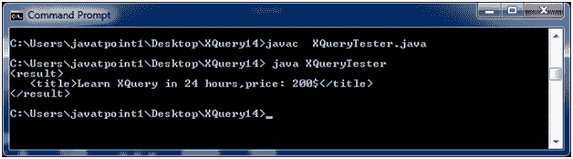

# XQuery concat()函数

> 原文：<https://www.javatpoint.com/xquery-concat-function>

XQuery concat 函数用于连接各种字符串。

```xml

concat($input as xs:anyAtomicType?) as xs:string 

```

**参数说明:**

**$input** -它指定一个或多个用逗号分隔的输入。

* * *

## XQuery 连接示例

让我们举个例子来演示 XQuery concat 函数的用法。以名为“books.xqy”的 XQuery 表达式为例，其代码如下。它将连接给定 XQuery 表达式的标题和价格。

**XQuery 表达式:**

**书籍. xqy:**

```xml

let $bookTitle := "Learn XQuery in 24 hours"
let $updatedTitle := concat($bookTitle,",price: 200$")
return
   <result>   
      <title>{$updatedTitle}</title>
   </result>

```

创建一个基于 Java 的 XQuery executor 程序来读取 books.xqy，将其传递给 XQuery 表达式处理器，并执行该表达式。之后将显示结果。

**XQueryTester.java**

```xml

import java.io.File;
import java.io.FileInputStream;
import java.io.FileNotFoundException;
import java.io.InputStream;

import javax.xml.xquery.XQConnection;
import javax.xml.xquery.XQDataSource;
import javax.xml.xquery.XQException;
import javax.xml.xquery.XQPreparedExpression;
import javax.xml.xquery.XQResultSequence;

import com.saxonica.xqj.SaxonXQDataSource;

public class XQueryTester {
   public static void main(String[] args){
      try {
         execute();
      }

      catch (FileNotFoundException e) {
         e.printStackTrace();
      }

      catch (XQException e) {
         e.printStackTrace();
      }
   }

   private static void execute() throws FileNotFoundException, XQException{
      InputStream inputStream = new FileInputStream(new File("books.xqy"));
      XQDataSource ds = new SaxonXQDataSource();
      XQConnection conn = ds.getConnection();
      XQPreparedExpression exp = conn.prepareExpression(inputStream);
      XQResultSequence result = exp.executeQuery();
       while (result.next()) {
         System.out.println(result.getItemAsString(null));
      }
   }	
}

```

* * *

## 对 XML 执行 XQuery

将以上两个文件放在同一个位置。我们将它们放在桌面上一个名为 XQuery14 的文件夹中。使用控制台编译 XQueryTester.java。您的计算机上必须安装 JDK 1.5 或更高版本，并且配置了类路径。

**编译:**

javac XQueryTester.java

**执行:**

java XQueryTester

**输出:**

[download this example](https://static.javatpoint.com/xquery/src/XQuery14.zip)