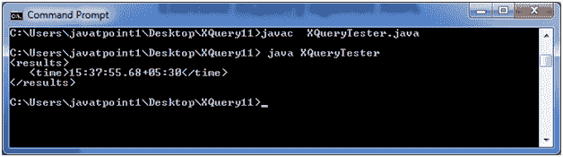

# XQuery 当前时间()函数

> 原文:[https://www.javatpoint.com/xquery-current-time-function](https://www.javatpoint.com/xquery-current-time-function)

XQuery 当前时间函数用于检索当前时间。

```

current-time() 

```

* * *

## XQuery 当前时间()示例

使用以下 XQuery 表达式获取当前时间。

**当前时间 xqy:**

```

let $time := current-time()
return
<results>
   <time>{$time}</time>
</results>

```

创建一个基于 Java 的 XQuery executor 程序来读取 current-time.xqy，将其传递给 XQuery 表达式处理器，并执行该表达式。之后将显示结果。

**XQueryTester.java**

```

import java.io.File;
import java.io.FileInputStream;
import java.io.FileNotFoundException;
import java.io.InputStream;

import javax.xml.xquery.XQConnection;
import javax.xml.xquery.XQDataSource;
import javax.xml.xquery.XQException;
import javax.xml.xquery.XQPreparedExpression;
import javax.xml.xquery.XQResultSequence;

import com.saxonica.xqj.SaxonXQDataSource;

public class XQueryTester {
   public static void main(String[] args){
      try {
         execute();
      }

      catch (FileNotFoundException e) {
         e.printStackTrace();
      }

      catch (XQException e) {
         e.printStackTrace();
      }
   }

   private static void execute() throws FileNotFoundException, XQException{
      InputStream inputStream = new FileInputStream(new File("current-time.xqy"));
      XQDataSource ds = new SaxonXQDataSource();
      XQConnection conn = ds.getConnection();
      XQPreparedExpression exp = conn.prepareExpression(inputStream);
      XQResultSequence result = exp.executeQuery();
       while (result.next()) {
         System.out.println(result.getItemAsString(null));
      }
   }	
}

```

* * *

## 对 XML 执行 XQuery

将以上两个文件放在同一个位置。我们将它们放在桌面上一个名为 XQuery11 的文件夹中。使用控制台编译 XQueryTester.java。您的计算机上必须安装 JDK 1.5 或更高版本，并且配置了类路径。

**编译:**

javac XQueryTester.java

**执行:**

java XQueryTester

**输出:**

[download this example](https://static.javatpoint.com/xquery/src/XQuery11.zip)