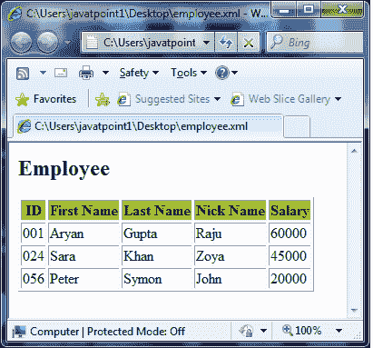

# XSLT 语法

> 原文：<https://www.javatpoint.com/xslt-syntax>

让我们举一个例子来获取一个示例 XML 文件，并将其转换为格式良好的 HTML 文档。

**见本例:**

创建一个名为 employee.xml 的 XML 文件，其代码如下:

**Employee.xml**

```xml
<?xml version = "1.0"?>
<class> 
   <employee id = "001">
      <firstname>Aryan</firstname> 
      <lastname>Gupta</lastname> 
      <nickname>Raju</nickname> 
      <salary>30000</salary>
   </employee> 
   <employee id = "024"> 
      <firstname>Sara</firstname> 
      <lastname>Khan</lastname> 
      <nickname>Zoya</nickname> 
      <salary>25000</salary>
   </employee> 
   <employee id = "056"> 
      <firstname>Peter</firstname> 
      <lastname>Symon</lastname> 
      <nickname>John</nickname> 
      <salary>10000</salary> 
   </employee> 
</class>

```

为上面的 XML 文档定义一个 XSLT 样式表文档。您应该遵循下面给出的标准:

*   页面应该有一个标题员工。
*   页面应该有一个员工详细信息表。
*   列应该有以下标题:身份证，名字，姓氏，昵称，工资
*   表格必须包含相应员工的详细信息。

**步骤 1:创建 XSLT 文档**

创建满足上述要求的 XSLT 文档。将其命名为 employee.xsl，并将其保存在 employee.xml 的相同位置。

**员工 xsl**

```xml
<?xml version = "1.0" encoding = "UTF-8"?>
<!-- xsl stylesheet declaration with xsl namespace: 
Namespace tells the xlst processor about which 
element is to be processed and which is used for output purpose only 
--> 
<xsl:stylesheet version = "1.0" 
xmlns:xsl = "http://www.w3.org/1999/XSL/Transform">   
<!-- xsl template declaration:  
template tells the xlst processor about the section of xml 
document which is to be formatted. It takes an XPath expression. 
In our case, it is matching document root element and will 
tell processor to process the entire document with this template. 
--> 
   <xsl:template match = "/"> 
      <!-- HTML tags 
         Used for formatting purpose. Processor will skip them and browser 
            will simply render them. 
      --> 
      <html> 
         <body>
            <h2>Employee</h2> 
            <table border = "1"> 
               <tr bgcolor = "#9acd32"> 
                  <th>ID</th> 
                  <th>First Name</th> 
                  <th>Last Name</th> 
                  <th>Nick Name</th> 
                  <th>Salary</th> 
               </tr> 
               <!-- for-each processing instruction 
               Looks for each element matching the XPath expression 
               --> 
              <xsl:for-each select="class/employee"> 
                  <tr> 
                     <td> 
                        <!-- value-of processing instruction 
                        process the value of the element matching the XPath expression 
                        --> 
                        <xsl:value-of select = "@id"/> 
                     </td> 
                     <td><xsl:value-of select = "firstname"/></td> 
                     <td><xsl:value-of select = "lastname"/></td> 
                     <td><xsl:value-of select = "nickname"/></td> 
                     <td><xsl:value-of select = "salary"/></td>   
                  </tr> 
               </xsl:for-each> 
            </table> 
         </body> 
      </html> 
   </xsl:template>  
</xsl:stylesheet>

```

**第二步:将 XSLT 文档列表到 XML 文档中**

使用以下 xml 样式表标记更新 employee.xml 文档。将 href 值设置为 employee.xsl

```xml
<?xml version = "1.0"?> 
<?xml-stylesheet type = "text/xsl" href = "employee.xsl"?> 
<class> 
... 
</class>

```

**更新“employee . XML”**

```xml
<?xml version = "1.0"?>
<?xml-stylesheet type = "text/xsl" href = "employee.xsl"?> 
<class> 
   <employee id = "001">
      <firstname>Aryan</firstname> 
      <lastname>Gupta</lastname> 
      <nickname>Raju</nickname> 
      <salary>30000</salary>
   </employee> 
   <employee id = "024"> 
      <firstname>Sara</firstname> 
      <lastname>Khan</lastname> 
      <nickname>Zoya</nickname> 
      <salary>25000</salary>
   </employee> 
   <employee id = "056"> 
      <firstname>Peter</firstname> 
      <lastname>Symon</lastname> 
      <nickname>John</nickname> 
      <salary>10000</salary> 
   </employee> 
</class>

```

**第三步:在互联网浏览器**中查看 XML 文档

输出如下所示:

**输出:**

