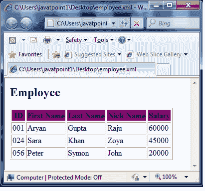

# XSLT <value-of>元素</value-of>

> 原文：<https://www.javatpoint.com/xslt-xsl-value-of-element>

XSLT <value-of>元素用于提取所选节点的值。它按照 XPath 表达式将选定节点的值作为文本。</value-of>

```

<xsl:value-of
   select = Expression
   disable-output-escaping = "yes" | "no">
</xsl:value-of> 

```

* * *

## 参数说明

| 索引 | 名字 | 描述 |
| 1) | 挑选 | 它指定要在当前上下文中计算的 XPpath 表达式。 |
| 2) | 禁用-输出扫描 | 默认-“否”。如果为“是”，输出文本将不会从文本中转义 XML 字符。 |

* * *

## XSLT <value-of>元素示例</value-of>

让我们举个例子来看看 XSLT <value-of>元素及其属性“id”和子元素<firstname>、<lastname>、<nickname>和<salary>的用法。</salary></nickname></lastname></firstname></value-of>

**Employee.xml**

```

<?xml version = "1.0"?>
<?xml-stylesheet type = "text/xsl" href = "employee.xsl"?> 
<class> 
   <employee id = "001">
      <firstname>Aryan</firstname> 
      <lastname>Gupta</lastname> 
      <nickname>Raju</nickname> 
      <salary>30000</salary>
   </employee> 
   <employee id = "024"> 
      <firstname>Sara</firstname> 
      <lastname>Khan</lastname> 
      <nickname>Zoya</nickname> 
      <salary>25000</salary>
   </employee> 
   <employee id = "056"> 
      <firstname>Peter</firstname> 
      <lastname>Symon</lastname> 
      <nickname>John</nickname> 
      <salary>10000</salary> 
   </employee> 
</class>

```

**员工 xsl**

```

<?xml version = "1.0" encoding = "UTF-8"?>
<xsl:stylesheet version = "1.0" 
xmlns:xsl = "http://www.w3.org/1999/XSL/Transform">   
   <xsl:template match = "/"> 
      <html> 
         <body> 
            <h2>Employee</h2> 
            <table border = "1"> 
               <tr bgcolor = "purple"> 
                  <th>ID 
                  <th>First Name</th> 
                  <th>Last Name</th> 
                  <th>Nick Name</th> 
                  <th>Salary</th> 
               </tr> 
               <!-- for-each processing instruction 
               Looks for each element matching the XPath expression 
               --> 
               <xsl:for-each select="class/employee"> 
                  <tr> 
                     <td> 
                        <!-- value-of processing instruction 
                        process the value of the element matching the XPath expression 
                        -->
                        <xsl:value-of select = "@id"/> 
                     </td> 
                     <td><xsl:value-of select = "firstname"/></td> 
                     <td><xsl:value-of select = "lastname"/></td> 
                     <td><xsl:value-of select = "nickname"/></td> 
                     <td><xsl:value-of select = "salary"/></td>   
                  </tr> 
               </xsl:for-each> 
            </table>
         </body>
      </html> 
   </xsl:template>  
</xsl:stylesheet>

```

**输出:**

