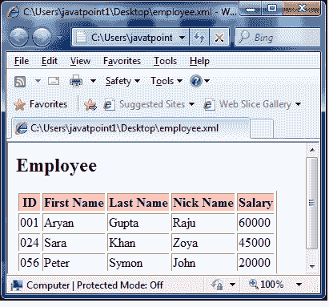

# XSLT <for-each>元素</for-each>

> 原文：<https://www.javatpoint.com/xslt-xsl-for-each-element>

XSLT <for-each>元素用于为每个节点重复应用一个模板。</for-each>

```xml

<xsl:for-each
   select = Expression>  
</xsl:for-each> 

```

* * *

## 参数说明

**选择:**要在当前上下文中评估的 XPath 表达式，以确定要迭代的节点集。

* * *

## XSLT <for-each>元素示例</for-each>

让我们举一个例子，通过迭代每个员工，创建一个属性为“id”的<employee>元素及其子元素<firstname>、<lastname>、<nickname>和<salary>的表。</salary></nickname></lastname></firstname></employee>

**Employee.xml**

```xml

<?xml version = "1.0"?>
<?xml-stylesheet type = "text/xsl" href = "employee.xsl"?> 
<class> 
   <employee id = "001">
      <firstname>Aryan</firstname> 
      <lastname>Gupta</lastname> 
      <nickname>Raju</nickname> 
      <salary>30000</salary>
   </employee> 
   <employee id = "024"> 
      <firstname>Sara</firstname> 
      <lastname>Khan</lastname> 
      <nickname>Zoya</nickname> 
      <salary>25000</salary>
   </employee> 
   <employee id = "056"> 
      <firstname>Peter</firstname> 
      <lastname>Symon</lastname> 
      <nickname>John</nickname> 
      <salary>10000</salary> 
   </employee> 
</class>

```

**员工 xsl**

```xml

<?xml version = "1.0" encoding = "UTF-8"?>
<xsl:stylesheet version = "1.0" 
xmlns:xsl = "http://www.w3.org/1999/XSL/Transform">   
   <xsl:template match = "/"> 
      <html> 
         <body> 
            <h2>Employee 
                  <th>First Name</th> 
                  <th>Last Name</th> 
                  <th>Nick Name</th> 
                  <th>Salary</th> 
               </tr> 
               <!-- for-each processing instruction 
               Looks for each element matching the XPath expression 
               --> 
               <xsl:for-each select="class/employee"> 
                  <tr> 
                     <td> 
                        <!-- value-of processing instruction 
                        process the value of the element matching the XPath expression 
                        --> 
                        <xsl:value-of select = "@id"/> 
                     </td> 
                     <td><xsl:value-of select = "firstname"/></td> 
                     <td><xsl:value-of select = "lastname"/></td> 
                     <td><xsl:value-of select = "nickname"/></td> 
                     <td><xsl:value-of select = "salary"/></td>   
                  </tr> 
               </xsl:for-each> 
            </table> 
         </body> 
      </html>
   </xsl:template> 
</xsl:stylesheet>

```

**输出:**

