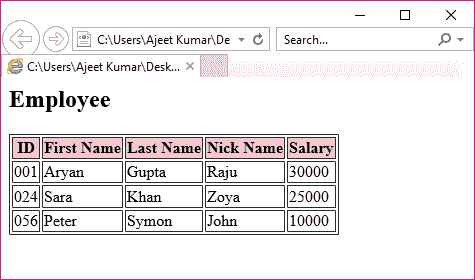

# XSLT <sort>元素</sort>

> 原文：<https://www.javatpoint.com/xslt-xsl-sort-element>

XSLT <sort>元素用于指定节点上的排序标准。它以排序的形式显示输出。</sort>

在 XSL 文件的<for-each>元素中添加<xml:sort>元素，对输出进行排序。</xml:sort></for-each>

```xml
<xsl:sort 
   select = string-expression  
   lang = { nmtoken } 
   data-type = { "text" | "number" | QName } 
   order = { "ascending" | "descending" } 
   case-order = { "upper-first" | "lower-first" } > 
</xsl:sort> 

```

* * *

## 参数说明

| 索引 | 名字 | 描述 |
| 1) | 挑选 | 用于对节点的关键字进行排序。 |
| 2) | 语言 | 它指定了用于确定排序顺序的语言字母表。 |
| 3) | 数据类型 | 它指定文本的数据类型。 |
| 4) | 命令 | 它用于指定排序顺序。默认情况下，排序顺序是升序。 |
| 5) | 案例顺序 | 用于按大小写指定字符串的排序顺序。默认为“上优先”。 |

* * *

## XSLT <sort>元素示例</sort>

让我们举一个例子，通过迭代每个学生按姓氏排序来创建一个包含属性“id”及其子元素<firstname>、<lastname>、<nickname>和<salary>的<employee>元素的表。</employee></salary></nickname></lastname></firstname>

**Employee.xml**

```xml
<?xml version = "1.0"?>
<?xml-stylesheet type = "text/xsl" href = "employee.xsl"?> 
<class> 
   <employee id = "001">
      <firstname>Aryan</firstname> 
      <lastname>Gupta</lastname> 
      <nickname>Raju</nickname> 
      <salary>30000</salary>
   </employee> 
   <employee id = "024"> 
      <firstname>Sara</firstname> 
      <lastname>Khan</lastname> 
      <nickname>Zoya</nickname> 
      <salary>25000</salary>
   </employee> 
   <employee id = "056"> 
      <firstname>Peter</firstname> 
      <lastname>Symon</lastname> 
      <nickname>John</nickname> 
      <salary>10000</salary> 
   </employee> 
</class>

```

**员工 xsl**

```xml
<?xml version = "1.0" encoding = "UTF-8"?>
<xsl:stylesheet version = "1.0" 
xmlns:xsl = "http://www.w3.org/1999/XSL/Transform">   
   <xsl:template match = "/"> 
      <html> 
         <body> 
            <h2>Employee</h2> 
            <table border = "1"> 
               <tr bgcolor = "pink"> 
                  <th>ID</th> 
                  <th>First Name</th> 
                  <th>Last Name</th> 
                  <th>Nick Name</th> 
                  <th>Salary</th> 
               </tr> 
               <xsl:for-each select = "class/employee"> 
               <xsl:sort select = "lastname"/> 
                     <tr> 
                     <td><xsl:value-of select = "@id"/></td> 
                     <td><xsl:value-of select = "firstname"/></td> 
                     <td><xsl:value-of select = "lastname"/></td> 
                     <td><xsl:value-of select = "nickname"/></td> 
                     <td><xsl:value-of select = "salary"/></td>   
                  </tr> 
               </xsl:for-each> 
            </table> 
         </body> 
      </html>
  </xsl:template>  
</xsl:stylesheet>

```

**输出:**



**注:**上表按姓氏排序。