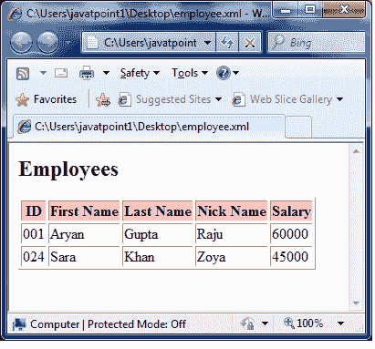

# XSLT <if>元素</if>

> 原文：<https://www.javatpoint.com/xslt-xsl-if-element>

XSLT <if>元素用于针对 XML 文件的内容指定条件测试。</if>

```xml

<xsl:if test="expression">
  ...some output if the expression is true...
</xsl:if> 

```

* * *

## 参数说明

**测试:**在 xml 数据中指定一个条件进行测试。

* * *

## XSLT <if>元素示例</if>

让我们举个例子，通过迭代每个员工，创建一个属性为“id”的<employee>元素及其子<名字>、<姓氏>、<昵称>和<工资>的表格。让我们假设一个条件，假设工资大于 15000，然后打印员工的详细信息。</employee>

**Employee.xml**

```xml

<?xml version = "1.0"?>
<?xml-stylesheet type = "text/xsl" href = "employee.xsl"?> 
<class> 
   <employee id = "001">
      <firstname>Aryan</firstname> 
      <lastname>Gupta</lastname> 
      <nickname>Raju</nickname> 
      <salary>30000</salary>
   </employee> 
   <employee id = "024"> 
      <firstname>Sara</firstname> 
      <lastname>Khan</lastname> 
      <nickname>Zoya</nickname> 
      <salary>25000</salary>
   </employee> 
   <employee id = "056"> 
      <firstname>Peter</firstname> 
      <lastname>Symon</lastname> 
      <nickname>John</nickname> 
      <salary>10000</salary> 
   </employee> 
</class>

```

**员工 xsl**

```xml

<?xml version = "1.0" encoding = "UTF-8"?> 
<xsl:stylesheet version = "1.0" 
   xmlns:xsl = "http://www.w3.org/1999/XSL/Transform">
   <xsl:template match = "/"> 
      <html> 
         <body> 
            <h2>Employee </h2> 
            <table border = "1"> 
               <tr bgcolor = "pink"> 
                  <th>ID</th> 
                  <th>First Name</th> 
                  <th>Last Name</th> 
                  <th>Nick Name</th> 
                  <th>Salary</th> 
               </tr> 

               <xsl:for-each select = "class/employee"> 

                  <xsl:if test = "salary > 30000"> 
                     <tr>> 
                        <td><xsl:value-of select = "@id"/></td> 
                        <td><xsl:value-of select = "firstname"/></td> 
                        <td><xsl:value-of select = "lastname"/></td>
                        <td><xsl:value-of select = "nickname"/></td>> 
                        <td><xsl:value-of select = "salary"/></td>
                     </tr> 
                  </xsl:if> 
               </xsl:for-each> 

            </table> 
         </body> 
      </html>
   </xsl:template>  
</xsl:stylesheet>

```

**输出:**

