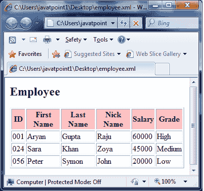

# XSLT <choose>元素</choose>

> 原文：<https://www.javatpoint.com/xslt-xsl-choose-element>

XSLT <choose>元素用于针对具有<otherwise>和<when>元素的节点内容指定多重条件测试。</when></otherwise></choose>

```xml

<xsl:choose>
  <xsl:when test="expression">
    ... some output ...
  </xsl:when>
  <xsl:otherwise>
    ... some output ....
  </xsl:otherwise>
</xsl:choose>

```

* * *

## 参数说明

**测试:**在 xml 数据中指定一个条件进行测试。

* * *

## XSLT <choose>元素示例</choose>

让我们举个例子，通过迭代每个员工，创建一个属性为“id”的<employee>元素及其子<名字>、<姓氏>、<昵称>和<工资>的表格。它检查工资，然后打印等级详细信息。</employee>

**Employee.xml**

```xml

<?xml version = "1.0"?>
<?xml-stylesheet type = "text/xsl" href = "employee.xsl"?> 
<class> 
   <employee id = "001">
      <firstname>Aryan</firstname> 
      <lastname>Gupta</lastname> 
      <nickname>Raju</nickname> 
      <salary>30000</salary>
   </employee> 
   <employee id = "024"> 
      <firstname>Sara</firstname> 
      <lastname>Khan</lastname> 
      <nickname>Zoya</nickname> 
      <salary>25000</salary>
   </employee> 
   <employee id = "056"> 
      <firstname>Peter</firstname> 
      <lastname>Symon</lastname> 
      <nickname>John</nickname> 
      <salary>10000</salary> 
   </employee> 
</class>

```

**员工 xsl**

```xml

<?xml version = "1.0" encoding = "UTF-8"?> 
<xsl:stylesheet version = "1.0" 
   xmlns:xsl = "http://www.w3.org/1999/XSL/Transform">   
   <xsl:template match = "/"> 
      <html> 
         <body> 
            <h2>Employee</h2> 
            <table border = "1"> 
               <tr bgcolor = "pink"> 
                  <th>ID</th> 
                  <th>First Name</th> 
                  <th>Last Name</th> 
                  <th>Nick Name</th> 
                  <th>Salary</th> 
                  <th>Grade</th> 
               </tr> 

               <xsl:for-each select = "class/employee"> 

                  <tr> 
                     <td><xsl:value-of select = "@id"/></td> 
                     <td><xsl:value-of select = "firstname"/></td> 
                     <td><xsl:value-of select = "lastname"/></td> 
                     <td><xsl:value-of select = "nickname"/></td> 
                     <td><xsl:value-of select = "salary"/></td> 

                     <td> 
                        <xsl:choose> 
                           <xsl:when test = "salary > 50000"> 
                              High 
                           </xsl:when> 

                           <xsl:when test = "salary > 40000"> 
                              Medium 
                           </xsl:when> 

                           <xsl:otherwise> 
                              Low 
                           </xsl:otherwise> 
                        </xsl:choose> 
                     </td> 
                  </tr> 
               </xsl:for-each> 
            </table> 
         </body> 
      </html> 
   </xsl:template>  
</xsl:stylesheet>

```

**输出:**

