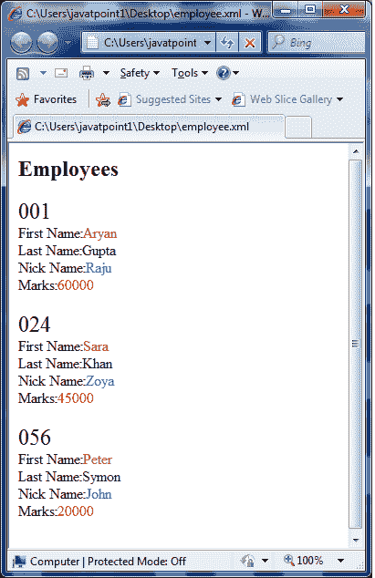

# XSLT <apply-template>元素</apply-template>

> 原文：<https://www.javatpoint.com/xslt-xsl-apply-template-element>

XSLT <apply-template>元素用于告诉 XSLT 处理器根据每个选定节点的类型和上下文找到合适的模板进行应用。</apply-template>

```
<xsl:apply-template 
   select = Expression 
   mode = QName>
</xsl:apply-template> 

```

* * *

## 参数说明

| 索引 | 名字 | 描述 |
| 1) | 挑选 | 它用于处理 XPath 表达式从所有节点及其子节点列表中选择的节点。 |
| 2) | 方式 | 它用于允许由限定名指定的元素被处理多次，每次产生不同的结果。 |

* * *

## XSLT <apply-template>元素示例</apply-template>

让我们举一个例子，通过迭代每个员工，创建一个属性为“id”的<employee>元素及其子元素<firstname>、<lastname>、<nickname>和<salary>的列表。</salary></nickname></lastname></firstname></employee>

**Employee.xml**

```
<?xml version = "1.0"?>
<?xml-stylesheet type = "text/xsl" href = "employee.xsl"?> 
<class> 
   <employee id = "001">
      <firstname>Aryan</firstname> 
      <lastname>Gupta</lastname> 
      <nickname>Raju</nickname> 
      <salary>30000</salary>
   </employee> 
   <employee id = "024"> 
      <firstname>Sara</firstname> 
      <lastname>Khan</lastname> 
      <nickname>Zoya</nickname> 
      <salary>25000</salary>
   </employee> 
   <employee id = "056"> 
      <firstname>Peter</firstname> 
      <lastname>Symon</lastname> 
      <nickname>John</nickname> 
      <salary>10000</salary> 
   </employee> 
</class>

```

**员工 xsl**

```
<?xml version = "1.0" encoding = "UTF-8"?> 
<xsl:stylesheet version = "1.0" 
   xmlns:xsl = "http://www.w3.org/1999/XSL/Transform">   
   <xsl:template match = "/"> 
      <html> 
         <body> 
            <h2>Employees</h2> 
            <xsl:apply-templates select = "class/employee" /> 
         </body> 
      </html>
   </xsl:template>  

   <xsl:template match = "class/employee"> 
      <xsl:apply-templates select = "@id" /> 
      <xsl:apply-templates select = "firstname" /> 
      <xsl:apply-templates select = "lastname" /> 
      <xsl:apply-templates select = "nickname" /> 
      <xsl:apply-templates select = "salary" /> 
      <br /> 
   </xsl:template>  
   <xsl:template match = "@id"> 
      <span style = "font-size = 25px;"> 
         <xsl:value-of select = "." /> 
      </span> 

   </xsl:template>  
   <xsl:template match = "firstname"> 
      First Name:<span style = "color:brown;"> 
         <xsl:value-of select = "." /> 
      </span> 
      <br /> 
   </xsl:template>  
   <xsl:template match = "lastname"> 
      Last Name:<span style = "color:green;"> 
         <xsl:value-of select = "." /> 
      </span> 
      <br /> 

```

**输出:**

