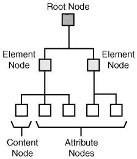

# XPath 节点

> 原文：<https://www.javatpoint.com/xpath-nodes>

XPath 中有七种节点:

1.  元素
2.  属性
3.  文本
4.  命名空间
5.  加工指令
6.  评论
7.  文档节点。

一个 XML 文档可以被指定为一个节点树。树的最顶端的元素称为根元素。



让我们以一个 XML 文档为例来理解 XPath 节点的不同术语。

**一个 XML 文档:**

```xml

<?xml version="1.0" encoding="UTF-8"?>
<Library>
  <book>
    <title lang="en">Three Mistakes of My Life</title>
    <author>Chetan Bhagat</author>
    <year>2008</year>
    <price>110</price>
  </book>
</Library>

```

**上述 XML 文档中的节点:**

```xml

<library> (root element node)
<author>Chetan Bhagat</author> (element node)
lang="en" (attribute node) 

```

* * *

## 原子值

原子值用于指定没有子节点或父节点的节点。例如:在上面的 XML 文档中，原子值如下:

查坦·巴特

"在"

* * *

## 节点的关系

**父节点**

每个元素和属性都有一个父元素，它是相应元素或属性的顶级元素。

**见本例:**

在本例中，book 元素是标题、作者、年份和价格的父元素。

```xml

<book>
    <title lang="en">Three Mistakes of My Life</title>
    <author>Chetan Bhagat</author>
    <year>2008</year>
    <price>110</price>
</book>

```

**子节点**

子节点可以有零个、一个或多个子节点。在本例中，标题、作者、年份和价格元素都是 book 元素的子元素。

```xml

<book>
    <title lang="en">Three Mistakes of My Life</title>
    <author>Chetan Bhagat</author>
    <year>2008</year>
    <price>110</price>
</book>

```

**兄弟节点**

具有相同父节点的节点称为兄弟节点。在本例中，标题、作者、年份和价格元素都是同级。

```xml

<book>
    <title lang="en">Three Mistakes of My Life</title>
    <author>Chetan Bhagat</author>
    <year>2008</year>
    <price>110</price>
</book>

```

**祖先**

节点的父节点或父节点的父节点被指定为祖先节点。在本例中，title 元素的祖先是 book 元素和 library 元素。

```xml

 <Library>
   <book>
     <title lang="en">Three Mistakes of My Life</title>
     <author>Chetan Bhagat</author>
     <year>2008</year>
     <price>110</price>
   </book>
 </Library>

```

**后代**

后代被指定为节点的子节点或子节点的子节点。在本例中，库元素的后代是图书、标题、作者、年份和价格元素。

```xml

<Library>
  <book>
    <title lang="en">Three Mistakes of My Life</title>
    <author>Chetan Bhagat</author>
    <year>2008</year>
    <price>110</price>
  </book>
</Library>

```