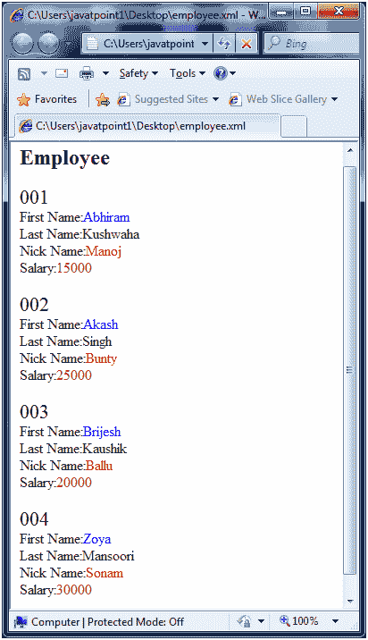

# XPath 通配符

> 原文:[https://www.javatpoint.com/xpath-wildcard](https://www.javatpoint.com/xpath-wildcard)

与 XPath 表达式一起使用的 XPath 通配符列表。

| 索引 | 通配符 | 表示 |
| 1) | * | 它用于匹配任何节点。 |
| 2) | 。 | 它用于匹配上下文中的当前节点。 |
| 3) | @* | 它用于匹配任何属性。 |
| 4) | 节点() | 它用于匹配任何类型的节点。 |

* * *

## XPath 通配符示例

让我们举一个例子，通过迭代每个员工来创建一个包含<employee>元素及其细节的表。</employee>

**Employee.xml**

```
<?xml version = "1.0"?>
<?xml-stylesheet type = "text/xsl" href = "employee.xsl"?>
<class>
   <employee id = "001">
      <firstname>Abhiram</firstname>
      <lastname>Kushwaha</lastname>
      <nickname>Manoj</nickname>
      <salary>15000</salary>
   </employee>
   <employee id = "002">
      <firstname>Akash</firstname>
      <lastname>Singh</lastname>
      <nickname>Bunty</nickname>
      <salary>25000</salary>
   </employee>
    <employee id = "003">
      <firstname>Brijesh</firstname>
      <lastname>Kaushik</lastname>
      <nickname>Ballu</nickname>
      <salary>20000</salary>
   </employee>
    <employee id = "004">
      <firstname>Zoya</firstname>
      <lastname>Mansoori</lastname>
      <nickname>Sonam</nickname>
      <salary>30000</salary>
   </employee>
</class>

```

**员工 xsl**

```
<?xml version = "1.0" encoding = "UTF-8"?>
<xsl:stylesheet version = "1.0">
   xmlns:xsl = "http://www.w3.org/1999/XSL/Transform">	
    <xsl:template match = "/">
       <html>
          <body>
             <h2>Employee </h2>
             <xsl:apply-templates select = "class/*" />
          </body>
       </html>
    </xsl:template>
    <xsl:template match = "class/*">
      <xsl:apply-templates select = "@id" />
       <xsl:apply-templates select = "firstname" />
       <xsl:apply-templates select = "lastname" />
       <xsl:apply-templates select = "nickname" />
       <xsl:apply-templates select = "salary" />
       <br />
    </xsl:template>
    <xsl:template match = "@id">
       <span style = "font-size = 22px;">
          <xsl:value-of select = "." />
       </span>
       <br />
    </xsl:template>
    <xsl:template match = "firstname">
      First Name: <span style = "color:blue;">
          <xsl:value-of select = "." />
       </span>
       <br />
    </xsl:template>
    <xsl:template match = "lastname">
      Last Name: <span style = "color:green;">
          <xsl:value-of select = "." />
       </span>
       <br />
    </xsl:template>
    <xsl:template match = "nickname">
      Nick Name: <span style = "color:red;">
          <xsl:value-of select = "." />
       </span>
       <br />
    </xsl:template>
    <xsl:template match = "salary">
      Salary: <span style = "color:brown;">
          <xsl:value-of select = "." />
       </span>
       <br />
    </xsl:template>
 </xsl:stylesheet>

```

**输出:**

