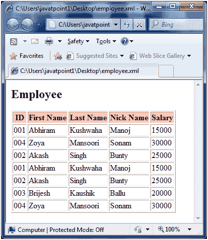

# XPath 谓词

> 原文：<https://www.javatpoint.com/xpath-predicate>

谓词指定用方括号书写的 XPath 表达式。它用于在某些条件下限制节点集中的选定节点。参见“员工”示例中谓词的使用。

**Employee.xml**

```
<?xml version = "1.0"?>
<?xml-stylesheet type = "text/xsl" href = "employee.xsl"?>
<class>
   <employee id = "001">
      <firstname>Abhiram</firstname>
      <lastname>Kushwaha</lastname>
      <nickname>Manoj</nickname>
      <salary>15000</salary>
   </employee>
   <employee id = "002">
      <firstname>Akash</firstname>
      <lastname>Singh</lastname>
      <nickname>Bunty</nickname>
      <salary>25000</salary>
   </employee>
    <employee id = "003">
      <firstname>Brijesh</firstname>
      <lastname>Kaushik</lastname>
      <nickname>Ballu</nickname>
      <salary>20000</salary>
   </employee>
    <employee id = "004">
      <firstname>Zoya</firstname>
      <lastname>Mansoori</lastname>
      <nickname>Sonam</nickname>
      <salary>30000</salary>
   </employee>
</class>

```

| 索引 | 述语 | 描述 |
| 1) | /班级/员工[1] | 它将选择第一个员工元素，它是类元素的子元素。 |
| 2) | /班级/员工[last()] | 它将选择最后一个员工元素，它是类元素的子元素。 |
| 3) | /class/employee[@id = 002] | 它将选择 id 为 002 的员工元素。 |
| 4) | /班级/工资[工资> 10000] | 它将选择薪资大于 10000 的员工元素。 |

* * *

## XPath 谓词示例

让我们举一个例子，通过迭代每个员工来创建一个包含<employee>元素及其细节的表。本示例使用谓词计算员工节点的位置，然后打印员工详细信息。</employee>

**Employee.xml**

```
<?xml version = "1.0"?>
<?xml-stylesheet type = "text/xsl" href = "employee.xsl"?>
<class>
   <employee id = "001">
      <firstname>Abhiram</firstname>
      <lastname>Kushwaha</lastname>
      <nickname>Manoj</nickname>
      <salary>15000</salary>
   </employee>
   <employee id = "002">
      <firstname>Akash</firstname>
      <lastname>Singh</lastname>
      <nickname>Bunty</nickname>
      <salary>25000</salary>
   </employee>
    <employee id = "003">
      <firstname>Brijesh</firstname>
      <lastname>Kaushik</lastname>
      <nickname>Ballu</nickname>
      <salary>20000</salary>
   </employee>
    <employee id = "004">
      <firstname>Zoya</firstname>
      <lastname>Mansoori</lastname>
      <nickname>Sonam</nickname>
      <salary>30000</salary>
   </employee>
</class>

```

**员工 xsl**

```
<?xml version = "1.0" encoding = "UTF-8"?>
<xsl:stylesheet version = "1.0"
   xmlns:xsl = "http://www.w3.org/1999/XSL/Transform">  
   <xsl:template match = "/">
      <html>
         <body>
            <h2>Employee</h2>
            <table border = "1">
               <tr bgcolor = "pink">	 
                  <th>ID</th>
                  <th>First Name</th>
                  <th>Last Name</th>
                  <th>Nick Name</th>
                  <th>Salary</th>	  
               </tr>					
               <xsl:for-each select = "/class/employee[1]">
                  <tr>	 
                     <td><xsl:value-of select = "@id"/></td>
                     <td><xsl:value-of select = "firstname"/></td>
                     <td><xsl:value-of select = "lastname"/></td>
                     <td><xsl:value-of select = "nickname"/></td>
                     <td><xsl:value-of select = "salary"/></td>	 
                  </tr>	
               </xsl:for-each>					
               <xsl:for-each select = "/class/employee[last()]">
                  <tr>	 
                     <td><xsl:value-of select = "@id"/></td>
                     <td><xsl:value-of select = "firstname"/></td>
                     <td><xsl:value-of select = "lastname"/></td>
                     <td><xsl:value-of select = "nickname"/></td>
                     <td><xsl:value-of select = "salary"/></td>	 
                  </tr>	
               </xsl:for-each>	
               <xsl:for-each select = "/class/employee[@id = 002]">
                  <tr>	 
                     <td><xsl:value-of select = "@id"/></td>
                     <td><xsl:value-of select = "firstname"/></td>
                     <td><xsl:value-of select = "lastname"/></td>
                     <td><xsl:value-of select = "nickname"/></td>
                     <td><xsl:value-of select = "salary"/></td>	 
                  </tr>	
               </xsl:for-each>
               <xsl:for-each select = "/class/employee[salary > 10000]">
                  <tr>	 
                     <td><xsl:value-of select = "@id"/></td>
                     <td><xsl:value-of select = "firstname"/></td>
                     <td><xsl:value-of select = "lastname"/></td>
                     <td><xsl:value-of select = "nickname"/></td>
                     <td><xsl:value-of select = "salary"/></td>	 
                  </tr>	
               </xsl:for-each>		
            </table> 
         </body>
      </html>
   </xsl:template>
</xsl:stylesheet>

```

**输出:**



**注意:**在上面的例子中，可以看到四个查询都被提取了。