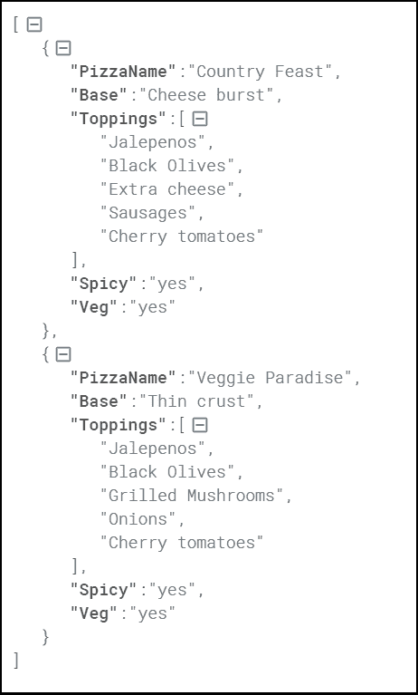

# 什么是 JSON

> 原文：<https://www.javatpoint.com/what-is-json>

JSON 是 JavaScript Object notification 的缩写，是一种开放的标准格式，它是轻量级的，基于文本的，为人类可读的数据交换而明确设计。它是一种独立于语言的数据格式。它支持几乎所有类型的语言、框架和库。

在 21 世纪初，JSON 最初是由道格拉斯·克洛克福特指定的。2013 年，JSON 标准化为 ECMA-404，2017 年发布了 RCF 8259。

JSON 是一个在网络上交换数据的开放标准。它支持像对象和数组这样的数据结构。所以，从 JSON 中读写数据很容易。

在 JSON 中，数据以键值对的形式表示，大括号保存对象，每个名称后面跟一个冒号。逗号用于分隔键值对。方括号用于保存数组，其中每个值都用逗号分隔。

## 什么是 JSON

*   JSON 代表 JavaScript 对象符号。
*   JSON 是一种开放的标准数据交换格式。
*   JSON 是轻量级和自描述的。
*   JSON 起源于 JavaScript。
*   JSON 很容易读写。
*   JSON 是独立于语言的。
*   JSON 支持数组和对象等数据结构。

## JSON 的特点

*   简单
*   公开
*   自我描述
*   国际化
*   展开性
*   互用性

## 我们为什么使用 JSON？

由于与其他可用的选项相比，JSON 是一种易于使用的轻量级语言数据交换格式，因此它可以用于 API 集成。以下是 JSON 的优点:

*   **不太冗长**:与 XML 相比，JSON 遵循紧凑的风格来提高用户的可读性。在处理复杂系统时，JSON 倾向于进行实质性的增强。
*   **更快**:JSON 解析过程比 XML 更快，因为 XML 中的 DOM 操作库需要额外的内存来处理大型 XML 文件。然而，JSON 需要更少的数据，最终导致降低成本和提高解析速度。
*   **可读**:JSON 结构可读性强，简单明了。无论您使用哪种编程语言，您都可以轻松地映射域对象。
*   **结构化数据**:在 JSON 中，使用的是地图数据结构，而 XML 遵循的是树形结构。键值对限制了任务，但有助于预测和易于理解的模型。

## 数据类型

以下是最常用的 JSON 数据类型。

| 数据类型 | 描述 | 例子 |
| 线 | 字符串总是用双引号括起来。它可以由数字、字母数字和特殊字符组成。 | “学生”、“姓名”、“1234”、“版本 1” |
| 数字 | 数字代表数字字符。 | 121, 899 |
| 布尔代数学体系的 | 它可以是真的，也可以是假的。 | 真实的 |
| 空 | 它是一个空值。 |  |

## JSON 对象

在 JSON 中，对象指的是字典，字典用花括号括起来，即{ }。这些对象以键/值对的形式编写，其中键必须是字符串，值必须是有效的 JSON 数据类型，如字符串、数字、对象、布尔值或空值。这里，键和值由冒号分隔，逗号分隔每个键/值对。

例如:

```js

{"name" : "Jack", "employeeid" : 001, "present" : false}

```

## JSON 数组

在 JSON 中，数组可以理解为对象的列表，主要用方括号[ ]括起来。数组值可以是字符串、数字、对象、数组、布尔值或 null。

例如:

```js

 [{
"PizzaName" : "Country Feast",
"Base" : "Cheese burst",
"Toppings" : ["Jalepenos", "Black Olives", "Extra cheese", "Sausages", "Cherry tomatoes"],
"Spicy" : "yes",
"Veg" : "yes"
},

{
"PizzaName" : "Veggie Paradise", 
"Base" : "Thin crust",
"Toppings" : ["Jalepenos", "Black Olives", "Grilled Mushrooms", "Onions", "Cherry tomatoes"],
"Spicy" : "yes",
"Veg" : "yes"
}
]

```

在上面的例子中，对象“比萨”是一个数组。它包含五个对象，即比萨名、基础、浇头、辣味和蔬菜。

输出:



### JSON Vs XML

JSON 代表 JavaScript 对象符号，而 XML 代表扩展标记语言。如今，JSON 和 XML 被广泛用作数据交换格式，并且两者都被应用程序获取作为存储结构化数据的技术。

### JSON 和 XML 的区别

| JSON 很容易学。 | XML 比 JSON 更难学。 |
| 读写很简单。 | 读写比 JSON 复杂。 |
| 它是面向数据的。 | 它是面向文档的。 |
| 与 XML 相比，JSON 不太安全。 | XML 是高度安全的。 |
| 它不提供显示功能。 | 它提供显示功能，因为它是一种标记语言。 |
| 它支持数组。 | 它不支持数组 |
| 示例:

```js
[
{
"name" : "Peter",
"employed id" : "E231",
"present" : true,
"numberofdayspresent" : 29
},
{
"name" : "Jhon",
"employed id" : "E331",
"present" : true,
"numberofdayspresent" : 27
}
]
```

 | 示例:

```js
<name>
<name>Peter</name>
</name>
```

 |

* * *