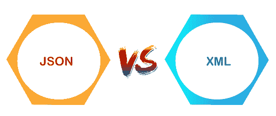

# JSON vs XML

> 原文：<https://www.javatpoint.com/json-vs-xml>

在了解 json 和 xml 之间的区别之前，我们应该了解 JSON 和 XML 的定义。

## 什么是 json？

JSON 代表 **JavaScript 对象符号**。JSON 是从 javascript 派生出来的，其中 javascript 是一种编程语言。最初创建它是为了保存可以在 javascript 中使用的结构化数据。JSON 变得如此流行，以至于它被用于各种应用程序的数据。这是为网络应用程序接口发送数据的最流行的方式。

**JSON 支持的基本数据类型有:**

*   **字符串**:用单引号或双引号括起来的字符。
*   **数字**:数字可以是整数或小数，正数或负数。
*   **布尔值**:布尔值可以是真也可以是假，没有任何引号。
*   **Null** :这里，Null 表示没有任何引号的东西。

除了基本的数据类型，json 还有数组和对象。

### 数组

数组是由方括号表示的列表，值之间有逗号。它们可以包含混合数据类型，即单个数组可以包含字符串、布尔值和数字。

**例如:**

**例 1:**【1、2、7.8、5、9、10】；

**例 2:** 【“红”“黄”“绿”】；

**例 3:**【8，“你好”，空，真】；

在上图中，示例 1 是数字数组，示例 2 是字符串数组，示例 3 是混合数据类型数组。

### 目标

对象是用花括号括起来的 JSON 字典。在对象中，键和值用冒号“:”分隔，对用逗号分隔。键和值可以是任何类型，但最常见的键类型是字符串。

例如:{“红”:1、“黄”:2、“绿”:3 }；

### 嵌套

嵌套包括将数组和对象保持在彼此内部。我们可以把数组放在对象里面，对象放在数组里面，数组放在数组里面，等等。我们可以说 json 文件是一个大对象，里面有很多对象和数组。

**示例:**

```

{
  "song" :
            {
                 "title" :  "Hey Dude";
                  "artist": "The Beatles";
                   "musicians": ["John Lennon", "Paul McCratney", "Ringo Starr"];
             }
}

```

在上面的代码中，歌曲以一个大括号开始。所以，一首歌就是一个对象。它包含三个键值对，其中标题、艺术家和音乐家是关键。'

## 什么是 XML？

XML 代表一种可扩展标记语言。它就像HTML，HTML代表HTML。HTML 用于创建网站，而 XML 可以用于任何类型的结构化数据。

XML 有两种处理数据的方式，即标签和属性。标签作为HTML工作。开始标记以<_>开始，以结束。开始和结束标记必须匹配。名称只能是字母、数字和下划线，标记名称只能以字母开头。

**例如:**

<title>你好世界</title>

### 嵌套标签

当我们将标签放入另一个创建嵌套数据的标签中时。

**例如:**

```

<color>
 <red> 1 </red>
<yellow> 2 </yellow>
<green> 3 </green>
</color>

```

从上面的代码中我们可以观察到，在颜色标签内部，我们还有三个标签，即红色、黄色和绿色。

## json 和 XML 之间的相似之处。

*   **自描述:**json 和 xml 都是自描述的，因为 xml 数据和 JSON 数据都是人类可读的文本。
*   **分层:【json 和 xml 都支持分层结构。这里的层次意味着值内的值。**
*   **数据交换格式:** JSON 和 XML 可以被很多不同的编程语言用作数据交换格式。
*   **解析:**这两种格式都很容易解析。
*   **检索:**两种格式都可以使用 HTTP 请求进行检索。用于检索数据的方法有 GET、PUT、POST。

## json 和 XML 的区别。



**以下是 json 和 xml 的区别:**

| 数据 | 可扩展置标语言 |
| JSON 代表 javascript 对象符号。 | XML 代表一种可扩展标记语言。 |
| json 文件的扩展名是. json。 | xml 文件的扩展名是. xml。 |
| 互联网媒体类型为 application/json。 | 互联网媒体类型是应用程序/xml 或文本/xml。 |
| JSON 中的格式类型是数据交换。 | XML 中的格式类型是一种标记语言。 |
| 它是从 javascript 扩展而来的。 | 它是从 SGML 扩展而来的。 |
| 它是开源的，这意味着我们使用 JSON 不需要支付任何费用。 | 它也是开源的。 |
| 在 JSON 中创建的对象有某种类型。 | XML 数据没有任何类型。 |
| JSON 支持的数据类型有字符串、数字、布尔值、null、数组。 | XML 数据是字符串格式的。 |
| 它没有任何显示数据的能力。 | XML 是一种标记语言，因此它有能力显示内容。 |
| JSON 没有标签。 | XML 数据用标签表示，即开始标签和结束标签。 |
|  | XML 文件较大。如果我们想用 XML 表示数据，那么与 JSON 相比，它会创建一个更大的文件。 |
| JSON 读写速度更快。 | XML 文件读写需要时间，因为学习曲线比较高。 |
| JSON 可以使用数组来表示数据。 | XML 不包含数组的概念。 |
| 它可以被标准的 javascript 函数解析。它在使用前必须被解析。 | 用于交换数据的 XML 数据必须用各自的编程语言进行解析才能使用。 |
| 它可以很容易地被解析，并且解析数据只需要很少的代码。 | 很难解析。 |
| 与 XML 相比，文件大小更小。 | 文件大小较大。 |
| JSON 面向数据。 | XML 是面向文档的。 |
| 它不如 XML 安全。 | 它比 JSON 更安全。 |

* * *