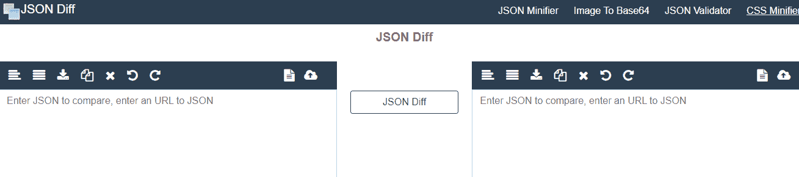

# JSON 比较

> 原文：<https://www.javatpoint.com/json-compare>

在本文中，我们将了解 JSON 之间的比较。本教程仅用于比较 JSON 格式的不同数据块。我们可能会选择使用不同的本地和在线工具。进行比较不仅是为了检查数据的依赖关系是否相关，也是为了我们将在本文中讨论的多项内容。从完全的意义上来说，我们将会了解比较通常基于什么因素。我们可能还会讨论一些可用于本地比较 JSON 的工具，以及一些基于它的在线工具。我们继续。

[JSON](https://www.javatpoint.com/json-tutorial) 比较是**JSON int 验证器**的超集，这是一个用于比较不同种类 JSON 数据的工具。JSON compare 以一种高级的方式提供类似于 JSONLint 的功能。这个工具允许我们直接输入并验证 JSON 代码。在此之后，我们可以上传 JSON 数据堆，甚至在独立环境或多个批处理中验证它。同时，您可以同时上传多个文件，并使用 JSON Compare 工具中的不同命令集对它们进行比较，然后合并两个 JSON 对象。

有多种使用 JSON 比较工具进行比较的方法。该工具主要有 **3 种模式**，覆盖整套。它们是:

**简单:**该模式使我们能够输入或复制粘贴和验证。

**批次:**此模式可让我们上传多个批次并进行验证。

**Diff:** 该模式使我们能够直接输入、复制粘贴、合并和验证两个独立的 JSON 对象。

让我们一个一个来看。但是在继续之前，我们需要安装所有这些模式来比较我们的 JSON 数据。

```js

npm install -g json-simple

npm install -g json-batch

npm install -g json-diff

```

上述命令将安装 JSON 比较中使用的模式的所有依赖项。

在这三种模式中，大多数开发人员更喜欢使用 diff 模式，因为简单的命令可以唯一地拾取和合并两个 JSON 对象，即批处理，并轻松地合并它们。有多个域网站可以使用 diff。考虑如图所示的示例图像。



如上图所示，diff 模式提供了比较两个 JSON 对象的不同方法。我们可以对它们进行排序、复制粘贴、合并和比较。一旦我们在两侧编写或粘贴我们的 JSON 对象，这种比较就会被自动验证。在写入或粘贴之后，JSON Diff 按钮可以很容易地进行相应的操作。

考虑一个用于比较两个 JSON 对象的函数，然后返回包含所有可能差异的 JSON 对象列表，如下例所示。

```js

  var madrid = 
'{"type":"team","description":"Good","trophies":[{"ucl":"10"}, 
{"copa":"5"}]}';

var barca = 
'{"type":"team","description":"Bad","trophies":[{"ucl":"3"}]}';

```

如果我们像运行比较模式 diff(**Madrid，barca** )一样运行，返回的对象看起来会像这样。

```js

{"description" : "Bad", "trophies":[{"ucl":"3"}, {"copa":"5"}]}; 

```

从上面的例子中可以明显看出，compare 命令 diff 返回两个已定义对象中存在的不同对象。就这么简单。它不需要进一步的解释，因为 diff 命令会像泛型排序一样自动进行比较，或者比较编程范例中使用的函数。

### 使用 JSON diff 的优势

1.  与简单模式或批处理模式相比，JSON diff 是一种相对熟练模式。
2.  使用 diff 的比较参数较低，易于管理。
3.  JSON diff 工具所做的验证非常高效和可靠。
4.  JSON diff 严格检查所有的约束，并在多个批次中验证它们，减少了比较所需的时间。

### 摘要

在本文中，我们遇到了使用 JSON compare 来比较 JSON 数据集中存在的各种对象的事实。我们还了解了降低比较所需基础设施成本的在线工具。随后，我们讨论了不同模式的 JSON 比较工具的安装，使用该工具，我们可以根据需求执行简单到复杂的任务。我们还讨论了高度使用的 JSON 差异模式，它同时具有简单模式和批处理模式的属性。我们还通过一个例子讨论了 diff 模式如何比较 JSON 中的两个对象，并通过一个函数调用来显示这两个对象之间的差异。

* * *