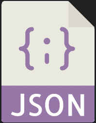
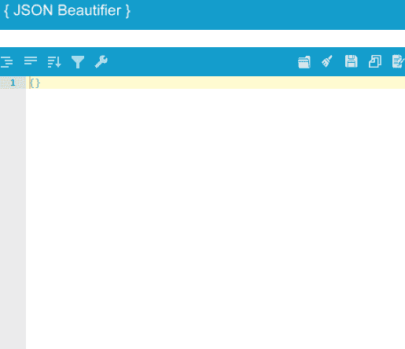

# 美丽的 JSON

> 原文:[https://www.javatpoint.com/json-beautifier](https://www.javatpoint.com/json-beautifier)



JSON 或 **JavaScript 对象符号**是一种用于开放标准文件和数据交换格式的格式，它使用人类可读的文本来捕获和传输由一些属性组成的数据对象，即数组和值对或可序列化的值。JSON 现在非常受欢迎，因为每个 [JavaScript](https://www.javatpoint.com/javascript-tutorial) 库或任何其他编程范例的框架都使用它，因为它的**简单性**和**可读性**。JSON 是一种非常常见的数据格式，用于在各种类型的应用程序中存储各种各样的数据。例如，基于响应服务器的 web 应用程序。

此外，在处理各种类型的数据时，人类处理 JSON 数据会变得非常忙碌。当可能高度依赖 JSON 的巨大应用程序在冲突发生时变得难以调试时，问题就变得更加严重了。当人类在所有沉重的 JSON 堆中移动时，很难找出 bug 存在的地方。这个问题需要立即治疗。这就是 JSON 变美的原因。

## 什么是 JSON 美化器？

[JSON](https://www.javatpoint.com/json-tutorial) 美化器是帮助开发者控制 JSON 文件中数据格式的工具。这是一个由 JSON 在线网站提供的**免费工具**，以抑制减少来自海量 JSON 数据的 bug 的需求。JSON 美化器识别原始 JSON 数据的坏模式，并再次构建它们，使它们易于阅读。这有利于开发者社区为用户节省时间和金钱。开发人员不需要支付一分钱来查看他们一直在开发的应用程序的独立 JSON 数据。他们可以轻松地编译和测试正在处理的 JSON 数据。我们可以认为它是一个多功能的网络工具。此外，使用信用卡时不需要任何信用卡或任何隐藏费用。我们可以通过浏览器本身轻松访问在线工具。此外，使用这个在线工具并访问目前所有可用的浏览器不需要插件或特定于设备的配置。

JSON 美化器还附带了 JSON **格式化器**，这是一个跨协作工具，通过将 JSON 数据组织成特定的标准来集成它们。无论是整数、字符串还是其他什么数据，美化工具都能轻松处理所有这些类型的数据。每当我们有一堆难以阅读和理解的 JSON 数据时，我们可以选择使用这个美丽的工具将数据整理成可读和美丽的支出。JSON 美化器看起来是这样的。



在上图中，空白处表示我们将从源文件库或文件中写入或粘贴的**可编辑的**或**无组织的 JSON** 。光标一移动，上述选项就会弹出。我们可以自动编译它或者在需要的时候调试它。

考虑以下未排序或未正确排列的 JSON 数据。

```

{
"Company": {
"Employee": {
"FirstName": "Sonoo",
"LastName": "Jaiswal",
"ContactNo": "1234567890",
"Email": "sonoojaiswal@javatpoint.com",
"Address": {
"City": "Noida",
"State": "Uttar Pradesh",
"Zip": "123456"
}
}
}
}

```

上面那堆 JSON 数据似乎与括号和参数混淆了。显然很难概括哪个括号包含哪些参数。使用 JSON 美化器，我们可以很容易地使它可读，对它进行相应的排序，如果数据不正确，也可以进行编辑。使用 JSON 在线美颜器后美化后的 JSON 数据是这样的

```

{
    "Company": {
        "Employee": {
            "FirstName": "Sonoo",
            "LastName": "Jaiswal",
            "ContactNo": "1234567890",
            "Email": "sonoojaiswal@javatpoint.com",
            "Address": {
                "City": "Noida",
                "State": "Uttar Pradesh",
                "Zip": "123456"
            }
        }
    }
}

```

很明显，使用 JSON 美化器使数据看起来很神奇，也很容易理解。括号中的参数看起来很平衡。同样，在处理大型项目时，使用 JSON 美化器可以轻松地处理各种这样的无组织或不正确的数据格式。

### 摘要

我们还看到了如何使用这个实用工具轻松美化无序数据。在线应用程序的 web 界面很容易理解，还有对未排序的数组进行排序的内置功能，在 JSON 格式化程序中处理大量数据时将复杂性降至最低。我们还看到了一个例子，说明 JSON 美化器如何平衡 JSON 数据格式中的括号。这使得任何开发人员更容易执行操作，同时编辑 JSON 数据，同时轻松美化它。

* * *