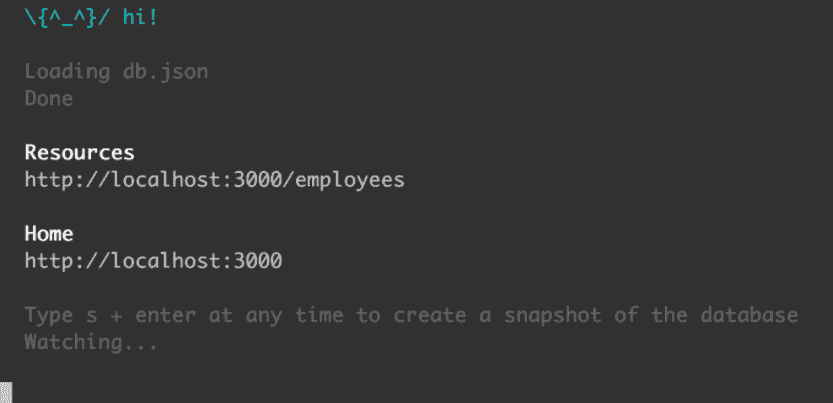
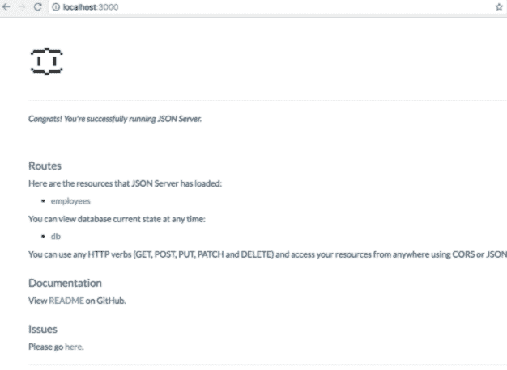

# JSON 服务器

> 原文：<https://www.javatpoint.com/json-server>

大多数开发人员都听说过 JSON 这个术语。它缩写为“ **JavaScript 对象符号**”。JSON 只不过是一种开放的标准文件格式和数据交换格式。它使用人类可读的文本来存储和传输数据对象。它通常由两个人类可读的属性组成，即**值对**和**数组。** JSON 是一种非常常见的数据格式，具有不同的应用。例如，与服务器通信的网络应用程序使用 JSON。

同理， [JSON](https://www.javatpoint.com/json-tutorial) 服务器也没什么不同。JSON 服务器是一个节点模块，您可以使用它在几分钟内创建演示 **REST JSON** 服务。我们所需要做的就是有一个 JSON 文件作为样本数据。让我们了解更多关于如何在我们的系统中安装和设置一个 JSON 服务器，同时我们将尝试创建一个 **REST API** 。让我们了解更多。

## 装置

要开始安装 JSON 服务器，我们只需要打开系统的终端并键入以下命令。

```js

npm install -g json-server

```

下一步包括用 JSON 创建一个数据库。为了便于学习，我们创建了如下所示的示例数据库。

```js

  //db.json

{
  "posts": [
    { "id": 1, "title": "json-server", "author": "typicode" }
  ],
  "comments": [
    { "id": 1, "body": "some comment", "postId": 1 }
  ],
  "profile": { "name": "typicode" }
}

```

我们快完成了。下一步是启动 JSON 服务器，并使用下面的命令。

```js

json server --watch db.json

```

现在，如果我们转到 http://localhost:3000/post/1，我们会得到类似这样的内容。

```js

{ "id": 1, "title": "json-server", "author": "typicode" }

```

这个输出表示我们的 JSON 服务器对于上述属性工作正常，并且其中有一些值。我们现在可以轻松地为 JSON 服务器创建一个请求。但是，在进一步行动之前，最好考虑一些关键因素。这些关键因素是:

1.如果我们做一些像 **POST、DELETE、PUT** 或者 **PATCH** 这样的请求，这些更改会被直接反映出来并安全地存储在 db.json 文件中。

2.请求的 JSON 体应该是对象封闭的，就像 **GET** 一样，例如:

```js

{"name": Foobar}

```

3.**标识**值通常不可变。默认情况下，PUT 和 PATCH 请求正文中的 ID 的任何值通常都会被忽略。开机自检请求中设置的值只有在尚未考虑时才会考虑。

4.PATCH、POST 和 PUT 请求应始终包含一个**内容类型:应用程序/json** 头，用于 json 请求正文。否则，它将返回 **2XX** 状态代码，而不更新对数据所做的更改。

## 路线

路由只不过是管道中处理请求的路径。特定的路由服务于特定的请求，因此依赖性不会受到干扰。

因此，基于之前的 **db.json** 文件，可以在终端用 **- routes** 命令添加各种默认路由。一些默认路由如下所示。

### 单一路线

```js

GET    /profile
POST   /profile
PUT    /profile
PATCH  /profile

```

### 多条路线

```js

GET    /posts
GET    /posts/1
POST   /posts
PUT    /posts/1
PATCH  /posts/1
DELETE /posts/1

```

### 创建 REST 应用编程接口

**表示状态转移** (REST)是一种使用 **HTTP** 子集的软件架构风格。它通常用于基于 web 提供的可用服务创建交互式应用程序。所有遵循这些网络服务指南的应用程序因此被称为 **RESTful** 。

现在让我们创建一个名为 db.json 的新 JSON 文件。对于 JSON 结构中包含的所有对象，将自动创建 **CRUD** ( **创建读取更新删除**)端点。让我们看一下示例 db.json 文件。

```js

"employees": [
    {
      "id": 1,
      "first_name": "Sebastian",
      "last_name": "Eschweiler",
      "email": "sebastian@javatpoint.com"
    },
    {
      "id": 2,
      "first_name": "Steve",
      "last_name": "Palmer",
      "email": "steve@javatpoint.com"
    },
    {
      "id": 3,
      "first_name": "Ann",
      "last_name": "Smith",
      "email": "ann@javatpoint.com"
    }
  ]
}

```

上面的示例 **db.json** 结构由一个有 3 个指定数据集的反对员工组成。每个员工对象由四个属性组成，如 **id、名字、姓氏、**和**电子邮件**。

完成这一步后，我们需要做的就是通过终端命令运行服务器。

```js

json server --watch db.json

```

下一步是在包含 JSON 结构的文件上传递一个参数。此外，我们正在使用 watch 参数，因为这可以确保服务器在 watch 模式下启动，并且更改和更新会相应地暴露给 API。以下控制台在我们启动服务器后拍摄。



现在，如果我们在浏览器环境中运行 URL http://localhost:3000/employees，我们可能会看到以下结果。



从上图中，我们可以看出资源员工的正确认知。现在，当我们点击 employees 链接，使用 **HTTP GET** 请求到 HTTP://localhost:3000/employees，它会给我们显示下面的 JSON 结果。

```js

 [
    {
      "id": 1,
      "first_name": "Sebastian",
      "last_name": "Eschweiler",
      "email": "sebastian@javatpoint.com"
    },
    {
      "id": 2,
      "first_name": "Steve",
      "last_name": "Palmer",
      "email": "steve@javatpoint.com"
    },
    {
      "id": 3,
      "first_name": "Ann",
      "last_name": "Smith",
      "email": "ann@javatpoint.com"
    }
]

```

该操作将创建各种路由端点，就像我们之前讨论的那样，在检查时，我们会发现以下结果。

```js

GET    /employees
GET    /employees/{id}
POST   /employees
PUT    /employees/{id}
PATCH  /employees/{id}
DELETE /employees/{id}

```

以上端点表示我们现在可以发出 DELETE、PATCH、GET、POST 和 PUT 请求，任何更改都将自动保存到 **db.json** 文件中。同时，在创建 PATCH、PUT 或 POST 请求时，不要忘记包含一个**内容类型:application/json** 头，因为 json 会在请求的正文中查找内容。否则，它可能会导致 **200 OK** 而不改变数据。

此外，还有另一个用更多参数扩展我们的网址的例子，比如通过使用**http://localhost:3000/employees 用以下参数集修改现有网址来过滤参数？first_name=Sebastian** 。在类似的意义上，其他请求也可以很容易地被过滤，并自动反映和保存到 db.json 文件中。这就是我们如何成功地创建了一个 RESTful API。我们可以测试它，使用各种工具轻松部署它，如 **Netlify、Heroku** 或 **Postman** 。让我们学习一些额外的操作，这些操作可以用我们创建的临时应用编程接口来执行。

## 额外选项

**静态文件服务器**

我们创建的 JSON 服务器可以用来为我们的 HTML 服务。CSS 和 JS 的兼容性不过是简单的创建一个**。/public** 目录或使用命令 **- static** 以便设置不同的静态文件目录。

```js

mkdir public
echo 'hello world' > public/index.html
json-server db.json

```

```js

json-server db.json --static ./some-other-dir

```

**端口开关/备用端口**

通过本地主机的请求处理可以转移或切换到另一个端口，使用下面的命令到我们现有的 JSON 服务器。我们只需要使用 **-端口号**标志。例如:

```js

 json-server --watch db.json --port 3004

```

**中间件模块**

如果我们希望通过创建一个模块并结合其他 **Express** 中间件来对您想要创建的应用编程接口或项目进行任何验证、身份验证或行为更改。考虑下面的例子。

```js

 npm install json-server --save-dev

```

```js

// server.js
const jsonServer = require('json-server')
const server = jsonServer.create()
const router = jsonServer.router('db.json')
const middlewares = jsonServer.defaults()

server.use(middlewares)
server.use(router)
server.listen(3000, () => {
  console.log('JSON Server is running')
})

```

使用运行上述文件，

```js

node server.js

```

我们为 json 提供的路径。上面代码片段中的 Server.router 函数是相对于启动节点进程的目录而言的。如果我们从另一个目录运行上面的代码片段，强烈建议使用绝对路径:

```js

const path = require('path')
const router = jsonServer.router(path.join(__dirname, 'db.json'))

```

对于任何其他内存数据库，我们只需要将一个对象传递给现有 Express 项目中的 **jsonServer.router()** 函数。

## JSON 服务器的数据嘲讽

到目前为止，我们学会了通过在 JSON 文件中手动创建一个假的 API 来公开数据。然而，如果我们需要大数据集，这种手工方式会导致忙乱和荒谬。因此，为了应对这个问题，我们可以使用 **Faker.js** ，因为它可以为 JSON Server 处理大量数据。它通过在与 JSON 和 API 集成时生成假数据来做到这一点。这可以通过使用以下步骤来完成。

```js

npm init

```

接下来，使用以下命令安装 Faker.js:

```js

npm install faker

```

Faker.js 将成功安装在 **node_modules** 文件夹中。现在，在 employees.js 中创建另一个文件，并插入下面给出的示例 JavaScript 代码。

```js

// employees.js
var faker = require('faker')
function generateEmployees () {
  var employees = []
  for (var id = 0; id < 50; id++) {
    var firstName = faker.name.firstName()
    var lastName = faker.name.lastName()
    var email = faker.internet.email()
    employees.push({
      "id": id,
      "first_name": firstName,
      "last_name": lastName,
      "email": email
    })
  }
  return { "employees": employees }
}

```

在上面的代码片段中，我们正在实现函数 **generateEmployees()** 来生成包含 50 名员工数据的基于 JSON 的对象。因此，为了获得我们正在使用的名字、姓氏和电子邮件的假数据，我们将使用方法 **faker.name.firstName()、faker.name.lastName()** 和 **faker.internet.email()** 。

此外，JSON 服务器需要导出上述代码中的通用 **employees()** 函数，这是使用方法完成的。

```js

module.exports = generateEmployees

```

添加该导出后，我们现在可以通过以下方式将 employees.js 文件直接传递给 json-server 命令

```js

Json-server employees.js

```

工作完成了。我们已经成功地公开了 REST API，它将使我们能够通过 Faker.js 访问所有 50 名员工的数据集。

## 摘要

在本教程中，我们从头开始学习了 JSON 服务器。我们试图融入它的用例，并最终学习了它的实现以及设置本地环境、创建请求等。我们还了解了非常重要的路由，因为我们可以使用它们来创建数据移动到文件的路径，然后追溯像 **POST、DELETE、**等请求。在后面的部分中，我们学习了使用 Express 环境设置中间件，然后使用 Faker.js 模仿 JSON Server。因此，我们可以得出结论，JSON Server 在开发中涵盖了巨大的应用，因为大多数开发人员都使用这种格式来建立数据操作、访问和存储机制，并执行整体的数据驱动范例。

* * *