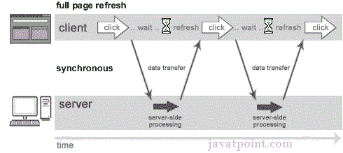
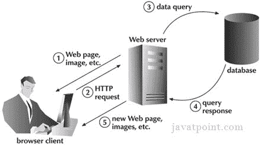
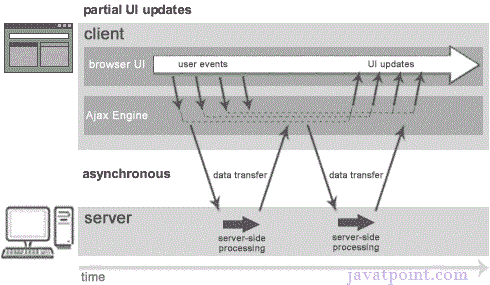
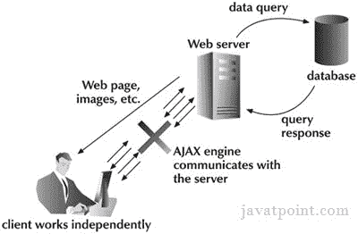

# 理解同步与异步

> 原文：<https://www.javatpoint.com/understanding-synchronous-vs-asynchronous>

在了解 AJAX 之前，我们先来了解一下经典的 web 应用模型和 ajax web 应用模型。

## 同步(经典网络应用模型)

同步请求会阻止客户端，直到操作完成，即浏览器没有响应。在这种情况下，浏览器的 javascript 引擎被阻塞。

正如您在上面的图片中所看到的，整个页面在请求时被刷新，用户被阻止，直到请求完成。

让我们换一种方式来理解。

* * *

## 异步(AJAX 网络应用模型)

异步请求不会阻塞客户端，即浏览器是响应的。这时，用户也可以执行另一个操作。在这种情况下，浏览器的 javascript 引擎不会被阻塞。

如上图所示，整个页面不会在请求时刷新，用户会从 ajax 引擎获得响应。

让我们试着通过下面给出的图片来理解异步通信。

#### 注意:每个阻塞操作不是同步的，每个解除阻塞操作也不是异步的。