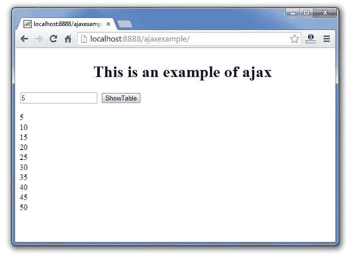

# Ajax Java 示例

> 原文:[https://www.javatpoint.com/ajax-example](https://www.javatpoint.com/ajax-example)

要创建 [ajax](ajax-tutorial) 示例，您需要使用任何服务器端语言，例如 [Servlet](servlet-tutorial) 、 [JSP](jsp-tutorial) 、 [PHP](php-tutorial) 、[ASP.Net](asp-net-tutorial)等。这里我们使用 JSP 来生成服务器端代码。

在这个例子中，我们只是打印给定数字的表格。

#### 用 jsp 创建 ajax 示例的步骤

您需要遵循以下步骤:

1.  加载 org.json.jar 文件
2.  创建输入页面以接收任何文本或数字
3.  创建服务器端页面来处理请求
4.  在 web.xml 文件中提供条目

* * *

#### 加载 org.json.jar 文件

下载这个例子，我们已经在 WEB-INF/lib 目录中包含了 org.json.jar 文件。

* * *

#### 创建输入页面以接收任何文本或数字

在这个页面中，我们已经创建了一个从用户那里获取输入的表单。当用户点击 showTable 按钮时，调用 **sendInfo()** 函数。我们已经编写了这个函数中的所有 ajax 代码。

每当就绪状态改变时，我们都会调用 **getInfo()** 函数。它借助 **innerHTML** 属性将返回的数据动态写入网页。

**table1.html**

```
<html>
<head>
<script>
var request;
function sendInfo()
{
var v=document.vinform.t1.value;
var url="index.jsp?val="+v;

if(window.XMLHttpRequest){
request=new XMLHttpRequest();
}
else if(window.ActiveXObject){
request=new ActiveXObject("Microsoft.XMLHTTP");
}

try
{
request.onreadystatechange=getInfo;
request.open("GET",url,true);
request.send();
}
catch(e)
{
alert("Unable to connect to server");
}
}

function getInfo(){
if(request.readyState==4){
var val=request.responseText;
document.getElementById('amit').innerHTML=val;
}
}

</script>
</head>
<body>
    <marquee><h1>This is an example of ajax</h1></marquee>
<form name="vinform">
<input type="text" name="t1">
<input type="button" value="ShowTable" onClick="sendInfo()">
</form>

<span id="amit"> </span>

</body>
</html>

```

* * *

#### 创建服务器端页面来处理请求

在这个 jsp 页面中，我们打印给定数字的表格。

**index.jsp**

```
<%
int n=Integer.parseInt(request.getParameter("val"));

for(int i=1;i<=10;i++)
out.print(i*n+"<br>");

%>

```

* * *

#### web.xml

```
<?xml version="1.0" encoding="UTF-8"?>
<web-app version="2.5"  
xmlns:xsi="http://www.w3.org/2001/XMLSchema-instance" 
xsi:schemaLocation="http://java.sun.com/xml/ns/javaee 
http://java.sun.com/xml/ns/javaee/web-app_2_5.xsd">

    <session-config>
        <session-timeout>
            30
        </session-timeout>
    </session-config>
    <welcome-file-list>
        <welcome-file>table1.html</welcome-file>
        </welcome-file-list>
    </web-app>

```

* * *

[download this ajax example](src/ajax/ajaxexample.zip)

* * *

#### 输出

