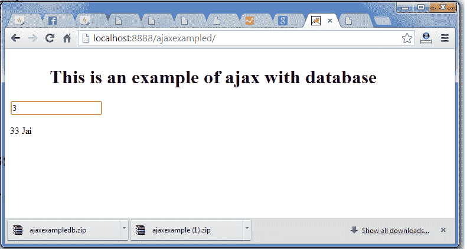

# 带有数据库的 Ajax Java 示例

> 原文:[https://www.javatpoint.com/ajax-example-with-database](https://www.javatpoint.com/ajax-example-with-database)

在这个例子中，我们正在与数据库交互。你不必做任何额外的努力。只在服务器端页面写数据库逻辑。

在这个例子中，我们已经在 index.jsp 文件中编写了服务器端代码。

#### 通过 jsp 用数据库创建 ajax 示例的步骤

您需要遵循以下步骤:

1.  加载 org.json.jar 文件
2.  创建输入页面以接收任何文本或数字
3.  创建服务器端页面来处理请求

* * *

#### 加载 org.json.jar 文件

下载这个例子，我们已经在 WEB-INF/lib 目录中包含了 org.json.jar 文件。

* * *

#### 创建输入页面以接收任何文本或数字

在这个页面中，我们已经创建了一个从用户那里获取输入的表单。当用户按任意键**时，调用 sendInfo()** 功能。我们已经在这个函数中编写了所有的 [ajax](ajax-tutorial) 代码。

每当就绪状态改变时，我们都会调用 **getInfo()** 函数。它借助 [**innerHTML**](javascript-innerHTML) 属性将返回的数据动态写入网页。

**table1.html**

```
<html>
<head>
<script>
var request;
function sendInfo()
{
var v=document.vinform.t1.value;
var url="index.jsp?val="+v;

if(window.XMLHttpRequest){
request=new XMLHttpRequest();
}
else if(window.ActiveXObject){
request=new ActiveXObject("Microsoft.XMLHTTP");
}

try{
request.onreadystatechange=getInfo;
request.open("GET",url,true);
request.send();
}catch(e){alert("Unable to connect to server");}
}

function getInfo(){
if(request.readyState==4){
var val=request.responseText;
document.getElementById('amit').innerHTML=val;
}
}

</script>
</head>
<body>
    <marquee><h1>This is an example of ajax</h1></marquee>
<form name="vinform">
Enter id:<input type="text" name="t1" onkeyup="sendInfo()">
</form>

<span id="amit"> </span>

</body>
</html>

```

* * *

#### 创建服务器端页面来处理请求

在这个 jsp 页面中，我们打印给定 id 的员工 id 和姓名。

**index.jsp**

```
<%@ page import="java.sql.*"%>

<%
String s=request.getParameter("val");
if(s==null || s.trim().equals("")){
out.print("Please enter id");
}else{
int id=Integer.parseInt(s);
out.print(id);
try{
Class.forName("com.mysql.jdbc.Driver");
Connection con=DriverManager.getConnection("jdbc:mysql://localhost:3306/mdb","root","root");
PreparedStatement ps=con.prepareStatement("select * from emp where id=?");
ps.setInt(1,id);
ResultSet rs=ps.executeQuery();
while(rs.next()){
out.print(rs.getInt(1)+" "+rs.getString(2));
}
con.close();
}catch(Exception e){e.printStackTrace();}
}
%>

```

* * *

[download this ajax example](src/ajax/ajaxexampled.zip)

* * *

#### 输出

 