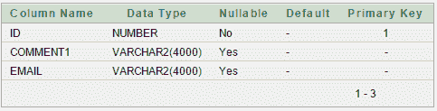
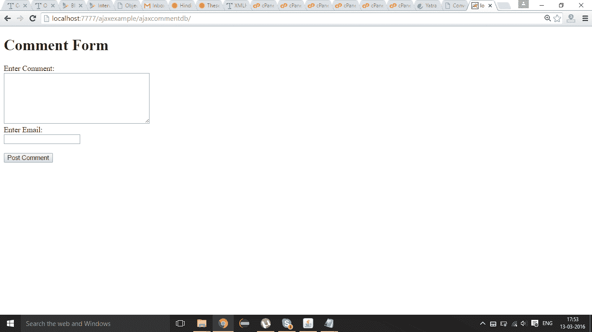
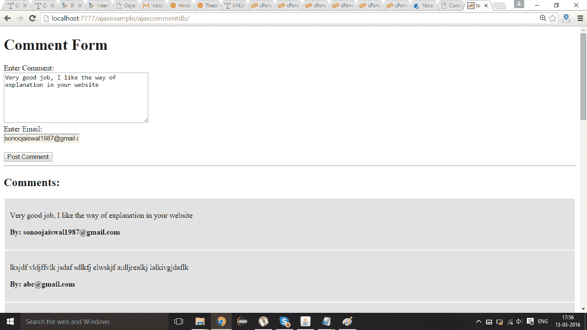

# Java 中使用 AJAX 的注释表单示例

> 原文：<https://www.javatpoint.com/comment-form-example-using-ajax-in-java>

在这个例子中，我们正在创建一个发布评论的表单。表单数据保存在数据库中，所有发布的评论列表显示在评论表单下方。

#### 在 Java 中使用 AJAX 创建注释表单示例的步骤

您需要遵循以下步骤:

1.  在数据库中创建表
2.  加载 org.json.jar 文件
3.  创建注释表单
4.  创建服务器端页面以保存表单数据并打印所有发布的评论

* * *

#### 在数据库中创建表

在这个例子中，我们使用的是 oracle 10g 数据库。表格结构如下:



“usercomment”表的 id 字段自动递增。

* * *

#### 加载 org.json.jar 文件

下载这个例子，我们已经在 WEB-INF/lib 目录中包含了 org.json.jar 文件。

* * *

#### 创建注释表单

在这个页面中，我们已经创建了一个从用户那里获取输入的表单。当用户点击帖子评论按钮时，会调用**Post mment()**函数。我们已经编写了这个函数中的所有 ajax 代码。

**index.html**

```js
<!DOCTYPE html>
<html>
<head>
<script>
var request;
function postComment(){
var comment=document.commentform.comment.value;
var email=document.commentform.email.value;

var url="index.jsp?comment="+comment+"&email="+email;

if(window.XMLHttpRequest){
request=new XMLHttpRequest();
}
else if(window.ActiveXObject){
request=new ActiveXObject("Microsoft.XMLHTTP");
}

try{
request.onreadystatechange=function(){
if(request.readyState==4){
var val=request.responseText;
document.getElementById('mylocation').innerHTML=val;
}
}//end of function
request.open("GET",url,true);
request.send();
}catch(e){alert("Unable to connect to server");}
}
</script>
</head>
<body>
<h1>Comment Form</h1>
<form name="commentform">
Enter Comment:<br/>
<textarea name="comment" style="width:300px;height:100px" required>
</textarea><br/>
Enter Email:<br/>
<input type="text" name="email" required/><br/><br/>

<input type="button" value="Post Comment" onclick="postComment()">
</form>

<span id="mylocation"></span>
</body>
</html>

```

* * *

#### 创建服务器端页面来处理请求

在这个 jsp 页面中，我们正在编写数据库代码来保存注释并打印所有注释。

**index.jsp**

```js
<!DOCTYPE html>
<html>
<head>
<style>
div.box{margin:2px;border:1px solid pink;padding:10px;background-color:#e3e3e3}
</style>
</head>
<body>

<%@ page import="java.sql.*" %>
<%
String comment=request.getParameter("comment");
String email=request.getParameter("email");
if(comment==null||email==null||comment.trim().equals("")||email.trim().equals("")){
out.print("<p>Please write comment</p>");
}else{

try{
Class.forName("oracle.jdbc.driver.OracleDriver");
Connection con=DriverManager.getConnection("jdbc:oracle:thin:@localhost:1521:xe","system","oracle");
PreparedStatement ps=con.prepareStatement("insert into usercomment(comment1,email) values(?,?)");
ps.setString(1,comment);
ps.setString(2,email);
int i=ps.executeUpdate();

PreparedStatement ps2=con.prepareStatement("select * from usercomment order by id desc");
ResultSet rs=ps2.executeQuery();

out.print("<hr/><h2>Comments:</h2>");
while(rs.next()){
out.print("<div class='box'>");
out.print("<p>"+rs.getString(2)+"</p>");
out.print("<p><strong>By: "+rs.getString(3)+"</strong></p>");
out.print("</div>");
}

con.close();
}catch(Exception e){out.print(e);}

}//end of else
%>
</body>
</html>

```

* * *

[Download this ajax example](https://static.javatpoint.com/ajaxpages/src/ajaxcommentdb.zip)

* * *

#### 输出

查看评论表。



现在写下评论和邮件 id，然后点击“发表评论”按钮。评论表单下方将显示一个已发布评论的列表。

