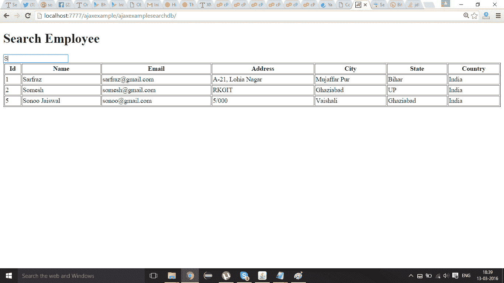

# Java 中使用 AJAX 的搜索示例

> 原文：<https://www.javatpoint.com/search-example-using-ajax-in-java>

在这个例子中，我们使用 java 中的 ajax 创建了一个按姓名搜索雇员的表单。在这里，我们编写了两层应用程序代码，使应用程序易于理解。您可以根据自己的标准编写数据库代码。

#### 在 Java 中使用 AJAX 创建搜索示例的步骤

您需要遵循以下步骤:

1.  在数据库中创建表
2.  加载 org.json.jar 文件
3.  创建输入表单
4.  创建服务器端页面，使用姓名搜索员工

* * *

#### 在数据库中创建表

在这个例子中，我们使用的是 oracle 10g 数据库。这里，我们创建了一个表“emp911”，它包含以下数据。


* * *

#### 加载 org.json.jar 文件

下载这个例子，我们已经在 WEB-INF/lib 目录中包含了 org.json.jar 文件。

* * *

#### 创建输入表单

在这个页面中，我们已经创建了一个表单，该表单从用户那里获取输入，以便按姓名搜索员工。当用户通过键盘按键后释放按键时，调用 searchInfo()函数。ajax 代码是在 searchInfo()函数中编写的。

**index.html**

```js
<!DOCTYPE html>
<html>
<head>
<script>
var request=new XMLHttpRequest();
function searchInfo(){
var name=document.vinform.name.value;
var url="index.jsp?val="+name;

try{
request.onreadystatechange=function(){
if(request.readyState==4){
var val=request.responseText;
document.getElementById('mylocation').innerHTML=val;
}
}//end of function
request.open("GET",url,true);
request.send();
}catch(e){alert("Unable to connect to server");}
}
</script>
</head>
<body>
<h1>Search Employee</h1>
<form name="vinform">
<input type="text" name="name" onkeyup="searchInfo()">
</form>

<span id="mylocation"></span>
</body>
</html>

```

* * *

#### 创建服务器端页面来处理请求

在这个 jsp 页面中，我们正在编写数据库代码，从给定的名字开始搜索雇员。

**index.jsp**

```js
<%@ page import="java.sql.*" %>
<%
String name=request.getParameter("val");
if(name==null||name.trim().equals("")){
out.print("<p>Please enter name!</p>");
}else{
try{
Class.forName("oracle.jdbc.driver.OracleDriver");
Connection con=DriverManager.getConnection("jdbc:oracle:thin:@localhost:1521:xe","system","oracle");
PreparedStatement ps=con.prepareStatement("select * from emp911 where name like '"+name+"%'");
ResultSet rs=ps.executeQuery();

if(!rs.isBeforeFirst()) {    
 out.println("<p>No Record Found!</p>"); 
}else{
out.print("<table border='1' cellpadding='2' width='100%'>");
out.print("<tr><th>Id</th><th>Name</th><th>Email</th>
<th>Address</th><th>City</th><th>State</th><th>Country</th></tr>");
while(rs.next()){
out.print("<tr><td>"+rs.getString(1)+"</td><td>"+rs.getString(2)+"</td><td>"+rs.getString(3)+"</td>
<td>"+rs.getString(4)+"</td><td>"+rs.getString(5)+"</td><td>"+rs.getString(6)+"</td>
<td>"+rs.getString(7)+"</td></tr>");
}
out.print("</table>");
}//end of else for rs.isBeforeFirst
con.close();
}catch(Exception e){out.print(e);}
}//end of else
%>

```

* * *

[Download this ajax example](https://static.javatpoint.comajaxpages/src/ajaxexamplesearchdb.zip)

* * *

#### 输出

查看搜索表单。


现在输入员工姓名。如果没有找到员工姓名，会显示“没有找到记录！”消息。


现在输入表中存在的员工姓名。现在它将显示以给定名称开始的所有记录。

