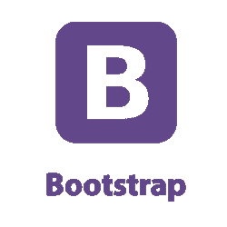

# Bootstrap教程

> 原文：<https://www.javatpoint.com/bootstrap-tutorial>

Bootstrap教程提供了Bootstrap的基本和高级概念。我们的Bootstrap教程是为初学者和专业人士设计的。

Bootstrap 是流行的 HTML、CSS 和 JavaScript 框架，用于开发一个响应迅速且移动友好的网站。

我们的 Bootstrap 教程包括 Bootstrap 的所有主题，如大屏幕、表格、按钮、网格、表单、图像、警报、井、容器、转盘、面板、图形、徽章、标签、进度条、分页、寻呼机、列表组、下拉列表、折叠、选项卡、药丸、导航条、输入、模式、工具提示、弹出和滚动浏览。

* * *

## Bootstrap索引

* * *

**Bootstrap教程**

*   [Bootstrap介绍](bootstrap-tutorial)
*   [什么是Bootstrap](what-is-bootstrap)
*   [Bootstrap示例](bootstrap-example)
*   [Bootstrap容器](bootstrap-container)

**Bootstrap示例**

*   [Bootstrap大屏幕](bootstrap-jumbotron)
*   [Bootstrap按钮](bootstrap-button)
*   [Bootstrap网格](bootstrap-grid)
*   [Bootstrap表](bootstrap-table)
*   [Bootstrap表](bootstrap-form)
*   [Bootstrap报警](bootstrap-alert)
*   [Bootstrap井](bootstrap-wells)
*   [Bootstrap徽章&标签](bootstrap-badges-and-labels)
*   [Bootstrap面板](bootstrap-panels)
*   [Bootstrap分页](bootstrap-pagination)
*   [Bootstrap寻呼机](bootstrap-pager)
*   [Bootstrap映像](bootstrap-image)
*   Bootstrap字形
*   [Bootstrap转盘](bootstrap-carousel)
*   [Bootstrap进度条](bootstrap-progress-bar)
*   [Bootstrap列表组](bootstrap-list-group)
*   [Bootstrap下拉菜单](bootstrap-dropdown)
*   [Bootstrap崩溃](bootstrap-collapse)

**Bootstrap前进**

*   [Bootstrap标签/药丸](bootstrap-tabs-and-pills)
*   Bootstrap船
*   [Bootstrap输入类型](bootstrap-inputs)
*   [Bootstrap模式](bootstrap-modals)
*   [Bootstrap弹出](bootstrap-popover)
*   【scrollspy Bootstrap带

**Bootstrap实用程序**

*   [Bootstrap边框](bootstrap-border)
*   Bootstrap式清理剂
*   [Bootstrap关闭图标](bootstrap-close-icons)
*   [Bootstrap颜色](bootstrap-colors)
*   [Bootstrap式 Flexbox](bootstrap-flexbox)
*   [显示属性](bootstrap-display-property)
*   [图像替换](bootstrap-image-replacement)
*   [不可见内容](bootstrap-invisible-content)
*   [Bootstrap位置](bootstrap-position)
*   [响应帮助者](bootstrap-responsive-helpers)
*   [屏幕阅读器](bootstrap-screen-readers)
*   [Bootstrap尺寸](bootstrap-sizing)
*   [Bootstrap间距](bootstrap-spacing)
*   [Bootstrap排版](bootstrap-typography)

**面试问题**

*   [HTML 面试](html-interview-questions)
*   [CSS 面试](css-interview-questions)
*   [jQuery 面试](jquery-interview-questions)
*   [JavaScript 面试](javascript-interview-questions)
*   [阿贾克斯面试](ajax-interview-questions)

* * *

## 先决条件

在学习 Bootstrap 之前，你必须具备 HTML 和 CSS 的基础知识。

## 观众

我们的Bootstrap教程旨在帮助初学者和专业人士。

## 问题

我们保证您在本Bootstrap教程中不会发现任何问题。但是如果有任何错误，请在联系表格中发布问题。